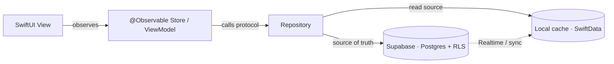

<div align="center">

  <h1>Finmate</h1>

  <p><strong>A private-first, Apple-grade personal finance companion — native iOS (lead) plus a web client on the same Supabase backend — for subscriptions, spending, income, assets, and currency-aware planning, wrapped in one cohesive Liquid Glass design language.</strong></p>

  <p>
    <a href="https://github.com/RNT56/finmate"></a>
    <a href="https://www.swift.org/"></a>
    <a href="https://developer.apple.com/xcode/swiftui/"></a>
    <a href="https://developer.apple.com/ios/"></a>
    <a href="https://supabase.com/"></a>
    <a href="#license"></a>
  </p>

  <p>
    <a href="#overview">Overview</a> ·
    <a href="#product-value">Product Value</a> ·
    <a href="#features">Features</a> ·
    <a href="#tech-stack">Tech Stack</a> ·
    <a href="#architecture">Architecture</a> ·
    <a href="#status">Status</a> ·
    <a href="#getting-started">Getting Started</a> ·
    <a href="#security--privacy">Security</a> ·
    <a href="#roadmap">Roadmap</a> ·
    <a href="#documentation">Docs</a>
  </p>

</div>

---

> **Finmate** is the modern, leaner, hardened, native-iOS successor to [**Substimate**](https://github.com/RNT56/Substimate) — same product vision, reimagined from the ground up as a polished SwiftUI app on a portable Supabase backend.

## Overview

Finmate is a **native iOS** personal finance companion built with **Swift 6 and SwiftUI**, backed by **Supabase** (managed PostgreSQL, Auth, Row Level Security, Edge Functions, Realtime, and Storage). It brings recurring-subscription tracking, cost analytics, income and expense management, money-flow visualizations, a payday calendar, CSV import, assets and investments, a Bitcoin/crypto calculator, and multi-currency display into a single, cohesive product surface.

Finmate is a **reimagining of Substimate** — an existing React 19 + Vite + Supabase web app. The product domain and vision are preserved; the implementation is not. Where Substimate stored money as floating-point, converted non-EUR amounts before storing, carried dual field-name cruft (`amount` vs `monthlyCost`, `favorite` vs `isFavorite`), and shipped **nine competing visual styles**, Finmate fixes each of these by design. Money is stored as **integer minor units** (cents for fiat, satoshis for BTC), field names are canonical, and the entire app speaks **one Liquid Glass design language** across light, dark, and system appearance.

The backend is intentionally portable: schema, RLS policies, hardened RPCs, Edge Functions, and generated types form a stable contract shared across clients. **iOS is the lead client**, and a **web client is now in scope** as a *separate* second client — a Vite + React 19 + TypeScript + `supabase-js` app under [`web/`](./web) that reuses the **same** Supabase backend and the [docs/13](./docs/13-algorithms-and-calculations.md) algorithms (reimplemented in TypeScript), in the **same one Liquid Glass design language** via CSS `backdrop-filter`. It is not a shared UI codebase — only the backend and the math are shared. See [docs/16-web-client.md](./docs/16-web-client.md) and [ADR-0021](./docs/12-decisions-adr.md).

> **This repository is currently in the planning and documentation phase.** No application code has been written yet. See [Status](#status) for an honest picture of what exists today, and [`/docs`](./docs/00-index.md) for the full design set that the code will be built from.

## Product Value

- **One place for recurring spend.** See subscriptions with vendor, payment method, billing period, category, usage state, and favorites — and understand monthly cost, lifetime spend, category distribution, and recent trends.
- **The full money picture.** Track income sources, fixed and variable expenses, assets and investments, and asset transactions alongside subscriptions.
- **Money-flow clarity.** A custom Sankey-style cost tracker visualizes how income flows into recurring and variable costs over a chosen period.
- **Timing you can see.** A payday calendar surfaces upcoming income and the next charges, so nothing is a surprise.
- **Bring your data.** CSV import validates and previews every row before a single write.
- **Currency-aware by design.** Work in EUR, USD, and BTC (satoshis) at minimum, with amounts stored in their native currency — never silently converted.
- **Private by default.** Your data is owner-scoped at the database via Row Level Security, tokens live in the iOS Keychain, optional Face ID / Touch ID gates app entry, and there are no third-party trackers.
- **Apple-grade polish.** A single Liquid Glass design language with motion, depth, haptics, full Dynamic Type, VoiceOver, and reduce-motion support.

## Features

All feature pillars are **in scope for v1**. The build is sequenced into internal milestones (see the [Roadmap](#roadmap)), but the target is a complete product.

| Pillar | What it does |
| --- | --- |
| **Subscriptions** | Add, edit, delete, reorder, favorite, categorize, and analyze recurring services with billing period, payment method, and usage state (active / rarely / unused). |
| **Price History** | Preserve historical subscription price and currency changes for long-term reporting, written automatically by a database trigger. |
| **Analytics** | Monthly trends, category distribution, lifetime cost, usage statistics, and payment-method breakdown — rendered with native Swift Charts. |
| **Income & Expenses** | Track income sources, fixed expenses (with autopay and due dates), and variable expenses across weekly / monthly / quarterly / yearly frequencies. |
| **Cost Tracker** | A Sankey / money-flow visualization comparing income against recurring and variable costs over a selected period, drawn by a custom `Canvas`/`Path` renderer. |
| **Payday Calendar** | Surface income timing and upcoming subscription charges on a calendar. |
| **CSV Import** | Parse, validate, and preview rows with clear error reporting before importing valid entries. |
| **Assets & Investments** | Track financial assets, quantities, purchase and current prices, and buy / sell / dividend transactions. |
| **Crypto / BTC Calculator** | Convert fiat ↔ satoshis (`satsPerBTC = 100,000,000`) using market data fetched **server-side via a Supabase Edge Function**, keeping any provider keys off the device. |
| **Multi-Currency** | EUR, USD, and BTC at minimum, with a per-user display currency and cached exchange rates; designed to extend. |
| **Settings & Theming** | Light / dark / system appearance, default currency, biometric lock toggle, and a customizable, draggable Home dashboard. |
| **Auth & Onboarding** | Sign in with Apple and email/password via Supabase Auth; first-run onboarding sets currency, appearance, and optional biometric lock. |

## Tech Stack

| Layer | Technology |
| --- | --- |
| **Language** | Swift 6 (strict concurrency, Swift 6 language mode) |
| **UI** | SwiftUI + Observation (`@Observable`, `@Bindable`, `@Environment`) |
| **Design** | Liquid Glass (`glassEffect` / `GlassEffectContainer` / `glassEffectID`, `.glass` & `.glassProminent` button styles) on iOS 26+, with automatic fallback to system Materials (`ultraThinMaterial`, `regularMaterial`, …) on iOS 18–25 |
| **Concurrency** | Swift Concurrency — `async`/`await`, actors, `@MainActor` throughout |
| **Charts** | Swift Charts (native); custom `Canvas`/`Path` renderer for Sankey money-flow |
| **Navigation** | `NavigationStack` + typed paths + lightweight coordinator/router; root `TabView` |
| **Local persistence** | SwiftData (iOS 17+) as offline cache, behind repository protocols (GRDB/SQLite noted as the swappable alternative) |
| **Backend** | Supabase — managed PostgreSQL + Auth + Row Level Security + Edge Functions + Realtime + Storage |
| **Backend SDK** | [`supabase-swift`](https://github.com/supabase/supabase-swift) (official) |
| **Money** | Integer **minor units** (`Int64`) + ISO currency code; `Decimal` for computation; a dedicated `Money` value type — never `Double`/`Float` |
| **Modularity** | Local Swift Packages (SPM): thin `App` target → `Features/*` → `Core` packages (`DesignSystem`, `DataLayer`, `Domain`, `Shared`) |
| **Tooling** | Xcode 26+, SwiftLint, swift-format, OSLog structured logging |
| **Testing** | Swift Testing / XCTest (money math, currency, analytics, CSV parsing), swift-snapshot-testing (DesignSystem), XCUITest (critical flows) |
| **CI/CD** | GitHub Actions (build / test / lint), Gitleaks secret scan, dependency review, Fastlane + TestFlight (Xcode Cloud as alternative) |

## Architecture

Finmate is a **modular, offline-first, unidirectional MVVM** app. A thin `App` target composes feature modules; features depend on shared `Core` packages and abstractions, **never on each other**.

```text
App (target — composition root, DI, TabView/router)
 │
 ├─ Features/*                Auth · Home · Subscriptions · CashFlow ·
 │                            CostTracker · Calendar · Import · Assets ·
 │                            Calculator · Settings
 │      depends on ▼
 ├─ DesignSystem             Liquid Glass primitives, tokens, components, charts
 ├─ DataLayer                Supabase client wrapper, repository protocols +
 │                            implementations, sync engine, local cache (SwiftData)
 ├─ Domain / Models          Entities, value types, Money
 └─ Shared / Utilities       Formatting, currency, logging
```

**Data flow.** SwiftUI views observe `@Observable` Stores/ViewModels → Stores call **repository protocols** → repository implementations coordinate the **local cache (read source)** and the **Supabase remote (source of truth)**. Reads serve instantly from the cache; writes are **optimistic, then synced**. Conflicts resolve **last-write-wins per field** using `updated_at`. Protocols keep persistence swappable and the app testable.



Full detail — module boundaries, the sync engine, conflict policy, and the `Money` type — is in **[docs/03-architecture.md](./docs/03-architecture.md)**, with the technology rationale in **[docs/04-tech-stack.md](./docs/04-tech-stack.md)**.

## Status

**Phase: greenfield → in build.** Docs complete; backend deployment-ready; the iOS **M0 foundation is built, compiled, and tested**; the web client is now in scope.

- ✅ Product vision, scope, and canonical decisions locked (2026-06-27).
- ✅ Full documentation set authored under [`/docs`](./docs/00-index.md) (00–16).
- ✅ **Backend deployment-ready** — Supabase schema (ordered migrations) and Edge Functions (`market-data`, `delete-account`) under [`supabase/`](./supabase).
- ✅ **iOS M0 foundation** — `Packages/FinmateCore` (the [docs/13](./docs/13-algorithms-and-calculations.md) algorithms with passing unit tests) and `App/` (Liquid Glass UI, root `TabView`, Subscriptions list+add slice) build for the iPhone simulator.
- ✅ **Web client brought into scope** ([ADR-0021](./docs/12-decisions-adr.md)) — a separate Vite + React 19 + TypeScript + `supabase-js` app under [`web/`](./web), reusing the same backend and the [docs/13](./docs/13-algorithms-and-calculations.md) algorithms (TypeScript port) in the same Liquid Glass language; see [docs/16-web-client.md](./docs/16-web-client.md).
- ⬜ Feature pillars M2–M8 (full UIs), the real Supabase-backed `DataLayer`, hosted deploy, and the web client tracking the iOS pillars — **in progress / forthcoming**.
- ⬜ CI/CD pipelines — **specified, being wired**.

The [Getting Started](#getting-started) instructions below describe the developer experience and become more accurate as the build progresses.

## Getting Started

> ⚠️ **Forthcoming.** These steps describe the intended workflow once the Xcode project exists. They will not work yet — there is no buildable code in this repository at this time. They are documented here so the setup contract is clear and so AI coding agents can scaffold toward it.

### Requirements (intended)

- **Xcode 26 or newer** (Swift 6, iOS 18.0 SDK or later)
- **macOS** version supported by Xcode 26
- An **iPhone** or simulator running **iOS 18.0+** (Liquid Glass renders fully on **iOS 26+**; Materials fallback applies on iOS 18–25)
- A **Supabase project** (free tier is sufficient to start)
- The **Supabase CLI** to apply migrations and deploy Edge Functions

### Clone

```bash
git clone https://github.com/RNT56/finmate.git
cd finmate
```

### Configure Supabase (intended)

Provision a Supabase project, then apply the database schema, RLS policies, triggers, and hardened RPCs, and deploy the Edge Functions:

```bash
supabase link --project-ref your-project-ref
supabase db push          # schema, indexes, RLS policies, triggers, RPCs
supabase functions deploy # e.g. the server-side market-data function
```

Only the **public anon key** and the project URL ship in the client. The **service-role key and any provider secrets never leave the Supabase Edge Function environment** and are never placed in the app bundle. Client configuration (project URL + anon key) is injected via a build configuration / `.xcconfig` that is **not** committed.

### Run (intended)

```bash
open Finmate.xcodeproj   # or the generated .xcworkspace
```

Build and run the `App` scheme on an iOS 18.0+ simulator or device. First-run onboarding will request sign-in (Sign in with Apple or email/password) and set currency, appearance, and an optional biometric lock.

Detailed environment setup, schema migration, and local development will live alongside the build as it lands. The authoritative setup contract is **[docs/04-tech-stack.md](./docs/04-tech-stack.md)** and **[docs/05-data-model.md](./docs/05-data-model.md)**.

## Security & Privacy

Security is a **hard requirement**, centered on Row Level Security deriving ownership from `auth.uid()`.

- **Auth & tokens.** Supabase Auth with Sign in with Apple and email/password. Access/refresh tokens are stored in the **iOS Keychain — never `UserDefaults`** — and refreshed automatically by the SDK.
- **Row Level Security everywhere.** RLS is enabled on **every table**; all access derives ownership from `auth.uid()`. `SECURITY DEFINER` RPCs are hardened with explicit `SET search_path = public`, `REVOKE ALL FROM PUBLIC`, `GRANT EXECUTE TO authenticated`, and per-row owner checks.
- **No secrets in the client.** Only the **public anon key** ships in the app. The service-role key and all provider secrets live in the Supabase Edge Function environment. Market data (for the BTC calculator) is fetched **server-side** so provider keys stay off the device — an explicit improvement over Substimate.
- **App-level privacy lock.** Optional Face ID / Touch ID via `LocalAuthentication` gates app entry, with a configurable timeout.
- **Transport.** App Transport Security (HTTPS only), with optional certificate pinning for the Supabase host.
- **Privacy.** Data minimization, an accurate App Privacy nutrition label, no third-party trackers, no PII in analytics or logs. In-app **account deletion and data export**, and sensitive caches cleared on logout.
- **CI security.** SwiftLint, swift-format, build + test, Gitleaks secret scanning, and dependency review on every change.

Full threat model and controls: **[docs/07-security-and-privacy.md](./docs/07-security-and-privacy.md)**.

## Roadmap

All pillars target v1; the work is sequenced into internal milestones **M0–M8**. This is a condensed view — the authoritative, dated plan is **[docs/08-roadmap-and-milestones.md](./docs/08-roadmap-and-milestones.md)**.

- [ ] **M0 — Foundations.** Repo + SPM module graph, thin `App` target + `Core` packages, Supabase project with schema/RLS/FORCE, Auth (incl. Sign in with Apple) + Keychain tokens, design tokens, and green CI.
- [ ] **M1 — Subscriptions + analytics.** Subscription CRUD with offline-first sync + price history, Swift Charts analytics, and the first customizable Home dashboard cards.
- [ ] **M2 — Income & Expenses + cash-flow metrics.** Income sources, fixed/variable expenses, and the cash-flow engine (net cash flow, surplus/deficit, savings rate).
- [ ] **M3 — Cost-tracker money-flow.** The custom `Canvas`/`Path` Sankey-style money-flow visualization fed by the M2 cash-flow engine.
- [ ] **M4 — Calendar + reminders.** Payday + upcoming-charges calendar and opt-in **local** notifications.
- [ ] **M5 — Assets + crypto + multi-currency + market data.** Assets/transactions, the BTC/crypto calculator, multi-currency display, and the server-side `market-data` Edge Function.
- [ ] **M6 — CSV import.** Parse, map, validate, preview, and commit user-supplied CSV into subscriptions, income, and expenses.
- [ ] **M7 — Polish / accessibility / performance.** Single Liquid Glass language finished across every surface, full a11y pass, and performance budgets met.
- [ ] **M8 — Hardening & release.** Security/privacy audit, account deletion + data export, accurate privacy label, TestFlight beta, and App Store submission.

The granular work is tracked in **[docs/10-task-backlog.md](./docs/10-task-backlog.md)**.

## Documentation

The complete design set lives in [`/docs`](./docs/00-index.md). Start with the index, then read in order.

| Doc | Topic |
| --- | --- |
| [CLAUDE.md](./CLAUDE.md) | Single source of truth & agent/engineer entry point |
| [docs/00-index.md](./docs/00-index.md) | Documentation index & reading order |
| [docs/01-vision-and-principles.md](./docs/01-vision-and-principles.md) | Vision, mission & product principles |
| [docs/02-product-spec.md](./docs/02-product-spec.md) | Product spec — features, flows, screens, acceptance criteria |
| [docs/03-architecture.md](./docs/03-architecture.md) | System & client architecture |
| [docs/04-tech-stack.md](./docs/04-tech-stack.md) | Technology stack & rationale |
| [docs/05-data-model.md](./docs/05-data-model.md) | Domain & data model — schema, RLS, migrations |
| [docs/06-design-system.md](./docs/06-design-system.md) | Liquid Glass design system |
| [docs/07-security-and-privacy.md](./docs/07-security-and-privacy.md) | Security, privacy & hardening |
| [docs/08-roadmap-and-milestones.md](./docs/08-roadmap-and-milestones.md) | Roadmap & milestones |
| [docs/09-engineering-practices.md](./docs/09-engineering-practices.md) | Engineering practices & quality gates |
| [docs/10-task-backlog.md](./docs/10-task-backlog.md) | Task backlog & TODOs |
| [docs/11-substimate-analysis.md](./docs/11-substimate-analysis.md) | Substimate analysis & migration map |
| [docs/12-decisions-adr.md](./docs/12-decisions-adr.md) | Architecture Decision Records (ADRs) |
| [docs/13-algorithms-and-calculations.md](./docs/13-algorithms-and-calculations.md) | Algorithms, calculations, conversions & statistics |
| [docs/14-visualizations-and-charts.md](./docs/14-visualizations-and-charts.md) | Visualizations, charts & the money-flow renderer |
| [docs/15-deployment.md](./docs/15-deployment.md) | Deployment runbook (Supabase backend) |
| [docs/16-web-client.md](./docs/16-web-client.md) | Web client — architecture & plan (Vite + React 19 + TS) |

## License

**No license has been declared yet** (`TBD`). Until a `LICENSE` file is added, this repository is source-available for review only — reuse, redistribution, and external contribution terms are not granted. A license decision will be recorded as an ADR in [docs/12-decisions-adr.md](./docs/12-decisions-adr.md).

---

## Related documents

- **[CLAUDE.md](./CLAUDE.md)** — the single source of truth and entry point that indexes the whole docs set.
- **[docs/00-index.md](./docs/00-index.md)** — documentation index and recommended reading order.
- **[docs/03-architecture.md](./docs/03-architecture.md)** — the system and client architecture this README summarizes.
- **[docs/07-security-and-privacy.md](./docs/07-security-and-privacy.md)** — the full security and privacy posture.
- **[docs/08-roadmap-and-milestones.md](./docs/08-roadmap-and-milestones.md)** — the detailed, dated roadmap.
