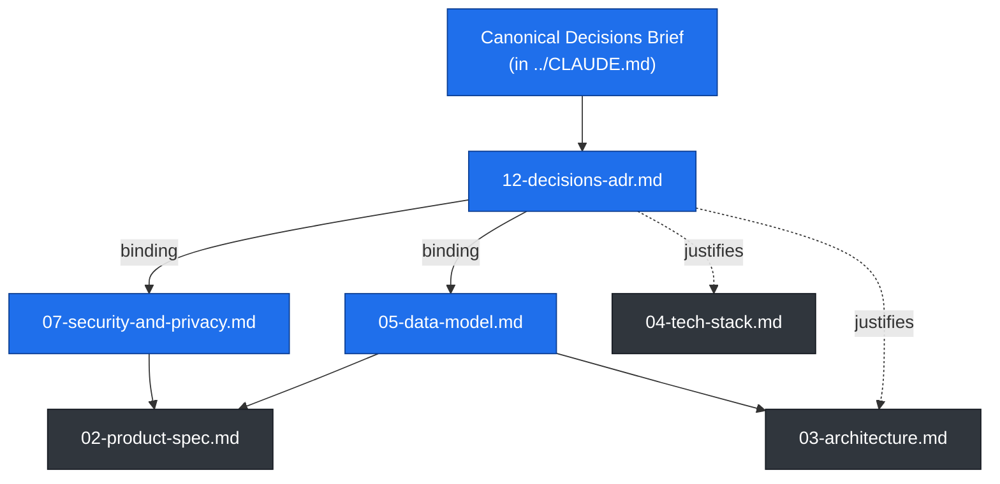

# Documentation Index & Reading Order

> The navigational hub for the Finmate documentation set: every document, its purpose, its audience, and the order to read them in — plus which docs are **normative** (binding) versus **descriptive** (context).

Finmate is a private-first, Apple-grade personal finance companion backed by Supabase — the hardened, single-design-language successor to the Substimate web app. The **lead client is native iOS** (Swift / SwiftUI); a **web client** (Vite + React 19 + TypeScript) is now in scope as a second client on the same backend contract ([`./16-web-client.md`](./16-web-client.md), [ADR-0021](./12-decisions-adr.md#adr-0021--web-client-brought-into-scope-amends-adr-0002)). The documentation set is complete, the **Supabase backend is deployment-ready** (`supabase/` migrations + Edge Functions), and the **iOS M0 foundation is built and tested** (`Packages/FinmateCore` + `App/`). These docs are the contract that senior engineers and AI coding agents build from.

Start at the root [`../CLAUDE.md`](../CLAUDE.md) — it is the single source of truth and the agent/engineer entry point. This file is its companion table of contents.

---

## How to use this set

- **Cross-links are relative.** From a file in `docs/`, link to a sibling as `./05-data-model.md` and to a root file as `../CLAUDE.md`. Keep links exact so they survive a move to GitHub Pages or an IDE preview.
- **The Canonical Decisions Brief wins.** If any document appears to contradict a locked decision (platform = native iOS, money = `Int64` minor units, one Liquid Glass language, RLS on every table, min iOS 18.0), the brief and the ADRs in [`./12-decisions-adr.md`](./12-decisions-adr.md) are authoritative. File an issue rather than silently diverging.
- **Conventions:** GitHub-Flavored Markdown, Mermaid/ASCII diagrams, task lists with checkboxes where work is enumerated, and concrete artifacts (real SQL, Swift, versions) over placeholders.

---

## The full document set

| # | Document | Title | One-line purpose | Primary audience |
|---|----------|-------|------------------|------------------|
| — | [`../CLAUDE.md`](../CLAUDE.md) | Single Source of Truth & Agent/Engineer Entry Point | Indexes everything, states the locked decisions, and tells an agent how to work in this repo. | Everyone (especially AI agents) |
| — | [`../README.md`](../README.md) | Public Project Overview | The public face: what Finmate is, status, and how to get oriented. | Public / new arrivals |
| 00 | [`./00-index.md`](./00-index.md) | Documentation Index & Reading Order | This file — the navigational hub and reading order. | Everyone |
| 01 | [`./01-vision-and-principles.md`](./01-vision-and-principles.md) | Vision, Mission & Product Principles | Why Finmate exists and the principles every decision is measured against. | Product, design, engineering |
| 02 | [`./02-product-spec.md`](./02-product-spec.md) | Product Specification — Features, Flows, Screens, Acceptance Criteria | What v1 does: each feature pillar with flows, screens, and acceptance criteria. | Product, design, engineering, QA |
| 03 | [`./03-architecture.md`](./03-architecture.md) | System & Client Architecture | The module graph, MVVM + Observation, offline-first repositories, navigation. | Engineering, AI agents |
| 04 | [`./04-tech-stack.md`](./04-tech-stack.md) | Technology Stack & Rationale | Every tool/library/version chosen and why (Swift 6, SwiftData, Supabase, Swift Charts…). | Engineering, AI agents |
| 05 | [`./05-data-model.md`](./05-data-model.md) | Domain & Data Model — Schema, RLS, Migrations | The entities, Postgres schema, RLS policies, triggers, and migrations. **Normative.** | Engineering, AI agents, security |
| 06 | [`./06-design-system.md`](./06-design-system.md) | Liquid Glass Design System | Tokens, Liquid Glass primitives + Materials fallback, components, charts, motion, a11y. | Design, engineering |
| 07 | [`./07-security-and-privacy.md`](./07-security-and-privacy.md) | Security, Privacy & Hardening | Auth, Keychain, RLS posture, hardened RPCs, biometric lock, privacy. **Normative.** | Security, engineering, AI agents |
| 08 | [`./08-roadmap-and-milestones.md`](./08-roadmap-and-milestones.md) | Roadmap & Milestones | The M0..Mn build order that sequences the all-in-v1 scope. | Product, engineering, PM |
| 09 | [`./09-engineering-practices.md`](./09-engineering-practices.md) | Engineering Practices & Quality Gates | Coding standards, testing strategy, CI/CD, Definition of Done. | Engineering, AI agents |
| 10 | [`./10-task-backlog.md`](./10-task-backlog.md) | Task Backlog & TODOs | Concrete, checkbox-tracked tasks mapped to milestones and docs. | Engineering, AI agents, PM |
| 11 | [`./11-substimate-analysis.md`](./11-substimate-analysis.md) | Substimate Analysis & Migration Map | What Substimate did, its bugs/cruft, and the KEEP / IMPROVE / CUT mapping. | Engineering, product, AI agents |
| 12 | [`./12-decisions-adr.md`](./12-decisions-adr.md) | Architecture Decision Records (ADRs) | The numbered, dated record of binding decisions and their rationale. **Normative.** | Everyone (especially AI agents) |
| 13 | [`./13-algorithms-and-calculations.md`](./13-algorithms-and-calculations.md) | Algorithms & Calculations | Every algorithm, calculation, conversion, parser, and statistic — with formulas, Swift signatures, and worked test vectors. | Engineering, AI agents, QA |
| 14 | [`./14-visualizations-and-charts.md`](./14-visualizations-and-charts.md) | Visualizations & Charts | Every chart/diagram and the custom money-flow (Sankey) renderer, with render specs and accessibility. | Design, engineering, AI agents |
| 15 | [`./15-deployment.md`](./15-deployment.md) | Deployment Runbook | How to deploy the Supabase backend (migrations, Edge Functions, secrets, environments) in a few commands. | Engineering, ops, AI agents |
| 16 | [`./16-web-client.md`](./16-web-client.md) | Web Client — Architecture & Plan | The Vite + React 19 + TypeScript web client: stack, shared backend contract, structure, Liquid Glass parity in CSS, auth, secrets, build/deploy. | Engineering, AI agents |

---

## Normative vs. descriptive

Not all docs carry the same weight. Treat the **normative** documents as binding constraints — code is correct only if it matches them. The **descriptive** documents explain, justify, and contextualize, but the moment they conflict with a normative doc, the normative doc wins.

- **Normative (binding — match these exactly):**
  - [`./12-decisions-adr.md`](./12-decisions-adr.md) — the locked decisions and their authority. Supersedes any contradicting prose elsewhere.
  - [`./05-data-model.md`](./05-data-model.md) — schema, field names, money-as-`Int64`-minor-units, RLS policies, triggers, migrations. The database contract.
  - [`./07-security-and-privacy.md`](./07-security-and-privacy.md) — Keychain token storage, RLS-on-every-table, hardened `SECURITY DEFINER` RPCs, biometric lock, privacy/App Store requirements.
- **Descriptive (explanatory — follow in spirit, defer to normative on conflict):**
  - [`../README.md`](../README.md), [`./00-index.md`](./00-index.md), [`./01-vision-and-principles.md`](./01-vision-and-principles.md), [`./11-substimate-analysis.md`](./11-substimate-analysis.md).
- **Operative (the work to do — turn the above into product):**
  - [`./02-product-spec.md`](./02-product-spec.md), [`./03-architecture.md`](./03-architecture.md), [`./04-tech-stack.md`](./04-tech-stack.md), [`./06-design-system.md`](./06-design-system.md), [`./08-roadmap-and-milestones.md`](./08-roadmap-and-milestones.md), [`./09-engineering-practices.md`](./09-engineering-practices.md), [`./10-task-backlog.md`](./10-task-backlog.md), [`./13-algorithms-and-calculations.md`](./13-algorithms-and-calculations.md), [`./14-visualizations-and-charts.md`](./14-visualizations-and-charts.md), [`./15-deployment.md`](./15-deployment.md), [`./16-web-client.md`](./16-web-client.md).

> Dependency note: `02-product-spec`, `03-architecture`, and `06-design-system` all read **downstream** of the data model and security docs. When the schema or the security posture changes, update [`./05-data-model.md`](./05-data-model.md) / [`./07-security-and-privacy.md`](./07-security-and-privacy.md) **first**, then propagate to the operative docs and record the change as a new ADR in [`./12-decisions-adr.md`](./12-decisions-adr.md).

---

## Recommended reading orders

Pick the path that matches your role. Each path is ordered; later docs assume the earlier ones.

### (a) New engineer — full onboarding

You want the whole picture before touching code.

1. [`../README.md`](../README.md) — what Finmate is, in plain terms.
2. [`../CLAUDE.md`](../CLAUDE.md) — the single source of truth and the locked decisions.
3. [`./01-vision-and-principles.md`](./01-vision-and-principles.md) — the "why" and the principles.
4. [`./11-substimate-analysis.md`](./11-substimate-analysis.md) — the predecessor, its lessons, and the KEEP/IMPROVE/CUT map.
5. [`./02-product-spec.md`](./02-product-spec.md) — what we're building.
6. [`./03-architecture.md`](./03-architecture.md) — how the client is structured.
7. [`./04-tech-stack.md`](./04-tech-stack.md) — the tools and versions.
8. [`./05-data-model.md`](./05-data-model.md) — the data contract (normative).
9. [`./06-design-system.md`](./06-design-system.md) — the Liquid Glass language.
10. [`./07-security-and-privacy.md`](./07-security-and-privacy.md) — the hard security requirements (normative).
11. [`./09-engineering-practices.md`](./09-engineering-practices.md) — how we write, test, and ship.
12. [`./08-roadmap-and-milestones.md`](./08-roadmap-and-milestones.md) → [`./10-task-backlog.md`](./10-task-backlog.md) → [`./12-decisions-adr.md`](./12-decisions-adr.md) — where to start and the decision history.

### (b) AI coding agent — picking up a single task

You have a scoped task and need just enough binding context to implement it correctly.

1. [`../CLAUDE.md`](../CLAUDE.md) — orient, then jump straight to the relevant doc it indexes.
2. [`./10-task-backlog.md`](./10-task-backlog.md) — find your task and its acceptance criteria / linked docs.
3. [`./12-decisions-adr.md`](./12-decisions-adr.md) — confirm no decision constrains your approach (normative).
4. [`./05-data-model.md`](./05-data-model.md) — exact field names, types, constraints if you touch data (normative).
5. [`./07-security-and-privacy.md`](./07-security-and-privacy.md) — required if you touch auth, tokens, RPCs, or RLS (normative).
6. [`./03-architecture.md`](./03-architecture.md) — which module the code belongs in and which layer may depend on which.
7. [`./06-design-system.md`](./06-design-system.md) — if you render UI, use existing tokens/components; do not invent styles.
8. [`./09-engineering-practices.md`](./09-engineering-practices.md) — satisfy the Definition of Done (tests, lint, concurrency) before opening a PR.

> Agent rule of thumb: read the **normative** docs in full for anything they govern; skim the operative docs only for the section you touch.

### (c) Designer

You're shaping the look, feel, motion, and accessibility.

1. [`./01-vision-and-principles.md`](./01-vision-and-principles.md) — the product north star.
2. [`./06-design-system.md`](./06-design-system.md) — the one Liquid Glass language (with Materials fallback), tokens, components, motion, a11y.
3. [`./02-product-spec.md`](./02-product-spec.md) — the screens and flows the design must serve.
4. [`./11-substimate-analysis.md`](./11-substimate-analysis.md) — why the 9 competing styles were cut to one.
5. [`./03-architecture.md`](./03-architecture.md) (navigation + TabView IA section) — how screens connect.
6. [`./07-security-and-privacy.md`](./07-security-and-privacy.md) (privacy lock + appearance) — design constraints from the biometric lock and accessibility/contrast requirements.

### (d) Security reviewer

You're auditing the security posture against the hardening requirements.

1. [`./07-security-and-privacy.md`](./07-security-and-privacy.md) — the full posture (normative): Keychain, RLS, hardened RPCs, biometric lock, ATS/pinning, privacy.
2. [`./05-data-model.md`](./05-data-model.md) — verify RLS on every table, owner-only policies via `auth.uid()`, `SECURITY DEFINER` RPC hardening, CHECK constraints (normative).
3. [`./12-decisions-adr.md`](./12-decisions-adr.md) — the security-relevant ADRs (anon-key-only client, secrets in Edge Functions, server-side market data).
4. [`./11-substimate-analysis.md`](./11-substimate-analysis.md) — the security patterns carried over and the client-side-secrets/float-money/pre-store-conversion issues being fixed.
5. [`./03-architecture.md`](./03-architecture.md) — the DataLayer / Edge Function boundary that keeps provider secrets server-side.
6. [`./09-engineering-practices.md`](./09-engineering-practices.md) — CI security gates (Gitleaks secret scan, dependency review, SwiftLint/swift-format).

---

## At a glance: which docs to touch for common changes

| If you're changing… | Update first (normative) | Then propagate to | And record in |
|---------------------|--------------------------|-------------------|---------------|
| A table / field / RLS policy | [`./05-data-model.md`](./05-data-model.md) | [`./02-product-spec.md`](./02-product-spec.md), [`./03-architecture.md`](./03-architecture.md) | [`./12-decisions-adr.md`](./12-decisions-adr.md) |
| Auth, tokens, RPC hardening | [`./07-security-and-privacy.md`](./07-security-and-privacy.md) | [`./03-architecture.md`](./03-architecture.md), [`./09-engineering-practices.md`](./09-engineering-practices.md) | [`./12-decisions-adr.md`](./12-decisions-adr.md) |
| A feature's scope or flow | [`./02-product-spec.md`](./02-product-spec.md) | [`./08-roadmap-and-milestones.md`](./08-roadmap-and-milestones.md), [`./10-task-backlog.md`](./10-task-backlog.md) | [`./12-decisions-adr.md`](./12-decisions-adr.md) if architectural |
| Visual language / components | [`./06-design-system.md`](./06-design-system.md) | [`./02-product-spec.md`](./02-product-spec.md) | [`./12-decisions-adr.md`](./12-decisions-adr.md) if a design principle |
| A library / version / pattern | [`./04-tech-stack.md`](./04-tech-stack.md) | [`./03-architecture.md`](./03-architecture.md), [`./09-engineering-practices.md`](./09-engineering-practices.md) | [`./12-decisions-adr.md`](./12-decisions-adr.md) |
| An algorithm / calculation / conversion | [`./13-algorithms-and-calculations.md`](./13-algorithms-and-calculations.md) | [`./09-engineering-practices.md`](./09-engineering-practices.md) (test vectors) | [`./12-decisions-adr.md`](./12-decisions-adr.md) if a method changes |
| A chart / visualization / diagram | [`./14-visualizations-and-charts.md`](./14-visualizations-and-charts.md) | [`./06-design-system.md`](./06-design-system.md) | — |
| Backend schema / migration / Edge Function deploy | [`./05-data-model.md`](./05-data-model.md) + `supabase/` | [`./15-deployment.md`](./15-deployment.md) | [`./12-decisions-adr.md`](./12-decisions-adr.md) if infra |

---

## Related documents

- [`../CLAUDE.md`](../CLAUDE.md) — the single source of truth; read it before this index has full meaning.
- [`./12-decisions-adr.md`](./12-decisions-adr.md) — the binding decision record that resolves any conflict between docs.
- [`./05-data-model.md`](./05-data-model.md) and [`./07-security-and-privacy.md`](./07-security-and-privacy.md) — the other normative docs every change must respect.
- [`./08-roadmap-and-milestones.md`](./08-roadmap-and-milestones.md) and [`./10-task-backlog.md`](./10-task-backlog.md) — where to go once you know what you're building.
