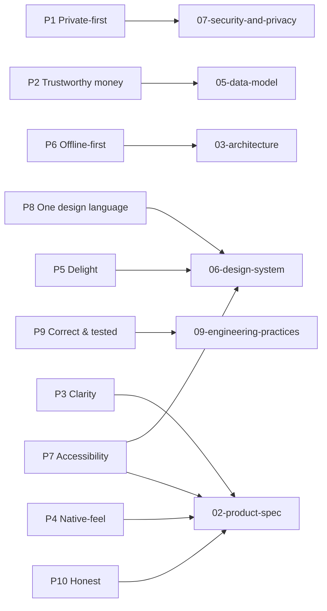

# Vision, Mission & Product Principles

> The "why" of Finmate: who it serves, what makes it worth building, the principles every screen and pull request must honor, and the concrete, testable definition of a great v1.

---

## 1. One-sentence pitch

**Finmate is a private-first, Apple-grade personal-finance companion for iPhone that turns the scattered reality of subscriptions, spending, income, assets, and currency into one calm, trustworthy, beautifully-glassed picture — entirely under your control, working offline, owned by you.**

---

## 2. Vision

We believe people deserve a finance app that is **honest, private, and delightful** — not one that monetizes their attention, sells their transaction history, or buries the truth of their money under dark-pattern upsells and ad-funded "insights."

Finmate's vision is to be **the most trustworthy and beautiful way to understand your recurring financial life on iPhone**: where every euro, dollar, and satoshi is accounted for to the cent, where the interface feels like it was carved out of the operating system itself, and where the user — not a data broker, not an advertiser, not even us — is the owner of their data.

Finmate is the native, hardened, single-design-language successor to **Substimate** (the existing React 19 + Vite + Supabase web app). It keeps the entire product vision of Substimate — subscriptions, spending, income, assets, currency-aware planning — and reimagines it as a flawless iOS-26 **Liquid Glass** experience, fixing the engineering debt that made Substimate a portfolio prototype rather than a product people trust with their money.

> Substimate proved the *domain*. Finmate makes it *trustworthy*: correct money math, one design language, offline-first, real test coverage, server-side secrets.

---

## 3. Mission

**Give individuals a calm, precise, private command center for their recurring money — so they always know what they pay, what they earn, what they own, and what's coming next — without ever surrendering their data.**

Concretely, in v1 that means a user can, in under a minute and entirely on their own device:

- See **every subscription** they pay for, with exact per-period cost, next charge date, category, usage state, and lifetime spend.
- Understand **money flow** — income in, fixed and variable expenses out, what's left — through native charts and a money-flow (Sankey) visualization.
- Look at a **payday calendar** that shows income arriving and charges landing on the same timeline.
- Track **assets and investments** (including a BTC/satoshi calculator) alongside everyday spending.
- Work in **EUR, USD, or BTC (satoshis)** with correct minor-unit math, no silent currency rewriting.
- Do all of the above **offline**, with changes syncing the moment connectivity returns.

---

## 4. Target users & primary jobs-to-be-done

Finmate is a **single-user, personal** tool. There is no team, household, or advisor mode in v1 (see [Non-goals](#9-non-goals-for-v1)).

### 4.1 Primary personas

| Persona | Who they are | What hurts today | What they want from Finmate |
| --- | --- | --- | --- |
| **The Subscription-Aware Professional** ("Mara", 32, designer) | Tech-comfortable, 15–40 active subscriptions, multiple cards, occasional USD/EUR mixing. | Forgets what auto-renews; surprised by price hikes; no single number for "monthly burn." | A trustworthy monthly-cost total, price-change history, and a glanceable next-charge calendar. |
| **The Multi-Currency / Crypto-Curious Saver** ("Tariq", 28, contractor) | Earns in more than one currency, holds some BTC, thinks in both fiat and sats. | Apps mangle non-base currencies; crypto value is a separate mental silo. | Correct per-currency math, a fiat↔sats calculator, assets and subscriptions in one view. |
| **The Privacy-Conscious Planner** ("Lena", 41, engineer) | Refuses bank-aggregation apps on principle; manually curious about cash flow. | Mainstream finance apps demand bank logins and sell data; spreadsheets are tedious and ugly. | A gorgeous, offline-capable, no-bank-link, no-tracker tool she manually feeds and fully owns. |

These three share one trait: **they will not link a bank account, and they care about correctness and privacy.** Finmate is built for them, not for users who want automatic bank import (a deliberate non-goal — see §9).

### 4.2 Jobs-to-be-done (JTBD)

Framed as "When ___, I want to ___, so I can ___." Each JTBD maps to a v1 feature pillar and is the seed of acceptance criteria in [`02-product-spec.md`](./02-product-spec.md).

| # | When… | I want to… | So I can… | v1 pillar |
| --- | --- | --- | --- | --- |
| J1 | I sign up for yet another service | quickly record the subscription with its cost, period, and category | know my true recurring burn | Subscriptions |
| J2 | I review my month | see monthly total, lifetime spend, category split, and usage waste | cancel what I don't use | Analytics |
| J3 | I get paid and pay bills | place income and expenses on one timeline | never be caught short before payday | Payday Calendar |
| J4 | I want the full picture | see income → expenses → leftover as a money-flow diagram | understand where money actually goes | Cash Flow / Cost Tracker |
| J5 | I migrate from a spreadsheet or Substimate | import a CSV with preview and validation | onboard without re-typing everything | CSV Import |
| J6 | I think about net worth | track assets, quantities, purchase vs current value, and transactions | see investments beside spending | Assets/Investments |
| J7 | I think in Bitcoin | convert fiat ↔ satoshis with live market data | reason in sats without a separate app | BTC Calculator |
| J8 | I earn or spend in several currencies | record amounts in their native currency and view a chosen display currency | avoid currency confusion and rounding loss | Multi-currency |
| J9 | I open the app in public | lock it behind Face ID and pick light/dark/system | keep my finances private and comfortable | Settings / Privacy |

---

## 5. Core value proposition

Finmate wins on the intersection of **four** things that competitors rarely deliver together:

1. **Trustworthy money handling.** Money is stored as **integer minor units** (`Int64` cents / satoshis) plus an ISO currency code — never `Double`/`Float`. Computation uses `Decimal` through a dedicated `Money` value type. Amounts are recorded in their **native** currency and never silently rewritten on save. This is a deliberate fix of three Substimate bugs (float money, pre-store currency conversion, duplicate field names) — see [`11-substimate-analysis.md`](./11-substimate-analysis.md).
2. **Apple-grade craft.** One cohesive **Liquid Glass** design language (iOS 26 `glassEffect` / `GlassEffectContainer`, `.glass` / `.glassProminent` buttons, scroll-edge effects), with **graceful fallback** to system Materials on iOS 18–25. Native SwiftUI, Swift Charts, SF Symbols, haptics, motion, and full accessibility — not a web view in a shell. See [`06-design-system.md`](./06-design-system.md).
3. **Genuine privacy.** No bank aggregation, no third-party trackers, no PII in logs, the public anon key as the only secret in the bundle, tokens in the **Keychain**, Row-Level Security on **every** table, optional Face ID app lock, and in-app **data export + account deletion**. See [`07-security-and-privacy.md`](./07-security-and-privacy.md).
4. **Works offline, syncs cleanly.** An **offline-first** local cache (SwiftData behind repository protocols) serves reads instantly; writes are optimistic and sync to Supabase (the source of truth) with a documented **last-write-wins-per-field via `updated_at`** conflict policy. See [`03-architecture.md`](./03-architecture.md).

### The Finmate promise (memorable form)

> **Correct to the cent. Calm to the eye. Private by default. Yours, even offline.**

---

## 6. Positioning vs Substimate

Finmate is **the same product vision, rebuilt to be trustworthy and native.** It is explicitly *not* a port of the Substimate codebase; it reuses the Supabase backend *contract* (schema shape, RLS model, hardened RPCs, Edge Functions, generated types) and the domain knowledge, and rebuilds the client from scratch in Swift.

The detailed file-by-file migration map lives in [`11-substimate-analysis.md`](./11-substimate-analysis.md). At the vision level:

### 6.1 What stays (the proven core)

- **All feature pillars and the domain model**: subscriptions + analytics, income & expenses, cost-tracker money-flow, payday calendar, CSV import (with validation + preview), assets/investments, BTC calculator, multi-currency, settings/theming.
- **The security model**: Supabase managed Postgres + Auth + **RLS on every table** deriving ownership from `auth.uid()`, plus **hardened SECURITY DEFINER RPCs** (`SET search_path = public`, `REVOKE ALL FROM PUBLIC`, `GRANT EXECUTE TO authenticated`, per-row owner checks). Substimate already ships exactly these patterns; Finmate keeps and tightens them.
- **Subscription price history** auto-written by a database trigger on price/currency change.
- **Optimistic updates with clear feedback** (Substimate's toast/optimistic pattern), reimagined natively.
- **The customizable, draggable dashboard** concept.

### 6.2 What gets dramatically better

| Dimension | Substimate (today) | Finmate (v1) |
| --- | --- | --- |
| **Money type** | `monthly_cost` as floating point; client converts non-EUR to EUR **before storing** while keeping the original currency label (a correctness bug) | `Int64` minor units + ISO currency, native-currency storage, `Decimal` math, `Money` value type — **no float, no pre-store conversion** |
| **Field naming** | Dual cruft: `amount` vs `monthlyCost`, `favorite` (DB) vs `isFavorite` (client) | **Single canonical names** in a clean domain model (snake_case in Postgres, camelCase in Swift) |
| **Design language** | **9 competing styles** (aurora, brutalist, claymorphism, glassmorphism, minimal, modern, neobrutalist, neumorphism, retro) + CSS-variable theme sprawl | **One** Liquid Glass language, light/dark/system only |
| **Platform** | Responsive web; sidebar **plus** a separate mobile menu | Native iPhone app; one **TabView** information architecture, no dual nav |
| **Charts** | Recharts 3 + D3-Sankey (web libs) | **Swift Charts** (native) + a custom Canvas/Path money-flow renderer |
| **Market data** | Fetched **from the client** (BTC calculator) | Fetched **server-side via a Supabase Edge Function** — provider keys never touch the device |
| **Sync model** | Online-only React state + Supabase Realtime | **Offline-first** cache + optimistic writes + documented conflict resolution |
| **Tests** | Essentially none for money/conversion/import (a stated gap) | **Real automated coverage** for money math, currency conversion, analytics aggregation, CSV parsing; snapshot + UI tests |
| **Accessibility** | Incidental | **First-class**: Dynamic Type, VoiceOver, reduce-motion, contrast — an acceptance gate, not an afterthought |
| **Secrets** | Public anon key in client (correct) | Same, **plus** all provider secrets confined to Edge Function environment; tokens in Keychain |

### 6.3 What gets cut

- **The 9 visual styles** → one Liquid Glass language.
- **Web-specific layout cruft** (sidebar + mobile-menu split, responsive breakpoints, CSS duplication).
- **All backwards-compatibility shims** and dual field-name handling.

> Positioning summary: *Substimate showed it could be built. Finmate makes it something you'd trust with your money and proud to keep on your Home Screen.*

---

## 7. Product principles

These are the non-negotiable rules every screen, component, schema change, and pull request must honor. Each is **testable** — phrased so a reviewer can say yes/no. They are referenced from the Definition of Done in [`09-engineering-practices.md`](./09-engineering-practices.md).

### P1 — Private-first
The user owns their data; we are custodians, not owners.
- No bank aggregation, no third-party analytics SDKs, no advertising IDs, no PII in logs or crash reports.
- Only the **public anon key** ships in the bundle; provider secrets live in Edge Function environment.
- Auth tokens in the **Keychain**, never `UserDefaults`. RLS on **every** table.
- In-app **data export** and **account deletion** are shipped, not promised.
- **Test:** a release build, decompiled, contains no service-role key or provider secret; `grep`-style secret scan (Gitleaks) passes; the App Privacy nutrition label matches reality.

### P2 — Trustworthy money handling
Money correctness is sacred.
- Money is **`Int64` minor units + ISO currency code**; never `Double`/`Float`; computation via `Decimal`/`Money`.
- Amounts are stored in their **native currency**; display conversion happens at the view layer only and is never persisted as a rewrite.
- Rounding rules are explicit and tested; satoshis use `satsPerBTC = 100_000_000`.
- **Test:** unit tests cover minor-unit round-tripping, multi-currency aggregation, and BTC↔fiat conversion; no `Double` appears on any money path (lint rule); a value entered in USD reads back as USD with identical magnitude.

### P3 — Clarity over density
Every screen answers one primary question first.
- A user gets the headline number (e.g., monthly burn, leftover this month) before any breakdown.
- We prefer whitespace, hierarchy, and progressive disclosure over cramming.
- **Test:** each primary screen has a single, identifiable "hero" answer reachable in ≤1 tap from its tab; usability review confirms the top question is answered above the fold.

### P4 — Native-feel
Finmate must feel like it belongs to iOS.
- SwiftUI + Observation, `NavigationStack`, `TabView`, SF Symbols, system gestures, share sheet, context menus, Dynamic Type.
- No web views for core UI; no non-native navigation metaphors; respects system appearance and Settings.
- **Test:** all core flows are native SwiftUI; the app honors light/dark/system instantly; standard iOS gestures (swipe-to-delete, pull-to-refresh, back-swipe) work where expected.

### P5 — Delight through motion & haptics
Polish is a feature, used with restraint.
- Purposeful transitions, Liquid Glass depth, and haptic feedback on meaningful actions (add, delete, sync-complete).
- Motion is tasteful and **always** yields to Reduce Motion.
- **Test:** key actions emit appropriate `UINotificationFeedbackGenerator`/`UIImpactFeedbackGenerator` feedback; enabling Reduce Motion removes or simplifies every non-essential animation; no animation blocks interaction.

### P6 — Offline-first
The app is fully usable without a connection.
- Local cache serves reads instantly; writes are optimistic; sync resumes automatically on reconnect.
- Conflicts resolve **last-write-wins per field via `updated_at`**, documented and tested.
- Sync/connectivity state is honestly surfaced (e.g., "Saved · syncing").
- **Test:** in Airplane Mode a user can add/edit/delete a subscription and navigate analytics; on reconnect the change appears in Supabase; a simulated conflict resolves per policy.

### P7 — Accessibility as a feature
Accessibility is an acceptance gate, not a retrofit.
- Full Dynamic Type (including the largest accessibility sizes), VoiceOver labels/traits/values, Reduce Motion, sufficient contrast in **both** themes, minimum 44×44pt targets.
- Charts have accessible audio/summary representations where feasible.
- **Test:** VoiceOver can complete every JTBD flow; the largest Dynamic Type size does not clip or truncate primary content; contrast meets WCAG AA in light and dark.

### P8 — One cohesive design language
There is exactly one Finmate look.
- Liquid Glass on iOS 26+, automatic Materials fallback on iOS 18–25; light/dark/system only.
- No competing themes, no per-screen style forks; all surfaces draw from the shared `DesignSystem` tokens and primitives.
- **Test:** there is a single design-token source; no view defines ad-hoc colors/typography outside `DesignSystem`; snapshot tests cover both themes and the fallback path.

### P9 — Correct, tested, and observable
We ship logic that is proven, not hoped.
- All pure logic (money math, currency conversion, analytics aggregation, CSV import parsing) has unit tests (Swift Testing / XCTest).
- Structured logging via OSLog (no PII); typed throwing errors; no force-unwraps on production paths.
- **Test:** CI runs build + test + SwiftLint + swift-format + Gitleaks and they pass; coverage exists for every pure-logic module listed above.

### P10 — Honest, no dark patterns
We never trick the user about money or their data.
- No fake urgency, no manipulative defaults, no hidden currency rewriting, no surprise data sharing.
- Destructive actions are clearly labeled and reversible where feasible (undo on delete).
- **Test:** every destructive action has confirmation or undo; displayed currency always matches stored currency or is explicitly labeled as a conversion.

### Principle-to-doc traceability

---

## 8. Design north star

Finmate's look is **Apple-like, highly polished Liquid Glass by default.** This is a deliberate, total break from Substimate's nine competing visual styles.

- **Target:** iOS 26+ Liquid Glass APIs — `glassEffect`, `GlassEffectContainer`, `glassEffectID`, `.glass` and `.glassProminent` button styles, scroll-edge effects.
- **Fallback:** automatic, graceful fall back to system Materials (`ultraThinMaterial`, `regularMaterial`, …, available since iOS 15) on iOS 18–25 so the **minimum deployment target of iOS 18.0** still feels first-class.
- **Constraints:** one cohesive language; light + dark + system appearance; custom next-level components and bespoke iconography alongside SF Symbols; motion, depth, haptics, and clarity as first-class — always subordinate to the principles in §7 (especially P3, P5, P7, P8).

The full token system, component library, Liquid Glass primitives, and fallback strategy are specified in [`06-design-system.md`](./06-design-system.md).

---

## 9. Non-goals for v1

Saying no is how v1 stays great. These are explicit, intentional exclusions — **not** statements that they will never happen. ALL nine product pillars *are* in scope for v1 (the cut is about capabilities *around* the product, not the product itself).

- [ ] **No bank / card aggregation (no Plaid, Tink, TrueLayer, Finicity).** Data is entered manually or via CSV import. This is core to the privacy positioning, not a temporary limitation; it directly serves the privacy-conscious persona.
- [ ] **No multi-user / sharing / household mode.** Finmate v1 is strictly single-user, single-owner; RLS scopes everything to one `auth.uid()`. No shared budgets, no collaborators, no advisor access.
- [ ] **iOS is the lead client; the web follows it.** A web client is **now in scope** as a *separate second client after the iOS foundation* — Vite + React 19 + TypeScript reusing the same Supabase backend contract and the [`./13-algorithms-and-calculations.md`](./13-algorithms-and-calculations.md) algorithms, in the same Liquid Glass language (see [`./16-web-client.md`](./16-web-client.md), [`./12-decisions-adr.md`](./12-decisions-adr.md#adr-0021--web-client-brought-into-scope-amends-adr-0002)). It is not a shared UI codebase, and it does not change the iOS-first sequencing: the polished iPhone app ships first.
- [ ] **No iPad / Mac Catalyst as a v1 target.** iPhone, mobile-only for now. iPad/Mac are post-v1 considerations.
- [ ] **No Android / cross-platform UI framework.** No React Native, no Flutter — native Swift/SwiftUI only.
- [ ] **No automated budgeting/AI advice or predictive forecasting engine in v1.** v1 reports the truth of recorded data; it does not give financial advice or auto-categorize via ML.
- [ ] **No remote/server-driven push or email reminder service in v1.** Opt-in, permission-gated **local notifications** for upcoming charges and upcoming paydays **are** in v1 (roadmap M4; ADR-0013). Only a server-side push or email reminder service is the post-v1 non-goal.
- [ ] **No tax, invoicing, or business-accounting features.** Finmate is a personal finance companion, not bookkeeping software.
- [ ] **No fiat payments / no on-app purchasing of subscriptions.** Finmate tracks money; it never moves money.
- [ ] **No live crypto trading or wallet integration.** The BTC calculator converts fiat ↔ sats using read-only market data via an Edge Function; it does not connect wallets or execute trades.

Each non-goal is revisitable by the product owner; the milestone plan in [`08-roadmap-and-milestones.md`](./08-roadmap-and-milestones.md) tracks post-v1 candidates.

---

## 10. Success metrics & definition of a great v1

We measure success **without violating P1 (Private-first)**: no third-party analytics SDKs and no PII. Metrics are either (a) opt-in, privacy-preserving, aggregate signals, or (b) engineering quality gates we control directly in CI and review. We do **not** ship behavioral trackers to compute these.

### 10.1 Product quality bar (qualitative, must be true)

A great Finmate v1 is one where:

- A new user completes onboarding (currency + appearance + optional biometric lock) and adds their first subscription **in under 2 minutes**.
- Every JTBD (J1–J9 in §4.2) is completable, end-to-end, on a real device.
- The app is **indistinguishable from a first-party Apple app** in feel: Liquid Glass on iOS 26, Materials fallback on iOS 18–25, instant theme switching, native gestures, haptics.
- The app is **fully usable in Airplane Mode** and reconciles correctly on reconnect.
- Money is **correct to the cent** across EUR, USD, and BTC, with zero float on money paths.

### 10.2 Engineering & release gates (binary, CI-enforced)

These are owned by us and verified every PR / release — the spine of "great."

- [ ] All CI checks green: build, **Swift 6 strict-concurrency** compile, unit tests, SwiftLint, swift-format, **Gitleaks** secret scan, dependency review.
- [ ] Unit-test coverage exists for **every** pure-logic module: money math, currency conversion, analytics aggregation, CSV import parsing.
- [ ] Snapshot tests cover the `DesignSystem` in light + dark + Materials-fallback.
- [ ] XCUITest covers the critical flows: sign-in, add subscription, CSV import, currency switch, app-lock.
- [ ] Zero force-unwraps on production paths; typed throwing errors; structured OSLog with **no PII**.
- [ ] Release build contains **no** service-role key or provider secret (verified by scan + manual review).
- [ ] App Privacy nutrition label is accurate; **data export** and **account deletion** are functional in-app.

### 10.3 Reliability & performance targets (measurable on-device)

| Metric | Target |
| --- | --- |
| Cold launch to interactive (iPhone 13 or newer) | ≤ 1.5 s |
| First-screen data shown from cache (offline) | ≤ 300 ms perceived |
| Optimistic write reflected in UI | ≤ 100 ms |
| Crash-free sessions (TestFlight cohort) | ≥ 99.5% |
| Frame rate on scroll/animation (core screens) | sustained 60 fps (120 fps on ProMotion where feasible) |
| Sync reconciliation after reconnect | ≤ 5 s for a typical dataset (≤ 200 records) |

### 10.4 Privacy-preserving adoption signals (opt-in, aggregate only)

If — and only if — the user opts in, we may collect **anonymous, aggregate, non-PII** signals (e.g., via App Store Connect analytics or an opt-in, self-hosted counter on Supabase). Candidate signals for "a great v1":

| Signal | Why it indicates success | Source |
| --- | --- | --- |
| Onboarding completion rate | Onboarding is clear and fast | App Store Connect / opt-in |
| Day-7 / Day-30 retention | Users find ongoing value | App Store Connect (aggregate) |
| Median subscriptions tracked per active user | Users actually populate the app | Opt-in aggregate |
| Share of sessions used offline | Offline-first delivers real value | Opt-in aggregate |
| TestFlight crash-free rate & average rating | Quality and trust | App Store Connect |

> No signal in this table requires per-user behavioral tracking, and none ships a third-party SDK. If a metric cannot be measured without violating P1 or P10, **we do not measure it.**

---

## 11. Anti-vision (how we'd fail)

Stating failure modes keeps the team honest. Finmate has failed if:

- It asks the user to link a bank account "for convenience."
- It ships a second visual theme "because users asked."
- A single euro is ever stored or computed as a `Double`.
- Market-data or any provider key appears in the app bundle.
- A screen looks great in light mode and breaks in dark mode or at the largest Dynamic Type size.
- Money is unreadable, or the app is unusable, without a network connection.
- We add an analytics SDK that phones home with anything resembling PII.

---

## Related documents

- [`../CLAUDE.md`](../CLAUDE.md) — Single Source of Truth & entry point; indexes the full docs set.
- [`./00-index.md`](./00-index.md) — Documentation index & recommended reading order.
- [`./02-product-spec.md`](./02-product-spec.md) — Features, flows, screens, and acceptance criteria that operationalize the JTBD here.
- [`./03-architecture.md`](./03-architecture.md) — How offline-first, MVVM, and the repository/sync model realize P6.
- [`./05-data-model.md`](./05-data-model.md) — Schema, RLS, and the `Money` / minor-units model behind P2.
- [`./06-design-system.md`](./06-design-system.md) — The single Liquid Glass design language (P5, P7, P8) and §8.
- [`./07-security-and-privacy.md`](./07-security-and-privacy.md) — The hardened posture behind P1 and P10.
- [`./08-roadmap-and-milestones.md`](./08-roadmap-and-milestones.md) — Build order (M0..Mn) and post-v1 candidates for the non-goals in §9.
- [`./09-engineering-practices.md`](./09-engineering-practices.md) — Quality gates and the Definition of Done enforcing P9 and §10.2.
- [`./11-substimate-analysis.md`](./11-substimate-analysis.md) — Detailed Substimate → Finmate migration map behind §6.
- [`./12-decisions-adr.md`](./12-decisions-adr.md) — ADRs recording the locked decisions referenced throughout.
