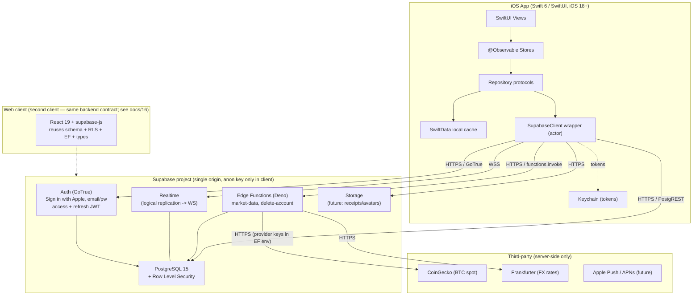
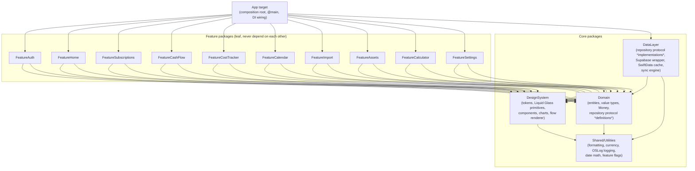

# System & Client Architecture

> The architecture reference for Finmate: how the native iOS app, the Supabase backend, and a future web client fit together — and how the SwiftUI client is structured internally (modules, MVVM data flow, offline-first sync, navigation, DI, and concurrency).

This document is the canonical reference for **structure**. It describes the **target** architecture for v1. **No application code exists yet** — every module name, file path, type, and snippet below is a *specification of what will be built*, not a description of existing code. Snippets are illustrative shapes intended to be implemented faithfully, not copy-paste-final.

For the *why* behind individual decisions, see [`./12-decisions-adr.md`](./12-decisions-adr.md). For the technology choices and versions, see [`./04-tech-stack.md`](./04-tech-stack.md). For the data schema and RLS, see [`./05-data-model.md`](./05-data-model.md).

---

## 1. Architectural goals & invariants

These are the load-bearing constraints. Any change to the architecture must preserve them or be recorded as a new ADR.

| # | Invariant | Rationale |
|---|-----------|-----------|
| A1 | **Offline-first.** The local cache is the read source; the network is never on the critical read path of a screen. | Apple-grade responsiveness; works on the subway. |
| A2 | **Supabase Postgres is the source of truth.** All durable state converges to the server. | Single authority; a future web client reuses the same contract. |
| A3 | **Ownership derives from `auth.uid()` server-side via RLS.** The client never sends a `user_id` it controls. | Hardened security posture (fixes Substimate's caller-supplied-uid RPC signatures). See [`./07-security-and-privacy.md`](./07-security-and-privacy.md). |
| A4 | **Features never import each other.** Cross-feature interaction happens through `Domain` types and the router. | Keeps the module graph acyclic and the app linkable in parallel. |
| A5 | **Repositories are protocols.** Stores depend on abstractions; SwiftData and Supabase are implementation details. | Mockable tests; swappable persistence (GRDB) and backend. |
| A6 | **Money is `Int64` minor units + ISO currency code.** Never `Double`. `Decimal` only for computation/formatting. | Fixes Substimate's float money and pre-store EUR conversion bug. |
| A7 | **`@MainActor` for UI state; actor-isolated data layer.** Swift 6 strict concurrency, zero data races. | Correctness under structured concurrency. |
| A8 | **One cohesive Liquid Glass design language** surfaced only through `DesignSystem`. | Replaces Substimate's 9 competing styles. See [`./06-design-system.md`](./06-design-system.md). |

---

## 2. System context

Finmate (the iOS client) talks to exactly one backend: a Supabase project. Supabase composes several managed services behind one origin and one anon key. The web client (a second client after the iOS foundation — see [`./16-web-client.md`](./16-web-client.md) and [ADR-0021](./12-decisions-adr.md#adr-0021--web-client-brought-into-scope-amends-adr-0002)) reuses the identical backend contract: same schema, same RLS, same Edge Functions, same generated types. This architecture document covers the iOS client; the web client's structure lives in [`./16-web-client.md`](./16-web-client.md).



**Boundary rules at the system level**

- The client ships **only the public anon key**. No service-role key, no provider secrets (CoinGecko/Frankfurter keys) in the bundle. This is a hard security requirement — Substimate called CoinGecko/Frankfurter *from the browser*; Finmate routes market data through the `market-data` Edge Function so any keys stay in Edge Function environment variables. See [`./05-data-model.md`](./05-data-model.md) and [`./07-security-and-privacy.md`](./07-security-and-privacy.md).
- All transport is HTTPS/WSS (App Transport Security; no cleartext exceptions). Optional certificate pinning for the Supabase host is a stretch hardening item.
- Auth tokens live in the **Keychain**, never `UserDefaults`. The `supabase-swift` SDK is configured with a Keychain-backed `localStorage`.

---

## 3. Client architecture — the SPM module graph

The app target is **thin** (a composition root and `@main` entry). All real code lives in local Swift Packages so modules build, test, and preview in isolation.

### 3.1 Target module graph (this is the plan, not existing code)



### 3.2 Dependency direction rules (enforced)

1. **`App` depends on everything; nothing depends on `App`.** It is the only place that knows concrete repository implementations exist.
2. **Features depend only on `Domain`, `DesignSystem`, and the *abstractions* in `Domain`** (repository protocols are *declared* in `Domain`, *implemented* in `DataLayer`). Features must **not** link `DataLayer` directly — they receive repositories as already-constructed protocol values via the SwiftUI `Environment`.
3. **Features never import other Features.** If Subscriptions needs a category picker also used by CashFlow, it lives in `DesignSystem` or `Domain`, not in a sibling feature.
4. **`DataLayer` depends on `Domain` + `Utilities`.** It maps Postgres/SwiftData rows ⇄ `Domain` entities. It never imports `DesignSystem` or any feature.
5. **`Domain` depends only on `Utilities`** (and Foundation). It has no SwiftUI, no Supabase, no SwiftData import. It is pure, fully unit-testable Swift.
6. **`Utilities` is a leaf** (Foundation/OSLog only).

> **Why repository protocols live in `Domain`, not `DataLayer`:** Features need to *name the type they depend on* without linking the implementation. Declaring `protocol SubscriptionRepository` in `Domain` lets `FeatureSubscriptions` reference it while `App` supplies the `DataLayer` concrete type. This is the dependency-inversion seam that makes A5 real.

### 3.3 Suggested `Package.swift` shape (illustrative)

```swift
// Packages/Core/Package.swift  (illustrative — to be created in M0)
let package = Package(
    name: "Core",
    platforms: [.iOS(.v18)],
    products: [
        .library(name: "Domain", targets: ["Domain"]),
        .library(name: "Utilities", targets: ["Utilities"]),
        .library(name: "DesignSystem", targets: ["DesignSystem"]),
        .library(name: "DataLayer", targets: ["DataLayer"]),
    ],
    dependencies: [
        .package(url: "https://github.com/supabase/supabase-swift", from: "2.0.0"),
    ],
    targets: [
        .target(name: "Utilities"),
        // Repository PROTOCOLS (interfaces) are compiled into Domain.
        .target(name: "Domain", dependencies: ["Utilities"]),
        .target(name: "DesignSystem", dependencies: ["Utilities"]),
        // Repository IMPLEMENTATIONS live here; DataLayer depends on Domain
        // for the protocols it conforms to. Features never link DataLayer.
        .target(name: "DataLayer", dependencies: [
            "Domain", "Utilities",
            .product(name: "Supabase", package: "supabase-swift"),
        ]),
        .testTarget(name: "DomainTests", dependencies: ["Domain"]),
        .testTarget(name: "DataLayerTests", dependencies: ["DataLayer"]),
    ]
)
```

Feature packages are separate `Package.swift` files (`Packages/Features/<Name>`) each depending on `Domain` + `DesignSystem`. Swift 6 language mode and `.enableUpcomingFeature("StrictConcurrency")` (or `swiftLanguageModes: [.v6]`) are set on every target.

---

## 4. Unidirectional MVVM data flow

Finmate uses **unidirectional MVVM** built on the Observation framework. Views render state and emit intents; an `@Observable` Store owns view state and calls repository protocols; repositories coordinate the cache and remote. Data flows down, intents flow up.

```
        intent (async method call)
   ┌──────────────────────────────────────────────┐
   │                                                │
   ▼                                                │
View ──observes──▶ @Observable Store ──awaits──▶ Repository (protocol)
(SwiftUI)          (@MainActor)                  (actor-isolated impl)
   ▲                    ▲                              │
   │                    │                       ┌──────┴───────┐
   └── state diff ──────┘                       ▼              ▼
       (Observation                       SwiftData cache   SupabaseClient
        tracks reads)                     (read source)     (source of truth)
```

### 4.1 The three layers

**View (SwiftUI, `@MainActor`).** Stateless beyond `@State` for transient UI (focus, sheet presentation). Holds the Store via `@State` (owned) or reads it from `@Environment`. Uses `@Bindable` for two-way bindings into the Store. No business logic, no networking, no formatting math — formatting comes from `Utilities`.

**Store / ViewModel (`@Observable`, `@MainActor`).** Owns `loadState` (`idle | loading | loaded | empty | failed(AppError)`) and the view's data. Exposes `async` intent methods. Calls repository protocols. Never touches SwiftData or Supabase types directly. One Store per screen or per cohesive feature surface.

```swift
// FeatureSubscriptions — illustrative
@MainActor
@Observable
final class SubscriptionsStore {
    private(set) var phase: LoadPhase<[Subscription]> = .idle
    private let repo: any SubscriptionRepository   // injected protocol

    init(repo: any SubscriptionRepository) { self.repo = repo }

    func load() async {
        phase = .loading
        do {
            // 1. instant local read (offline-first, A1)
            phase = .loaded(try await repo.cached())
            // 2. refresh from server in the background, then re-render
            for await snapshot in repo.observe() { phase = .loaded(snapshot) }
        } catch {
            phase = .failed(AppError(error))
        }
    }

    func toggleFavorite(_ id: Subscription.ID) async {
        do { try await repo.setFavorite(id, to: true) }   // optimistic inside repo
        catch { phase = .failed(AppError(error)) }
    }
}
```

**Repository (protocol in `Domain`, actor impl in `DataLayer`).** The seam. Reads come from the cache; writes are optimistic-then-synced. `observe()` returns an `AsyncStream` that yields the current cache snapshot immediately and again whenever the cache changes (local edit or sync result).

```swift
// Domain — protocol declaration
public protocol SubscriptionRepository: Sendable {
    func cached() async throws -> [Subscription]
    func observe() -> AsyncStream<[Subscription]>
    func setFavorite(_ id: Subscription.ID, to value: Bool) async throws
    func upsert(_ draft: SubscriptionDraft) async throws
    func delete(_ id: Subscription.ID, keepHistory: Bool) async throws
    func refresh() async throws            // pull from remote
}
```

> **Note on Substimate:** Substimate put all of this in React Contexts (`SubscriptionContext.tsx`) that talked to `supabase` directly and did `transformSubscription` mapping with **dual field names** (`monthlyCost`/`amount`, `isFavorite`/`favorite`). Finmate kills that duality — `Domain.Subscription` has exactly one `amountMinor: Int64` and one `favorite: Bool`. Mapping between snake_case Postgres and camelCase Swift happens **only** in `DataLayer`. See [`./11-substimate-analysis.md`](./11-substimate-analysis.md).

---

## 5. Offline-first sync engine

The sync engine lives in `DataLayer` and is shared by all repositories. It is the most subtle piece of the client, so it is specified in detail.

### 5.1 Data/sync flow diagram

```mermaid
sequenceDiagram
    participant V as View / Store (@MainActor)
    participant R as Repository (actor)
    participant C as SwiftData cache
    participant Q as MutationQueue (actor)
    participant S as SupabaseClient (actor)
    participant PG as Postgres + RLS

    Note over V,PG: READ PATH (instant, offline-capable)
    V->>R: observe()
    R->>C: fetch cached rows
    C-->>R: snapshot
    R-->>V: yield snapshot (immediate render)
    R->>S: refresh() (background)
    S->>PG: select where user_id = auth.uid()
    PG-->>S: rows
    S->>R: merged rows
    R->>C: upsert (merge by id, LWW per field)
    C-->>R: change -> yield new snapshot
    R-->>V: yield refreshed snapshot

    Note over V,PG: WRITE PATH (optimistic)
    V->>R: upsert(draft)
    R->>C: write locally (status = .pendingPush, updated_at = now)
    C-->>R: change -> yield (UI updates instantly)
    R->>Q: enqueue mutation
    Q->>S: flush -> upsert to Postgres
    alt success
        S->>PG: write (RLS check auth.uid())
        PG-->>S: server row (authoritative updated_at)
        S->>C: reconcile -> status = .synced
    else offline / failure
        S-->>Q: retry with backoff; mutation stays queued
    end
```

### 5.2 Read path

1. Store calls `repo.observe()`.
2. Repository immediately reads SwiftData and yields a snapshot — **the screen is populated without ever waiting on the network** (invariant A1).
3. In parallel, the repository triggers a `refresh()` that fetches from Postgres (scoped by RLS to `auth.uid()`), merges into the cache, and the cache change re-yields a fresh snapshot through the same `AsyncStream`.

### 5.3 Optimistic write path

1. Store calls a write intent (`upsert`, `setFavorite`, `delete`).
2. Repository writes the change to SwiftData **first**, stamping `updatedAt = Date.now` and `syncStatus = .pendingPush`. The cache change immediately re-yields, so the UI reflects the edit with zero latency (mirrors Substimate's `optimisticUpdatesRef`, but durable and offline-safe).
3. Repository enqueues a `PendingMutation` in the `MutationQueue`.
4. The sync engine flushes the queue: it pushes to Postgres via `SupabaseClient`. On success it reconciles the local row with the server's authoritative row (notably the server `updated_at`) and sets `syncStatus = .synced`. On failure it leaves the mutation queued for retry.

### 5.4 Pending-mutation queue

A persisted, ordered, deduplicated queue (its own SwiftData model so it survives app restarts and crashes). Each mutation records **the exact set of field keys it changed** and a **client mutation timestamp** so per-field last-write-wins (§5.5) is decidable without re-reading the prior row:

```swift
// DataLayer — illustrative
@Model final class PendingMutation {
    @Attribute(.unique) var id: UUID
    var entity: String          // "subscription", "fixed_expense", ...
    var entityId: UUID
    var kind: MutationKind       // .upsert | .delete
    var changedKeys: [String]    // e.g. ["amountMinor", "favorite"] — the fields this mutation touched
    var payloadJSON: Data        // encoded values for exactly the changedKeys
    var clientMutatedAt: Date    // monotonic client mutation clock (see below); persisted
    var createdAt: Date
    var attempts: Int
    var lastError: String?
}
```

- **Client mutation timestamp (`clientMutatedAt`).** A **monotonic, persisted** clock used as the local field-version stamp in conflict resolution. It is derived from a persisted monotonic source (a last-issued timestamp stored alongside the queue, advanced by at least one tick on every write) so it never goes backwards across a wall-clock adjustment, NTP correction, or app restart. It is the local-side counterpart to the server's `updated_at` (§5.5).
- **Changed-field tracking (`changedKeys`).** Each upsert records precisely which fields it wrote. This is what makes resolution **per field** rather than per row: only the keys in `changedKeys` are candidates to win against the incoming remote row.
- **Ordering:** flushed FIFO by `createdAt`, but grouped per `(entity, entityId)` so the latest payload for a row supersedes earlier queued upserts (coalescing). Coalescing **unions** the `changedKeys` and keeps the newest value (and `clientMutatedAt`) per key.
- **Retry:** exponential backoff with jitter (1s, 2s, 4s, … capped at ~5 min), reset on connectivity regain (`NWPathMonitor`).
- **Idempotency:** upserts key on the row `id` (client-generated UUID v4), so a replayed mutation is a no-op rather than a duplicate.
- **Triggers to flush:** app foreground, connectivity regained, after each local write, and a periodic background timer.

### 5.5 Conflict resolution — per-field last-write-wins (ADR-0017)

v1 uses **per-field last-write-wins (LWW)**, not per-row. When `refresh()` (or a Realtime event) brings down a server row that also has a local pending edit, the engine reconciles with this algorithm:

1. **Apply the incoming remote row** into the cache as the new baseline (every field takes the server value, and the row's `updatedAt` becomes the baseline clock).
2. **Re-apply still-pending changed-field values** on top: for each pending mutation on that `(entity, entityId)`, for each key in `changedKeys`, if the field's `clientMutatedAt` is **strictly newer** than the remote row's `updatedAt`, re-apply the local value (it stays queued for push). Otherwise the server value (already applied in step 1) stands and that key is dropped from the pending set as superseded.
3. **After a successful push**, the server `updated_at` (set by the DB `updated_at` trigger — see [`./05-data-model.md`](./05-data-model.md)) replaces `clientMutatedAt` as the field baseline, and the satisfied keys are removed from the queue.

Properties and consequences:

- The clock is **`updated_at` on the server side and `clientMutatedAt` on the local side**, compared per field. `updated_at` is decoded at full precision and is the authoritative LWW clock (see the date/timestamp decoding contract in [`./05-data-model.md`](./05-data-model.md) §8.4, and §9).
- It is intentionally simple and predictable; it can lose a concurrent edit to the *same field from another device*, which is acceptable for a single-user personal-finance app. Anything stronger (CRDTs, OT) is explicitly out of scope for v1 and would be a new ADR.

**Delta-poll cursor (`lastSyncedAt`).** A `lastSyncedAt` timestamp is **persisted per entity type** and used as the delta-poll cursor: warm refreshes query `updated_at > lastSyncedAt` rather than full-table pulls (§11). It advances to the max `updated_at` observed in a successful refresh. Realtime events do **not** advance the cursor on their own — the delta poll remains the authority so a missed Realtime event is recovered on the next poll.

**First-sync bootstrap.** When `lastSyncedAt` is unset for an entity (fresh install or post-logout cache clear), the engine performs a **full paginated fetch** before switching to delta-poll: pages of **1000 rows** ordered by `(updated_at, id)`, paging until a short page is returned, then sets `lastSyncedAt` to the max `updated_at` seen. Subsequent refreshes are delta-only.

**Tombstone lifecycle.** Deletions use soft-delete semantics during sync so a delete on device A is not resurrected by a stale refresh from device B before the push lands:

- A delete writes a **tombstone** (a `.delete` `PendingMutation` plus a tombstoned cache marker for the `id`). The tombstone is **retained until its push is confirmed by the server**, then garbage-collected.
- While a tombstone is live, an **incoming Realtime insert (or refresh row) carrying the tombstoned `id` is ignored** — the local delete has not yet been confirmed and must not be undone by a stale remote echo.
- Hard deletes are performed server-side via the hardened `delete_subscription(sub_id)` RPC, which itself re-checks `user_id = auth.uid()`. Once the RPC confirms, the tombstone is GC'd.

**SET NULL reconciliation.** When a category is deleted, dependent `category_id` FKs are `ON DELETE SET NULL` (see [`./05-data-model.md`](./05-data-model.md)). If a queued upsert for a row whose `category_id` was **set NULL server-side** is later flushed, the reconciled row **keeps the NULL** — the engine never resurrects a stale non-NULL `category_id` from the queued payload, because the deleted category no longer exists. A `category_id` that lost its referent is treated as superseded by the server and dropped from the pending changed-field set.

> **Realtime is the latency layer over the delta poll, not a separate correctness path** (ADR-0014, see §5.6). Every reconciliation above runs identically whether the trigger was a delta poll or a Realtime event.

### 5.6 Realtime subscriptions

Supabase **Realtime is in v1** (see [`./12-decisions-adr.md`](./12-decisions-adr.md) ADR-0014). It is a **latency optimization layered over the delta-poll-by-`updated_at` baseline** (§5.2/§11): the delta poll (`updated_at > lastSyncedAt`) remains the correctness and offline fallback, and Realtime simply pushes the same changes sooner. This is not an open question — the delta poll guarantees convergence on its own, and Realtime just reduces the window before a remote change appears.

For entities where multi-device freshness matters (subscriptions, expenses, income), the repository opens a Supabase Realtime channel scoped to the user. Incoming change events are funneled into the *same merge-into-cache path* as `refresh()` — Realtime is an *optimization that reduces refresh latency*, never a separate code path, and a dropped or unavailable channel degrades gracefully to the delta poll with no loss of correctness.

- Channels are opened on app foreground + authenticated, torn down on background/logout.
- Realtime events that match an in-flight local mutation (same `id`, older `updated_at`) are ignored to avoid flicker.
- `eventsPerSecond` is throttled (Substimate used 10) and events are debounced before hitting SwiftData to avoid write storms.

---

## 6. Error handling & typed errors

Errors are typed and converge to a single user-facing surface. No `try?`-swallowing on production paths; no force-unwraps.

- **`Domain.DomainError`** — validation and business-rule failures raised by `Domain` (e.g. `.invalidAmount`, `.unsupportedCurrency`, `.invalidBillingPeriod`). Pure and testable.
- **`DataLayer.DataError`** — wraps transport/persistence failures (`.network(URLError)`, `.postgrest(code:String, message:String)`, `.auth(AuthError)`, `.cache(Error)`, `.conflict`). Maps Supabase `PostgrestError` codes (e.g. `42501` RLS denial, `23514` CHECK violation, `23505` unique violation) to typed cases.
- **`AppError`** (in `Domain` or `Utilities`) — the presentation-facing error a Store stores in `phase = .failed(AppError)`. Carries a localized `title`, `message`, an optional `recovery` action, and a stable `code` for logging. Every lower-level error maps into exactly one `AppError`.

Functions use **typed throws** where the error set is closed (Swift 6): `func cached() async throws(DataError) -> [Subscription]`. The Store catches at the boundary and produces an `AppError`. Logging uses `OSLog` with privacy redaction (`Logger(subsystem: "com.finmate.app", category: "datalayer")`, `logger.error("\(code, privacy: .public) \(detail, privacy: .private)")`) — no PII in logs (security requirement). RLS denials (`42501`) are logged as a hard bug signal, never shown raw to the user.

---

## 7. Navigation & routing

Root is a `TabView` with five tabs (see IA in [`../CLAUDE.md`](../CLAUDE.md) / [`./02-product-spec.md`](./02-product-spec.md)): **Home, Subscriptions, Cash Flow, Calendar, More**. Each tab owns a `NavigationStack` driven by a typed path. A lightweight per-tab coordinator/router owns the path so deep links and programmatic navigation are testable.

```swift
// App — illustrative typed routes per tab
enum SubscriptionsRoute: Hashable {
    case detail(Subscription.ID)
    case edit(Subscription.ID)
    case priceHistory(Subscription.ID)
    case addNew
}

@MainActor @Observable
final class SubscriptionsRouter {
    var path: [SubscriptionsRoute] = []
    func show(_ r: SubscriptionsRoute) { path.append(r) }
    func popToRoot() { path.removeAll() }
}
```

```swift
NavigationStack(path: $router.path) {
    SubscriptionsListView(store: store)
        .navigationDestination(for: SubscriptionsRoute.self) { route in
            switch route {
            case .detail(let id):       SubscriptionDetailView(id: id)
            case .edit(let id):         SubscriptionEditView(id: id)
            case .priceHistory(let id): PriceHistoryView(id: id)
            case .addNew:               SubscriptionEditView(id: nil)
            }
        }
}
```

- **Tabs** are selected via a `TabRoute` enum stored on a top-level `AppRouter`; the contextual **Add (+)** action presents a route on the currently active tab's router.
- **Modals/sheets** that are not part of the back stack (Add flows, pickers) use `.sheet(item:)` driven by an optional route on the router, keeping presentation declarative.

### 7.1 Deep links — custom scheme, internal-only in v1

v1 uses the custom URL scheme **`finmate://`** for **internal navigation only** — it is *not* a public, web-clickable surface and is not advertised to users or other apps:

- A deep link (e.g. `finmate://subscription/<id>`) parses into a typed route and pushes onto the right tab's path — **one parse function, fully unit-testable**, no string-matching scattered in views.
- Its v1 role is intra-app and forward-compat plumbing (e.g. a future widget tap, an App Intent, or an in-app notification action routing to a screen), not inbound traffic from web pages or emails.
- **Universal Links** (an `applinks:` associated-domain so `https://finmate.app/...` opens the app) are **post-v1**. v1 does not register an associated domain, so there is no risk of unexpected inbound web→app routing.

**Forward-compatibility note (read models stay reusable).** Because read models are served only through repository **protocols** (A5) rather than ad-hoc data access, and a **shared App Group** is reserved at provisioning time, a future **WidgetKit timeline provider or App Intents extension** can reuse the same repositories and SwiftData cache without re-plumbing data access. The custom-scheme parser is the deep-link target those extensions would route into. This is reserved, not built, in v1 (see [`§12`](#12-what-is-explicitly-out-of-scope-for-v1-architecture)).

---

## 8. Dependency injection

DI is **constructor injection + SwiftUI Environment**, wired once in the composition root.

1. **Composition root = the `App` target.** `FinmateApp` (the `@main` struct) builds the concrete graph at launch: the `SupabaseClient` actor, the SwiftData `ModelContainer`, the `MutationQueue`, and one concrete repository per entity. This is the *only* place concrete `DataLayer` types are named.
2. **Environment injection.** Repositories (as protocol existentials, e.g. `any SubscriptionRepository`) and shared services (router, currency formatter, feature flags, `AuthSession`) are placed into the SwiftUI `Environment` via custom `EnvironmentKey`s / the `@Entry` macro. Features read them with `@Environment`.
3. **Stores receive dependencies in `init`.** A view constructs its Store from environment values (`@State private var store: SubscriptionsStore`), so the Store is testable in isolation by passing a mock repository — no global singletons.
4. **Previews & tests** build the graph with in-memory SwiftData (`ModelConfiguration(isStoredInMemoryOnly: true)`) and `Mock*Repository` conforming to the same `Domain` protocols. `DesignSystem` snapshot tests need no DataLayer at all.

```swift
// App — illustrative composition root
@main
struct FinmateApp: App {
    @State private var container: AppContainer = .live()   // builds Supabase + SwiftData + repos
    var body: some Scene {
        WindowGroup {
            RootTabView()
                .environment(\.subscriptionRepository, container.subscriptions)
                .environment(\.cashFlowRepository,     container.cashFlow)
                .environment(\.authSession,            container.authSession)
                .modelContainer(container.modelContainer)
        }
    }
}
```

There is **no third-party DI framework**; SwiftUI Environment + constructor injection is sufficient and keeps the graph visible.

---

## 9. Concurrency model

Swift 6 language mode, strict concurrency checking on every target. The rule of thumb: **UI is `@MainActor`; the data layer is its own actor; everything crossing a boundary is `Sendable`.**

| Layer | Isolation | Notes |
|-------|-----------|-------|
| Views | `@MainActor` (SwiftUI default) | Never block; only `await` intents on the Store. |
| Stores / ViewModels | `@MainActor @Observable` | Mutate published state only on the main actor; spawn `Task`s that `await` the repo. |
| Repositories | `actor` (each, or a shared `DataLayerActor`) | Serializes cache + queue access; no locks needed. |
| `SupabaseClient` wrapper | `actor` | Single owner of the SDK client; serializes token refresh. |
| `MutationQueue` | `actor` | Guarantees ordered, race-free flush. |
| SwiftData access | Via a dedicated `ModelActor` | `ModelContext` is not `Sendable`; a `@ModelActor` isolates all writes/reads off the main actor. |
| `Domain` types | value types, `Sendable` | `Money`, entities are immutable structs; trivially `Sendable`. |

- **`Domain` entities are `Sendable` value types**, so they cross actor boundaries freely (the snapshot the repo yields to the `@MainActor` Store).
- **SwiftData `ModelContext` is not `Sendable`** — all SwiftData work goes through a `@ModelActor`-isolated type in `DataLayer`. The Store never sees a `@Model`; it sees mapped `Domain` structs.
- **No `@unchecked Sendable`** on production paths without an ADR justifying it.
- **`AsyncStream`** (not Combine) is the canonical reactive primitive for `observe()`, keeping the codebase concurrency-native.

---

## 10. Recipe — adding a new feature module

This is the concrete, repeatable procedure an engineer or AI agent follows. It assumes the M0 skeleton (Section 3) exists.

- [ ] **1. Create the package.** `Packages/Features/FeatureX/` with a `Package.swift` declaring a `FeatureX` library that depends on `Domain` and `DesignSystem` only. Set iOS 18 platform and Swift 6 language mode.
- [ ] **2. Define domain types (if new).** Add entities/value types and the `XRepository` **protocol** to `Domain`. Add `DomainError` cases. Write `Domain` unit tests for any pure logic (money math, validation).
- [ ] **3. Implement the repository in `DataLayer`.** Add the SwiftData `@Model`(s), the snake_case⇄camelCase mapping, the Postgres calls via `SupabaseClient`, and wire it into the shared sync engine (read path, optimistic writes, queue, conflict resolution). Add `DataLayerTests` with in-memory SwiftData + a stub Supabase transport.
- [ ] **4. Build the Store.** `@MainActor @Observable XStore` taking `any XRepository` in `init`, exposing `phase` and `async` intents. Unit-test it against a `MockXRepository`.
- [ ] **5. Build the Views** using only `DesignSystem` components (Liquid Glass primitives, charts, the flow renderer). No raw colors/materials — tokens only (A8). Add SwiftUI previews backed by mocks; add `swift-snapshot-testing` cases for new reusable components in `DesignSystem`.
- [ ] **6. Add routing.** Define `XRoute: Hashable`, an `XRouter`, and `navigationDestination` mappings. Register any deep-link parsing.
- [ ] **7. Wire DI in `App`.** Construct the concrete repository in `AppContainer`, expose it via an `EnvironmentKey`, add the tab/entry point.
- [ ] **8. Quality gates.** SwiftLint + swift-format clean, tests green, no new force-unwraps, Gitleaks clean. See [`./09-engineering-practices.md`](./09-engineering-practices.md).

**Invariant check before merge:** `FeatureX` imports `Domain` + `DesignSystem` only (grep its `import` lines); it does **not** import `DataLayer` or any other `Feature*`. CI enforces this via a module-boundary lint.

---

## 11. Performance considerations

- **Reads never hit the network on the critical path** (A1). Screens render from SwiftData in-process; refresh is background. Target cold-list render < 16 ms/frame.
- **SwiftData query discipline:** fetch with `#Predicate` + `FetchDescriptor` `fetchLimit`/`sortBy`/`propertiesToFetch`; never load all rows to filter in Swift. If complex aggregate queries (cost-tracker flows, lifetime cost across history) strain SwiftData, the documented fallback is **GRDB/SQLite** behind the same repository protocol (A5) — a swap, not a rewrite. See [`./04-tech-stack.md`](./04-tech-stack.md).
- **Charts:** Swift Charts handles standard analytics. The **Sankey / money-flow renderer is custom** (`Canvas`/`Path` in `DesignSystem`) since Swift Charts has no Sankey — flagged as a known engineering item. Heavy flow geometry is computed off the main actor and cached.
- **Aggregations** (monthly trends, category distribution, payment-method breakdown) are pure functions in `Domain`/`Utilities`, memoized per input window so scrolling/timeframe changes don't recompute from scratch.
- **List performance:** `LazyVStack`/`List` with stable `Identifiable` ids; avoid re-identifying rows on every snapshot (diff by `id`).
- **Sync efficiency:** Realtime is debounced; refresh uses delta queries (`updated_at > lastSyncedAt`) once the cache is warm rather than full table pulls.
- **Liquid Glass cost:** `GlassEffectContainer` batches glass passes; respect `accessibilityReduceMotion`/reduce-transparency, and fall back to static Materials on iOS 18–25 (A8) to keep frame rate on older devices. See [`./06-design-system.md`](./06-design-system.md).
- **App launch:** thin app target + lazy module init; defer Realtime channel open and first refresh until after first frame.

---

## 12. What is explicitly out of scope for v1 architecture

- Cross-device real-time *collaboration* / shared accounts (single-user model only).
- CRDT/OT conflict resolution (LWW-per-field is the v1 policy, §5.5).
- The web client implementation — its architecture is in [`./16-web-client.md`](./16-web-client.md); this doc covers iOS, and only the shared backend *contract* is in scope here.
- iPad/Mac Catalyst-specific layouts (post-v1; the architecture does not preclude them).
- Push notifications via APNs (the Edge Function/notification plumbing is future work).
- **Universal Links** (associated-domain `https://finmate.app/...` → app). v1 ships only the internal-use custom scheme `finmate://` (§7.1).
- **WidgetKit / App Intents extensions.** Reserved for post-v1: a shared App Group is provisioned and read models stay behind repository protocols (A5) so they can be reused, but no extension is built in v1 (§7.1).

---

## Related documents

- [`../CLAUDE.md`](../CLAUDE.md) — Single source of truth & locked decisions.
- [`./04-tech-stack.md`](./04-tech-stack.md) — Versions and library choices behind this architecture.
- [`./05-data-model.md`](./05-data-model.md) — Schema, RLS, triggers, and the hardened RPCs referenced in §2/§5.
- [`./06-design-system.md`](./06-design-system.md) — The Liquid Glass design language consumed by all features.
- [`./07-security-and-privacy.md`](./07-security-and-privacy.md) — Keychain, RLS, Edge Function secrets, app lock.
- [`./09-engineering-practices.md`](./09-engineering-practices.md) — Quality gates referenced by the feature recipe (§10).
- [`./11-substimate-analysis.md`](./11-substimate-analysis.md) — What is kept/improved/cut from Substimate.
- [`./12-decisions-adr.md`](./12-decisions-adr.md) — ADRs recording the rationale for these choices.
