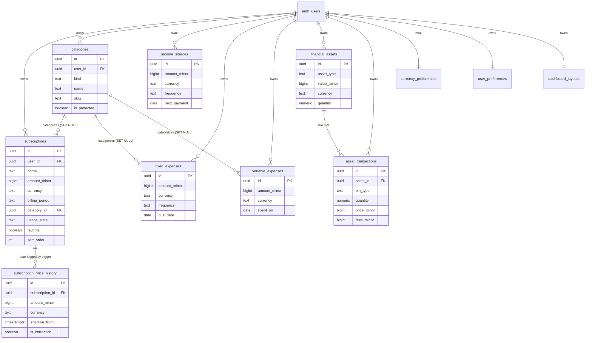

# Domain & Data Model — Schema, RLS, Migrations

> The **normative** definition of every Finmate entity: its Swift domain type (Int64 minor-unit money + enums) and its PostgreSQL table (DDL, constraints, indexes, RLS, triggers). This document is the source of truth for the database contract that both the iOS client and a future web client consume. If any other document disagrees with the schema here, this document wins.

---

## 0. Conventions (read first)

These rules are **mandatory** and applied uniformly across every table and type below.

| Concern | Rule |
| --- | --- |
| Naming — Postgres | `snake_case` for tables, columns, constraints, functions, indexes. Tables are plural (`subscriptions`, `income_sources`). |
| Naming — Swift | `UpperCamelCase` types, `lowerCamelCase` properties. **Exactly one** canonical name per concept (no `amount`/`monthlyCost` duality). |
| Primary key | `id uuid PRIMARY KEY DEFAULT gen_random_uuid()`. Swift mirrors as `UUID`. |
| Ownership | Every user-owned table has `user_id uuid NOT NULL REFERENCES auth.users(id) ON DELETE CASCADE`. |
| Money | **Integer minor units only**, stored as `bigint` (`Int64`). Never `numeric`, `decimal`, `float`, or `double`. See [§2 Money](#2-money--minor-units-the-single-most-important-rule). |
| Currency | `text` column named `currency` with a `CHECK (currency IN ('EUR','USD','BTC'))`. Money is always stored **in its own currency** — never pre-converted. |
| Timestamps | `created_at timestamptz NOT NULL DEFAULT now()`; `updated_at timestamptz NOT NULL DEFAULT now()` maintained by the `set_updated_at()` trigger (see [§4.1](#41-the-updated_at-trigger)). |
| Dates vs timestamps | Calendar dates the user picks (due date, purchase date, payday) are `date`. Audit/sync moments are `timestamptz`. |
| Enums | Stored as `text` + a `CHECK (col IN (...))` constraint (portable, diff-friendly, trivially extensible). Mirrored in Swift as `String`-backed `enum` conforming to `Codable, CaseIterable, Sendable`. We deliberately do **not** use Postgres `CREATE TYPE ... AS ENUM` (altering them requires care and breaks `supabase gen types` ergonomics). |
| Non-negativity | Amounts that can never be negative carry `CHECK (amount_minor >= 0)`. Signed deltas (none in v1) would be the only exception. |
| RLS | Every table is both `ENABLE ROW LEVEL SECURITY` **and** `FORCE ROW LEVEL SECURITY` (so even the table owner / `postgres` superuser role is subject to policies), with four owner-only policies keyed on `auth.uid() = user_id`. No table is ever reachable without a policy. |
| Sync columns | `updated_at` is the conflict-resolution clock for offline-first last-write-wins (see [§6](#6-offline-first-sync-contract)). |

All money/currency/enum/sync decisions trace back to the [Canonical Decisions Brief](../CLAUDE.md) and are justified against the real Substimate schema in [§9](#9-what-changed-from-substimate-and-why).

---

## 1. Entity-Relationship Diagram



**Relationship rules**

- `auth.users` is Supabase's managed identity table. Finmate **never** creates a `public.users` mirror; all FKs point at `auth.users(id)`. (Substimate had a stray `REFERENCES users(id)` on `subscription_price_history` — fixed here.)
- Deleting a user cascades (`ON DELETE CASCADE`) to all owned rows — required for in-app account deletion (App Store guideline 5.1.1(v)).
- `category_id` uses `ON DELETE SET NULL` so deleting a category never destroys financial records; a `NULL` `category_id` is rendered as the protected "Other" bucket of the relevant kind at the presentation layer (subscriptions use the subscription "Other", expenses the expense "Other").
- `subscription_price_history` and `asset_transactions` cascade-delete with their parent.

---

## 2. Money — minor units (the single most important rule)

Finmate stores **every monetary value as an integer count of the smallest indivisible unit of its currency** (`Int64` in Swift, `bigint` in Postgres), paired with an ISO-style currency code. We never store `Double`/`Float`/`numeric` for money. This eliminates the entire class of binary-floating-point rounding bugs (`0.1 + 0.2 != 0.3`) that Substimate shipped with (`monthly_cost decimal(10,2)`).

### 2.1 Minor-unit definition

```
satsPerBTC = 100_000_000     // 1 BTC = 100,000,000 satoshis
```

| Currency | Code | Minor unit | Exponent | Example |
| --- | --- | --- | --- | --- |
| Euro | `EUR` | cent | 2 | €12.99 → `1299` |
| US Dollar | `USD` | cent | 2 | $4.00 → `400` |
| Bitcoin | `BTC` | satoshi (sat) | 8 | ₿0.00050000 → `50000` |

The exponent table is the **only** place that knows how many minor units a currency has. It lives in the `Shared/Utilities` package and is consulted by parsing and formatting; the database stores the raw integer and the code, nothing else.

### 2.2 The `Money` value type (Swift)

`Money` is the canonical money type used everywhere in the domain and design system. It is a `Sendable`, `Codable`, `Hashable` value type. Arithmetic is integer arithmetic on `minorUnits`; **formatting and any division/percentage math uses `Decimal`**, never binary floating point.

```swift
import Foundation

/// ISO-style currency code supported by Finmate v1. Extensible by adding a case
/// and a row to `CurrencyExponent`. Mirrors the Postgres CHECK constraint.
public enum CurrencyCode: String, Codable, CaseIterable, Sendable {
    case eur = "EUR"
    case usd = "USD"
    case btc = "BTC"

    /// Number of minor units in one major unit (10^exponent).
    public var exponent: Int {
        switch self {
        case .eur, .usd: return 2   // cents
        case .btc:       return 8   // satoshis
        }
    }

    /// 10^exponent as a Decimal scaling factor.
    public var minorPerMajor: Decimal {
        Decimal(sign: .plus, exponent: exponent, significand: 1)
    }
}

public let satsPerBTC: Int64 = 100_000_000

/// Typed errors raised by `Money`. Never crash on a production path — every
/// failure mode is a thrown, catchable error (golden rule: no force-unwraps /
/// no `precondition` traps on production paths).
public enum MoneyError: Error, Equatable, Sendable {
    case currencyMismatch(CurrencyCode, CurrencyCode)  // (lhs, rhs)
    case negativeAmount                                 // amount fields must be >= 0
    case tooManyFractionalDigits(allowed: Int)          // more precision than the currency has
    case invalidNumber                                  // not parseable as a Decimal
    case overflow                                       // minor units exceed Int64 range
}

/// Integer-minor-unit money. The ONLY money type in the domain.
public struct Money: Codable, Hashable, Sendable {
    /// The single stored property: the integer count of minor units.
    public let minorUnits: Int64
    public let currency: CurrencyCode

    public init(minorUnits: Int64, currency: CurrencyCode) {
        self.minorUnits = minorUnits
        self.currency = currency
    }

    /// Exact decimal value in major units (e.g. 1299 cents -> 12.99). For
    /// display/aggregation math only; never round-trip storage through this.
    public var decimalValue: Decimal {
        Decimal(minorUnits) / currency.minorPerMajor
    }

    public var isZero: Bool { minorUnits == 0 }

    /// Same-currency addition. Cross-currency addition is a domain error and
    /// THROWS rather than crashing (honors the no-force-unwrap / no-crash rule).
    /// Cross-currency totals must go through `CurrencyConverter`
    /// ([04-tech-stack.md](./04-tech-stack.md)), which produces a new `Money`
    /// in a single currency first.
    public func adding(_ other: Money) throws -> Money {
        guard other.currency == currency else {
            throw MoneyError.currencyMismatch(currency, other.currency)
        }
        let (sum, overflowed) = minorUnits.addingReportingOverflow(other.minorUnits)
        guard !overflowed else { throw MoneyError.overflow }
        return Money(minorUnits: sum, currency: currency)
    }
}

extension Money {
    /// Parse user input ("12.99", "0.0005") into exact minor units using `Decimal`,
    /// rounding **half-up** at the currency's precision. This is an *amount* parser
    /// (subscription cost, expense, income), so it:
    ///   - REJECTS negative input (`MoneyError.negativeAmount`),
    ///   - REJECTS input with more fractional digits than the currency allows
    ///     (`MoneyError.tooManyFractionalDigits`) — e.g. "12.999" for EUR (2 dp),
    ///     so silent truncation can never hide a typo,
    ///   - REJECTS non-numeric input (`MoneyError.invalidNumber`),
    ///   - GUARDS Int64 overflow on the scaled result (`MoneyError.overflow`).
    /// Locale-aware decimal/grouping handling for free-form text (and CSV import)
    /// is the caller's responsibility — see "Internationalization & formatting"
    /// ([06-design-system.md](./06-design-system.md)); this parser expects a
    /// already-normalized `.`-decimal string.
    public static func parse(_ text: String, currency: CurrencyCode) throws -> Money {
        let trimmed = text.trimmingCharacters(in: .whitespaces)
        guard let value = Decimal(string: trimmed), value.isFinite else {
            throw MoneyError.invalidNumber
        }
        guard value.sign == .plus || value == 0 else {
            throw MoneyError.negativeAmount
        }
        // Reject more precision than the currency has (e.g. 3 dp for EUR).
        // `Decimal.exponent` is the base-10 exponent of the significand; a value
        // with N fractional digits has exponent -N once normalized.
        let fractionalDigits = max(0, -value.exponent)
        guard fractionalDigits <= currency.exponent else {
            throw MoneyError.tooManyFractionalDigits(allowed: currency.exponent)
        }
        var scaled = value * currency.minorPerMajor
        var rounded = Decimal()
        NSDecimalRound(&rounded, &scaled, 0, .plain)   // half-up at integer precision
        // Guard Int64 range before converting (NSDecimalNumber clamps silently).
        let maxMinor = Decimal(Int64.max)
        guard rounded <= maxMinor else { throw MoneyError.overflow }
        return Money(minorUnits: NSDecimalNumber(decimal: rounded).int64Value, currency: currency)
    }
}
```

> **Why `Decimal` and not `Double`?** `Decimal` (NSDecimal) is a base-10, 38-digit fixed type — exact for the fractional values that appear in money. We only use it transiently for parsing, formatting, percentage splits, and currency conversion; the stored representation is always the lossless `Int64` minor-unit count.

> **One canonical `Money` contract.** The API above is the single reconciled definition shared verbatim with [09-engineering-practices.md](./09-engineering-practices.md) §3.2 and recorded in **ADR-0005**: `init(minorUnits:currency:)`, a single stored `minorUnits` property, `adding(_:)` that **throws** `MoneyError.currencyMismatch` (no `precondition`/crash), and a `parse(_:currency:)` that rounds **half-up**, **rejects** negative amounts and over-precise input, and **guards** Int64 overflow. These exact behaviors are the named unit-test cases below.

> **Named unit-test cases (all in the `Domain/Models` test target, written with the logic):**
> - `parse_roundsHalfUp` — `"12.995"` is *rejected* for EUR (3 dp > 2); `"0.005"` for USD likewise; half-up rounding is exercised on the conversion path where extra precision is mechanically introduced, not on raw amount input.
> - `parse_rejectsNegative` — `"-1.00"` throws `MoneyError.negativeAmount`.
> - `parse_rejectsTooManyFractionalDigits` — `"12.999"` (EUR) throws `MoneyError.tooManyFractionalDigits(allowed: 2)`; `"0.000000001"` (BTC) throws `tooManyFractionalDigits(allowed: 8)`.
> - `parse_rejectsInvalid` — `"abc"`, `""` throw `MoneyError.invalidNumber`.
> - `parse_guardsOverflow` — a value scaling beyond `Int64.max` throws `MoneyError.overflow`.
> - `adding_sameCurrency_sums` — `1299 + 100` EUR = `1399` EUR.
> - `adding_mismatch_throws` — adding USD to EUR throws `MoneyError.currencyMismatch(.eur, .usd)` (never crashes).
> - `adding_guardsOverflow` — `Int64.max + 1` minor units throws `MoneyError.overflow`.

### 2.3 BTC handling

BTC amounts are stored as **satoshis** in the same `amount_minor` columns (`bigint` comfortably holds the 21M-BTC supply: `21_000_000 * 100_000_000 = 2.1e15 < 9.2e18`). The crypto calculator (Calculator feature) converts fiat↔sats using rates fetched **server-side** via a Supabase Edge Function (`market-data`), so no provider key ships in the app. Conversion math is `Decimal`-based and documented in [04-tech-stack.md](./04-tech-stack.md); persisted results land back as integer sats.

---

## 3. Entities — Swift type + Postgres DDL

For each entity: the Swift domain struct, then the table DDL, indexes, and RLS. Enums are defined once in [§3.0](#30-shared-enums-swift) and reused.

### 3.0 Shared enums (Swift)

```swift
public enum BillingPeriod: String, Codable, CaseIterable, Sendable {
    case weekly, monthly, quarterly, yearly
}

public enum SubscriptionUsageState: String, Codable, CaseIterable, Sendable {
    case active            // "active"
    case rarely            // "rarely"  (was Substimate "not much")
    case unused            // "unused"
}

public enum PaymentMethod: String, Codable, CaseIterable, Sendable {
    case creditCard = "credit_card"
    case debitCard  = "debit_card"
    case paypal
    case bankTransfer = "bank_transfer"
    case applePay = "apple_pay"
    case googlePay = "google_pay"
    case crypto
    case other
}

public enum IncomeFrequency: String, Codable, CaseIterable, Sendable {
    case weekly, monthly, yearly
    case oneTime = "one_time"
}

public enum ExpenseFrequency: String, Codable, CaseIterable, Sendable {
    case monthly, quarterly, yearly
}

public enum AssetType: String, Codable, CaseIterable, Sendable {
    case stock, crypto, savings
    case realEstate = "real_estate"
    case other
}

public enum AssetTransactionType: String, Codable, CaseIterable, Sendable {
    case buy, sell, dividend, other
}

public enum AppAppearance: String, Codable, CaseIterable, Sendable {
    case system, light, dark
}
```

The string raw values are exactly the strings stored in Postgres and listed in each table's `CHECK` constraint. **Keeping these in sync is enforced by a unit test** (see [§8.3](#83-keeping-swift-and-postgres-in-sync)).

---

<a id="subscriptions"></a>

### 3.1 `subscriptions`

The flagship entity. Substimate stored `monthly_cost decimal`, duplicated `favorite`/`isFavorite`, and held `category` as a free-text string with a tangle of sync triggers. Finmate stores integer `amount_minor` in the subscription's own `currency`, one `favorite` boolean, and a normalized `category_id` FK.

```swift
public struct Subscription: Identifiable, Codable, Hashable, Sendable {
    public let id: UUID
    public let userId: UUID
    public var name: String
    public var vendorURL: URL?
    public var icon: String?               // SF Symbol name or bespoke symbol id
    public var amount: Money               // amount_minor + currency, in native currency
    public var billingPeriod: BillingPeriod
    public var paymentMethod: PaymentMethod?
    public var categoryID: UUID?
    public var usageState: SubscriptionUsageState
    public var startDate: Date
    public var endDate: Date?
    public var autoRenew: Bool
    public var favorite: Bool
    public var remindersEnabled: Bool      // per-subscription payment-reminder opt-in
    public var sortOrder: Int
    public var notes: String?
    public var createdAt: Date
    public var updatedAt: Date
}
```

```sql
CREATE TABLE public.subscriptions (
  id              uuid PRIMARY KEY DEFAULT gen_random_uuid(),
  user_id         uuid NOT NULL REFERENCES auth.users(id) ON DELETE CASCADE,
  name            text NOT NULL CHECK (char_length(name) BETWEEN 1 AND 120),
  vendor_url      text,
  icon            text,
  amount_minor    bigint NOT NULL CHECK (amount_minor >= 0),
  currency        text   NOT NULL DEFAULT 'EUR' CHECK (currency IN ('EUR','USD','BTC')),
  billing_period  text   NOT NULL DEFAULT 'monthly'
                    CHECK (billing_period IN ('weekly','monthly','quarterly','yearly')),
  payment_method  text   CHECK (payment_method IN (
                      'credit_card','debit_card','paypal','bank_transfer',
                      'apple_pay','google_pay','crypto','other')),
  category_id     uuid REFERENCES public.categories(id) ON DELETE SET NULL,
  usage_state     text NOT NULL DEFAULT 'active'
                    CHECK (usage_state IN ('active','rarely','unused')),
  start_date      date NOT NULL DEFAULT (now() AT TIME ZONE 'utc')::date,
  end_date        date,
  auto_renew      boolean NOT NULL DEFAULT true,
  favorite        boolean NOT NULL DEFAULT false,
  reminders_enabled boolean NOT NULL DEFAULT false,
  sort_order      integer NOT NULL DEFAULT 0,
  notes           text,
  created_at      timestamptz NOT NULL DEFAULT now(),
  updated_at      timestamptz NOT NULL DEFAULT now(),
  CONSTRAINT subscriptions_date_order CHECK (end_date IS NULL OR end_date >= start_date)
);

CREATE INDEX idx_subscriptions_user_id       ON public.subscriptions(user_id);
CREATE INDEX idx_subscriptions_category_id   ON public.subscriptions(category_id);
CREATE INDEX idx_subscriptions_user_sort     ON public.subscriptions(user_id, sort_order);
CREATE INDEX idx_subscriptions_user_favorite ON public.subscriptions(user_id, favorite)
  WHERE favorite = true;

ALTER TABLE public.subscriptions ENABLE ROW LEVEL SECURITY;
ALTER TABLE public.subscriptions FORCE ROW LEVEL SECURITY;

CREATE POLICY subscriptions_select ON public.subscriptions
  FOR SELECT TO authenticated USING (auth.uid() = user_id);
CREATE POLICY subscriptions_insert ON public.subscriptions
  FOR INSERT TO authenticated WITH CHECK (auth.uid() = user_id);
CREATE POLICY subscriptions_update ON public.subscriptions
  FOR UPDATE TO authenticated USING (auth.uid() = user_id) WITH CHECK (auth.uid() = user_id);
CREATE POLICY subscriptions_delete ON public.subscriptions
  FOR DELETE TO authenticated USING (auth.uid() = user_id);

CREATE TRIGGER set_subscriptions_updated_at
  BEFORE UPDATE ON public.subscriptions
  FOR EACH ROW EXECUTE FUNCTION public.set_updated_at();
```

> **`sort_order` instead of mutating `created_at`.** Substimate's `batch_update_subscription_order` reordered cards by **overwriting `created_at`** — corrupting an audit field. Finmate adds an explicit `sort_order integer` and a dedicated reorder RPC ([§5.2](#52-batch_reorder_subscriptions)) that touches only that column.

---

<a id="subscription_price_history"></a>

### 3.2 `subscription_price_history`

Append-only audit log of every price/currency change on a subscription, written automatically by a `SECURITY DEFINER` trigger. Read-only from the client (no UPDATE/DELETE policy).

```swift
public struct SubscriptionPriceHistoryEntry: Identifiable, Codable, Hashable, Sendable {
    public let id: UUID
    public let subscriptionID: UUID
    public let userId: UUID
    public let amount: Money
    public let effectiveFrom: Date
    public let isCorrection: Bool
    public let createdAt: Date
}
```

```sql
CREATE TABLE public.subscription_price_history (
  id              uuid PRIMARY KEY DEFAULT gen_random_uuid(),
  subscription_id uuid NOT NULL REFERENCES public.subscriptions(id) ON DELETE CASCADE,
  user_id         uuid NOT NULL REFERENCES auth.users(id) ON DELETE CASCADE,
  amount_minor    bigint NOT NULL CHECK (amount_minor >= 0),
  currency        text   NOT NULL CHECK (currency IN ('EUR','USD','BTC')),
  effective_from  timestamptz NOT NULL,
  is_correction   boolean NOT NULL DEFAULT false,
  created_at      timestamptz NOT NULL DEFAULT now()
);

CREATE INDEX idx_sph_subscription_id ON public.subscription_price_history(subscription_id);
CREATE INDEX idx_sph_user_id         ON public.subscription_price_history(user_id);
CREATE INDEX idx_sph_effective_from  ON public.subscription_price_history(subscription_id, effective_from DESC);

ALTER TABLE public.subscription_price_history ENABLE ROW LEVEL SECURITY;
ALTER TABLE public.subscription_price_history FORCE ROW LEVEL SECURITY;

-- Read-only to clients. Rows are written ONLY by the SECURITY DEFINER trigger.
CREATE POLICY sph_select ON public.subscription_price_history
  FOR SELECT TO authenticated USING (auth.uid() = user_id);
-- Intentionally NO insert/update/delete policies for authenticated users.
```

The insert trigger is defined in [§4.2](#42-the-subscription-price-history-trigger).

---

<a id="categories"></a>

### 3.3 `categories`

Substimate kept three competing category mechanisms (`subscriptions.category` free text, a `user_categories` table, and a `subscription_categories` join table) wired together by six sync triggers. Finmate collapses this into **one** user-owned `categories` table referenced by FK.

A single `kind` discriminator (`'subscription' | 'expense'`) splits the namespace so subscriptions and expenses get distinct, independently-seeded taxonomies without a second table: `subscriptions.category_id` resolves against `kind = 'subscription'`; `fixed_expenses.category_id` and `variable_expenses.category_id` resolve against `kind = 'expense'`. (Enforcing that match is the repository/RPC layer's job — `get_user_categories(p_kind)` only ever offers the correct set to each Add/Edit sheet, so the UI cannot cross the streams.)

"All" and "Favorites" are **not** rows — they are presentation-layer pseudo-filters. Only `Other` is a seeded, **protected** (non-deletable) row, and it exists once **per kind** (`is_protected` marks it; the UI offers it but the user may not delete it).

```swift
public enum CategoryKind: String, Codable, CaseIterable, Sendable {
    case subscription   // categorizes subscriptions
    case expense        // categorizes fixed_expenses + variable_expenses
}

public struct Category: Identifiable, Codable, Hashable, Sendable {
    public let id: UUID
    public let userId: UUID
    public var kind: CategoryKind   // discriminates the subscription vs expense taxonomy
    public var name: String
    public var slug: String         // stable machine key, e.g. "ai_chat"
    public var symbol: String?      // SF Symbol name
    public var colorHex: String?    // "#RRGGBB"
    public var sortOrder: Int
    public let isProtected: Bool     // seeded defaults; not user-deletable
    public let createdAt: Date
    public var updatedAt: Date
}
```

```sql
CREATE TABLE public.categories (
  id           uuid PRIMARY KEY DEFAULT gen_random_uuid(),
  user_id      uuid NOT NULL REFERENCES auth.users(id) ON DELETE CASCADE,
  kind         text NOT NULL CHECK (kind IN ('subscription','expense')),
  name         text NOT NULL CHECK (char_length(name) BETWEEN 1 AND 60),
  slug         text NOT NULL CHECK (slug ~ '^[a-z0-9_]+$'),
  symbol       text,
  color_hex    text CHECK (color_hex IS NULL OR color_hex ~* '^#[0-9a-f]{6}$'),
  sort_order   integer NOT NULL DEFAULT 0,
  is_protected boolean NOT NULL DEFAULT false,
  created_at   timestamptz NOT NULL DEFAULT now(),
  updated_at   timestamptz NOT NULL DEFAULT now(),
  -- A category name is unique within (user, kind): the same "Other" can exist
  -- once as a subscription category and once as an expense category.
  CONSTRAINT categories_user_kind_name_unique UNIQUE (user_id, kind, name),
  -- Slug is likewise unique per (user, kind); this is the seed upsert conflict target.
  CONSTRAINT categories_user_kind_slug_unique UNIQUE (user_id, kind, slug)
);

CREATE INDEX idx_categories_user_id   ON public.categories(user_id);
CREATE INDEX idx_categories_user_kind ON public.categories(user_id, kind);

ALTER TABLE public.categories ENABLE ROW LEVEL SECURITY;
ALTER TABLE public.categories FORCE ROW LEVEL SECURITY;

CREATE POLICY categories_select ON public.categories
  FOR SELECT TO authenticated USING (auth.uid() = user_id);
CREATE POLICY categories_insert ON public.categories
  FOR INSERT TO authenticated WITH CHECK (auth.uid() = user_id);
CREATE POLICY categories_update ON public.categories
  FOR UPDATE TO authenticated USING (auth.uid() = user_id) WITH CHECK (auth.uid() = user_id);
-- Protected defaults cannot be deleted: the policy filters them out of DELETE entirely.
CREATE POLICY categories_delete ON public.categories
  FOR DELETE TO authenticated USING (auth.uid() = user_id AND is_protected = false);

CREATE TRIGGER set_categories_updated_at
  BEFORE UPDATE ON public.categories
  FOR EACH ROW EXECUTE FUNCTION public.set_updated_at();
```

Default categories are seeded per new user (both kinds) — see [§7.2](#72-seeding-default-categories). The `get_user_categories(p_kind)` RPC ([§5.1](#51-get_user_categories)) returns the categories of one kind with live usage counts.

---

<a id="income_sources"></a>

### 3.4 `income_sources`

Substimate had `income_sources` with both `name` and `source`, both `next_payment` and `nextPayment`. Finmate keeps a single `name` plus a single `next_payment date`, and adds `currency`.

```swift
public struct IncomeSource: Identifiable, Codable, Hashable, Sendable {
    public let id: UUID
    public let userId: UUID
    public var name: String
    public var amount: Money
    public var frequency: IncomeFrequency
    public var nextPayment: Date?
    public var notes: String?
    public let createdAt: Date
    public var updatedAt: Date
}
```

```sql
CREATE TABLE public.income_sources (
  id           uuid PRIMARY KEY DEFAULT gen_random_uuid(),
  user_id      uuid NOT NULL REFERENCES auth.users(id) ON DELETE CASCADE,
  name         text NOT NULL CHECK (char_length(name) BETWEEN 1 AND 120),
  amount_minor bigint NOT NULL CHECK (amount_minor >= 0),
  currency     text   NOT NULL DEFAULT 'EUR' CHECK (currency IN ('EUR','USD','BTC')),
  frequency    text   NOT NULL
                 CHECK (frequency IN ('weekly','monthly','yearly','one_time')),
  next_payment date,
  notes        text,
  created_at   timestamptz NOT NULL DEFAULT now(),
  updated_at   timestamptz NOT NULL DEFAULT now()
);

CREATE INDEX idx_income_sources_user_id      ON public.income_sources(user_id);
CREATE INDEX idx_income_sources_next_payment ON public.income_sources(user_id, next_payment);

ALTER TABLE public.income_sources ENABLE ROW LEVEL SECURITY;
ALTER TABLE public.income_sources FORCE ROW LEVEL SECURITY;

CREATE POLICY income_sources_select ON public.income_sources
  FOR SELECT TO authenticated USING (auth.uid() = user_id);
CREATE POLICY income_sources_insert ON public.income_sources
  FOR INSERT TO authenticated WITH CHECK (auth.uid() = user_id);
CREATE POLICY income_sources_update ON public.income_sources
  FOR UPDATE TO authenticated USING (auth.uid() = user_id) WITH CHECK (auth.uid() = user_id);
CREATE POLICY income_sources_delete ON public.income_sources
  FOR DELETE TO authenticated USING (auth.uid() = user_id);

CREATE TRIGGER set_income_sources_updated_at
  BEFORE UPDATE ON public.income_sources
  FOR EACH ROW EXECUTE FUNCTION public.set_updated_at();
```

---

<a id="fixed_expenses"></a>

### 3.5 `fixed_expenses`

Substimate had both `due_date` and `dueDate`. Finmate keeps a single `due_date date`, normalizes `category` → `category_id` FK, adds `currency`, and constrains `amount_minor`.

```swift
public struct FixedExpense: Identifiable, Codable, Hashable, Sendable {
    public let id: UUID
    public let userId: UUID
    public var name: String
    public var amount: Money
    public var categoryID: UUID?
    public var dueDate: Date?
    public var frequency: ExpenseFrequency
    public var autopay: Bool
    public var notes: String?
    public let createdAt: Date
    public var updatedAt: Date
}
```

```sql
CREATE TABLE public.fixed_expenses (
  id           uuid PRIMARY KEY DEFAULT gen_random_uuid(),
  user_id      uuid NOT NULL REFERENCES auth.users(id) ON DELETE CASCADE,
  name         text NOT NULL CHECK (char_length(name) BETWEEN 1 AND 120),
  amount_minor bigint NOT NULL CHECK (amount_minor >= 0),
  currency     text   NOT NULL DEFAULT 'EUR' CHECK (currency IN ('EUR','USD','BTC')),
  category_id  uuid REFERENCES public.categories(id) ON DELETE SET NULL,
  due_date     date,
  frequency    text NOT NULL CHECK (frequency IN ('monthly','quarterly','yearly')),
  autopay      boolean NOT NULL DEFAULT false,
  notes        text,
  created_at   timestamptz NOT NULL DEFAULT now(),
  updated_at   timestamptz NOT NULL DEFAULT now()
);

CREATE INDEX idx_fixed_expenses_user_id     ON public.fixed_expenses(user_id);
CREATE INDEX idx_fixed_expenses_category_id ON public.fixed_expenses(category_id);
CREATE INDEX idx_fixed_expenses_due_date    ON public.fixed_expenses(user_id, due_date);

ALTER TABLE public.fixed_expenses ENABLE ROW LEVEL SECURITY;
ALTER TABLE public.fixed_expenses FORCE ROW LEVEL SECURITY;

CREATE POLICY fixed_expenses_select ON public.fixed_expenses
  FOR SELECT TO authenticated USING (auth.uid() = user_id);
CREATE POLICY fixed_expenses_insert ON public.fixed_expenses
  FOR INSERT TO authenticated WITH CHECK (auth.uid() = user_id);
CREATE POLICY fixed_expenses_update ON public.fixed_expenses
  FOR UPDATE TO authenticated USING (auth.uid() = user_id) WITH CHECK (auth.uid() = user_id);
CREATE POLICY fixed_expenses_delete ON public.fixed_expenses
  FOR DELETE TO authenticated USING (auth.uid() = user_id);

CREATE TRIGGER set_fixed_expenses_updated_at
  BEFORE UPDATE ON public.fixed_expenses
  FOR EACH ROW EXECUTE FUNCTION public.set_updated_at();
```

---

<a id="variable_expenses"></a>

### 3.6 `variable_expenses`

The brief's `date` field is renamed `spent_on` to avoid shadowing the SQL `date` type name and to read clearly. `category` → `category_id`; `currency` added.

```swift
public struct VariableExpense: Identifiable, Codable, Hashable, Sendable {
    public let id: UUID
    public let userId: UUID
    public var name: String
    public var amount: Money
    public var categoryID: UUID?
    public var spentOn: Date
    public var notes: String?
    public let createdAt: Date
    public var updatedAt: Date
}
```

```sql
CREATE TABLE public.variable_expenses (
  id           uuid PRIMARY KEY DEFAULT gen_random_uuid(),
  user_id      uuid NOT NULL REFERENCES auth.users(id) ON DELETE CASCADE,
  name         text NOT NULL CHECK (char_length(name) BETWEEN 1 AND 120),
  amount_minor bigint NOT NULL CHECK (amount_minor >= 0),
  currency     text   NOT NULL DEFAULT 'EUR' CHECK (currency IN ('EUR','USD','BTC')),
  category_id  uuid REFERENCES public.categories(id) ON DELETE SET NULL,
  spent_on     date NOT NULL,
  notes        text,
  created_at   timestamptz NOT NULL DEFAULT now(),
  updated_at   timestamptz NOT NULL DEFAULT now()
);

CREATE INDEX idx_variable_expenses_user_id     ON public.variable_expenses(user_id);
CREATE INDEX idx_variable_expenses_category_id ON public.variable_expenses(category_id);
CREATE INDEX idx_variable_expenses_spent_on    ON public.variable_expenses(user_id, spent_on DESC);

ALTER TABLE public.variable_expenses ENABLE ROW LEVEL SECURITY;
ALTER TABLE public.variable_expenses FORCE ROW LEVEL SECURITY;

CREATE POLICY variable_expenses_select ON public.variable_expenses
  FOR SELECT TO authenticated USING (auth.uid() = user_id);
CREATE POLICY variable_expenses_insert ON public.variable_expenses
  FOR INSERT TO authenticated WITH CHECK (auth.uid() = user_id);
CREATE POLICY variable_expenses_update ON public.variable_expenses
  FOR UPDATE TO authenticated USING (auth.uid() = user_id) WITH CHECK (auth.uid() = user_id);
CREATE POLICY variable_expenses_delete ON public.variable_expenses
  FOR DELETE TO authenticated USING (auth.uid() = user_id);

CREATE TRIGGER set_variable_expenses_updated_at
  BEFORE UPDATE ON public.variable_expenses
  FOR EACH ROW EXECUTE FUNCTION public.set_updated_at();
```

---

<a id="financial_assets"></a>

### 3.7 `financial_assets`

Substimate stored asset money as `numeric(20,2)` (no BTC sat precision) and `quantity numeric(20,8)`. Finmate stores monetary fields as `bigint` minor units in the asset's `currency` and keeps `quantity numeric(38,8)` (quantity is a count of units/shares/coins, not money — `numeric` is correct here). `last_updated` is folded into the standard `updated_at`.

**Cost-basis semantics (pinned, v1 = average-cost; FIFO deferred per ADR-0015):**

- `purchase_price_minor` = **TOTAL cost basis** — the aggregate amount invested across all buys, using the **average-cost** method. It is *not* a per-unit figure.
- `current_price_minor` = latest **PER-UNIT** market price (one unit/share/coin).
- `value_minor` = current **TOTAL** market value of the holding (≈ `quantity × current_price_minor`, persisted as the authoritative total).
- **Unrealized gain/loss** = `value_minor − purchase_price_minor` (total market value minus total cost basis).

```swift
public struct FinancialAsset: Identifiable, Codable, Hashable, Sendable {
    public let id: UUID
    public let userId: UUID
    public var name: String
    public var assetType: AssetType
    public var currency: CurrencyCode
    public var valueMinor: Int64               // current TOTAL market value of the holding
    public var quantity: Decimal?
    public var purchasePriceMinor: Int64?       // TOTAL cost basis (aggregate invested, average-cost)
    public var purchaseDate: Date?
    public var currentPriceMinor: Int64?        // latest PER-UNIT market price
    public var notes: String?
    public let createdAt: Date
    public var updatedAt: Date

    public var value: Money { Money(minorUnits: valueMinor, currency: currency) }
}
```

```sql
CREATE TABLE public.financial_assets (
  id                   uuid PRIMARY KEY DEFAULT gen_random_uuid(),
  user_id              uuid NOT NULL REFERENCES auth.users(id) ON DELETE CASCADE,
  name                 text NOT NULL CHECK (char_length(name) BETWEEN 1 AND 120),
  asset_type           text NOT NULL
                         CHECK (asset_type IN ('stock','crypto','savings','real_estate','other')),
  currency             text NOT NULL DEFAULT 'EUR' CHECK (currency IN ('EUR','USD','BTC')),
  value_minor          bigint NOT NULL CHECK (value_minor >= 0),
  quantity             numeric(38,8),
  purchase_price_minor bigint CHECK (purchase_price_minor IS NULL OR purchase_price_minor >= 0),
  purchase_date        date,
  current_price_minor  bigint CHECK (current_price_minor IS NULL OR current_price_minor >= 0),
  notes                text,
  created_at           timestamptz NOT NULL DEFAULT now(),
  updated_at           timestamptz NOT NULL DEFAULT now()
);

COMMENT ON COLUMN public.financial_assets.purchase_price_minor IS
  'TOTAL cost basis: aggregate amount invested across all buys, average-cost method (v1; FIFO deferred, ADR-0015). NOT per-unit.';
COMMENT ON COLUMN public.financial_assets.current_price_minor IS
  'Latest PER-UNIT market price (one unit/share/coin).';
COMMENT ON COLUMN public.financial_assets.value_minor IS
  'Current TOTAL market value of the holding. Unrealized gain/loss = value_minor - purchase_price_minor.';

CREATE INDEX idx_financial_assets_user_id ON public.financial_assets(user_id);
CREATE INDEX idx_financial_assets_type    ON public.financial_assets(user_id, asset_type);

ALTER TABLE public.financial_assets ENABLE ROW LEVEL SECURITY;
ALTER TABLE public.financial_assets FORCE ROW LEVEL SECURITY;

CREATE POLICY financial_assets_select ON public.financial_assets
  FOR SELECT TO authenticated USING (auth.uid() = user_id);
CREATE POLICY financial_assets_insert ON public.financial_assets
  FOR INSERT TO authenticated WITH CHECK (auth.uid() = user_id);
CREATE POLICY financial_assets_update ON public.financial_assets
  FOR UPDATE TO authenticated USING (auth.uid() = user_id) WITH CHECK (auth.uid() = user_id);
CREATE POLICY financial_assets_delete ON public.financial_assets
  FOR DELETE TO authenticated USING (auth.uid() = user_id);

CREATE TRIGGER set_financial_assets_updated_at
  BEFORE UPDATE ON public.financial_assets
  FOR EACH ROW EXECUTE FUNCTION public.set_updated_at();
```

---

<a id="asset_transactions"></a>

### 3.8 `asset_transactions`

Substimate's `asset_transactions.type` `CHECK` allowed only `('buy','sell')` even though `database.types.ts` claimed `'buy' | 'sell' | 'dividend' | 'other'`. Finmate aligns both to all four. `price`/`fees` become `bigint` minor units in the transaction's `currency`.

```swift
public struct AssetTransaction: Identifiable, Codable, Hashable, Sendable {
    public let id: UUID
    public let userId: UUID
    public let assetID: UUID
    public var type: AssetTransactionType
    public var quantity: Decimal
    public var price: Money       // price_minor + currency, per unit
    public var fees: Money?       // fees_minor + currency
    public var date: Date
    public var notes: String?
    public let createdAt: Date
}
```

```sql
CREATE TABLE public.asset_transactions (
  id           uuid PRIMARY KEY DEFAULT gen_random_uuid(),
  asset_id     uuid NOT NULL REFERENCES public.financial_assets(id) ON DELETE CASCADE,
  user_id      uuid NOT NULL REFERENCES auth.users(id) ON DELETE CASCADE,
  txn_type     text NOT NULL CHECK (txn_type IN ('buy','sell','dividend','other')),
  quantity     numeric(38,8) NOT NULL,
  price_minor  bigint NOT NULL CHECK (price_minor >= 0),
  fees_minor   bigint CHECK (fees_minor IS NULL OR fees_minor >= 0),
  currency     text NOT NULL DEFAULT 'EUR' CHECK (currency IN ('EUR','USD','BTC')),
  date         date NOT NULL,
  notes        text,
  created_at   timestamptz NOT NULL DEFAULT now()
);

CREATE INDEX idx_asset_txn_user_id  ON public.asset_transactions(user_id);
CREATE INDEX idx_asset_txn_asset_id ON public.asset_transactions(asset_id);
CREATE INDEX idx_asset_txn_date     ON public.asset_transactions(asset_id, date DESC);

ALTER TABLE public.asset_transactions ENABLE ROW LEVEL SECURITY;
ALTER TABLE public.asset_transactions FORCE ROW LEVEL SECURITY;

CREATE POLICY asset_txn_select ON public.asset_transactions
  FOR SELECT TO authenticated USING (auth.uid() = user_id);
CREATE POLICY asset_txn_insert ON public.asset_transactions
  FOR INSERT TO authenticated WITH CHECK (auth.uid() = user_id);
CREATE POLICY asset_txn_update ON public.asset_transactions
  FOR UPDATE TO authenticated USING (auth.uid() = user_id) WITH CHECK (auth.uid() = user_id);
CREATE POLICY asset_txn_delete ON public.asset_transactions
  FOR DELETE TO authenticated USING (auth.uid() = user_id);
```

> `asset_transactions` is append-mostly and has no `updated_at` (edits are rare; an edit re-writes the row, the parent asset's `updated_at` reflects the change). If product later needs edit auditing, add `updated_at` + trigger in a follow-up migration.

---

<a id="currency_preferences"></a>

### 3.9 `currency_preferences`

One row per user (UNIQUE on `user_id`). Holds the display currency and a cache of exchange rates fetched server-side by the `market-data` Edge Function. The `exchange_rates` `jsonb` uses the **canonical rate schema** (single source of truth defined in [04-tech-stack.md](./04-tech-stack.md) "Currency & conversion", and matching [07-security-and-privacy.md](./07-security-and-privacy.md) §5.2):

```jsonc
{
  "eur_usd":   1.0843,            // USD per 1 EUR (Decimal)
  "btc_eur":   58234.50,          // EUR per 1 BTC (Decimal)
  "btc_usd":   63148.20,          // USD per 1 BTC (Decimal)
  "fetched_at": "2026-06-28T09:30:00Z"   // ISO8601
}
```

The full 3×3 EUR/USD/BTC conversion matrix is **triangulated** from these three pairs (and `satsPerBTC` for BTC↔sats); the algorithm, `CurrencyConverter` protocol, half-up rounding, and stale/missing-rate policy all live in [04-tech-stack.md](./04-tech-stack.md). This table is a **cache, never the system of record** for stored money — conversion is **display-only and never mutates stored amounts** (the Substimate pre-conversion bug, item #2 in [§9](#9-what-changed-from-substimate-and-why)).

```swift
public struct CurrencyPreference: Identifiable, Codable, Hashable, Sendable {
    public let id: UUID
    public let userId: UUID
    public var displayCurrency: CurrencyCode
    public var exchangeRates: ExchangeRates?   // decoded from jsonb; cache only, may be nil/empty pre-first-fetch
    public var lastUpdated: Date
    public let createdAt: Date
    public var updatedAt: Date
}

/// Canonical rate snapshot mirrored from the `market-data` Edge Function payload.
/// Defined here for the storage contract; conversion math lives in 04-tech-stack.md.
public struct ExchangeRates: Codable, Hashable, Sendable {
    public var eurUsd: Decimal     // USD per 1 EUR  (jsonb "eur_usd")
    public var btcEur: Decimal     // EUR per 1 BTC  (jsonb "btc_eur")
    public var btcUsd: Decimal     // USD per 1 BTC  (jsonb "btc_usd")
    public var fetchedAt: Date     // jsonb "fetched_at", ISO8601
}
```

> **Stale policy (summary; canonical in [04-tech-stack.md](./04-tech-stack.md)):** if `fetched_at` is older than 24h the UI shows a "rates may be stale" indicator but still converts; a missing rate makes that conversion unavailable, in which case the stored source amount is displayed **unconverted**.

```sql
CREATE TABLE public.currency_preferences (
  id               uuid PRIMARY KEY DEFAULT gen_random_uuid(),
  user_id          uuid NOT NULL REFERENCES auth.users(id) ON DELETE CASCADE,
  display_currency text NOT NULL DEFAULT 'EUR' CHECK (display_currency IN ('EUR','USD','BTC')),
  -- Canonical key schema: { "eur_usd", "btc_eur", "btc_usd", "fetched_at" } (see 04-tech-stack.md).
  -- Cache only; never the system of record. Empty {} until the first market-data fetch.
  exchange_rates   jsonb NOT NULL DEFAULT '{}'::jsonb,
  -- Row-level cache write time; the authoritative rate age is exchange_rates->>'fetched_at'.
  last_updated     timestamptz NOT NULL DEFAULT now(),
  created_at       timestamptz NOT NULL DEFAULT now(),
  updated_at       timestamptz NOT NULL DEFAULT now(),
  CONSTRAINT currency_preferences_user_unique UNIQUE (user_id)
);

ALTER TABLE public.currency_preferences ENABLE ROW LEVEL SECURITY;
ALTER TABLE public.currency_preferences FORCE ROW LEVEL SECURITY;

CREATE POLICY currency_pref_select ON public.currency_preferences
  FOR SELECT TO authenticated USING (auth.uid() = user_id);
CREATE POLICY currency_pref_insert ON public.currency_preferences
  FOR INSERT TO authenticated WITH CHECK (auth.uid() = user_id);
CREATE POLICY currency_pref_update ON public.currency_preferences
  FOR UPDATE TO authenticated USING (auth.uid() = user_id) WITH CHECK (auth.uid() = user_id);
CREATE POLICY currency_pref_delete ON public.currency_preferences
  FOR DELETE TO authenticated USING (auth.uid() = user_id);

CREATE TRIGGER set_currency_preferences_updated_at
  BEFORE UPDATE ON public.currency_preferences
  FOR EACH ROW EXECUTE FUNCTION public.set_updated_at();
```

---

<a id="user_preferences"></a>

### 3.10 `user_preferences`

New in Finmate (Substimate scattered these across `localStorage`, `ThemeContext`, and `dashboard_layouts`). One row per user. Holds appearance, biometric lock, default currency, and the notification/reminder preferences (the scalar opt-ins that gate local `UNUserNotification` scheduling). The dashboard card order lives in its own table ([§3.11](#311-dashboard_layouts)) because it is a list, not a scalar set.

```swift
public struct UserPreferences: Identifiable, Codable, Hashable, Sendable {
    public let id: UUID
    public let userId: UUID
    public var appearance: AppAppearance
    public var biometricLockEnabled: Bool
    public var biometricLockTimeoutSeconds: Int
    public var defaultCurrency: CurrencyCode
    public var paymentRemindersEnabled: Bool   // master switch for subscription/expense due reminders
    public var paydayRemindersEnabled: Bool    // master switch for income payday reminders
    public var reminderLeadTimeDays: Int       // 0...30; how many days before the event to fire
    public let createdAt: Date
    public var updatedAt: Date
}
```

```sql
CREATE TABLE public.user_preferences (
  id                            uuid PRIMARY KEY DEFAULT gen_random_uuid(),
  user_id                       uuid NOT NULL REFERENCES auth.users(id) ON DELETE CASCADE,
  appearance                    text NOT NULL DEFAULT 'system'
                                  CHECK (appearance IN ('system','light','dark')),
  biometric_lock_enabled        boolean NOT NULL DEFAULT false,
  biometric_lock_timeout_seconds integer NOT NULL DEFAULT 300 CHECK (biometric_lock_timeout_seconds >= 0),
  default_currency              text NOT NULL DEFAULT 'EUR' CHECK (default_currency IN ('EUR','USD','BTC')),
  payment_reminders_enabled     boolean NOT NULL DEFAULT true,
  payday_reminders_enabled      boolean NOT NULL DEFAULT true,
  reminder_lead_time_days       integer NOT NULL DEFAULT 2
                                  CHECK (reminder_lead_time_days BETWEEN 0 AND 30),
  created_at                    timestamptz NOT NULL DEFAULT now(),
  updated_at                    timestamptz NOT NULL DEFAULT now(),
  CONSTRAINT user_preferences_user_unique UNIQUE (user_id)
);

ALTER TABLE public.user_preferences ENABLE ROW LEVEL SECURITY;
ALTER TABLE public.user_preferences FORCE ROW LEVEL SECURITY;

CREATE POLICY user_pref_select ON public.user_preferences
  FOR SELECT TO authenticated USING (auth.uid() = user_id);
CREATE POLICY user_pref_insert ON public.user_preferences
  FOR INSERT TO authenticated WITH CHECK (auth.uid() = user_id);
CREATE POLICY user_pref_update ON public.user_preferences
  FOR UPDATE TO authenticated USING (auth.uid() = user_id) WITH CHECK (auth.uid() = user_id);
CREATE POLICY user_pref_delete ON public.user_preferences
  FOR DELETE TO authenticated USING (auth.uid() = user_id);

CREATE TRIGGER set_user_preferences_updated_at
  BEFORE UPDATE ON public.user_preferences
  FOR EACH ROW EXECUTE FUNCTION public.set_updated_at();
```

> The biometric **secret** is never stored here — only the *enabled* flag and timeout. The actual gate is enforced client-side by `LocalAuthentication`; see [07-security-and-privacy.md](./07-security-and-privacy.md).

---

<a id="dashboardlayout"></a>

### 3.11 `dashboard_layouts`

Ordered list of Home dashboard card ids. Substimate stored `layout text[]`; Finmate keeps `text[]` (a genuinely ordered array is the right shape) with one row per user.

```swift
public struct DashboardLayout: Identifiable, Codable, Hashable, Sendable {
    public let id: UUID
    public let userId: UUID
    public var cardOrder: [String]   // stable card identifiers
    public let createdAt: Date
    public var updatedAt: Date
}
```

```sql
CREATE TABLE public.dashboard_layouts (
  id         uuid PRIMARY KEY DEFAULT gen_random_uuid(),
  user_id    uuid NOT NULL REFERENCES auth.users(id) ON DELETE CASCADE,
  card_order text[] NOT NULL DEFAULT ARRAY[]::text[],
  created_at timestamptz NOT NULL DEFAULT now(),
  updated_at timestamptz NOT NULL DEFAULT now(),
  CONSTRAINT dashboard_layouts_user_unique UNIQUE (user_id)
);

ALTER TABLE public.dashboard_layouts ENABLE ROW LEVEL SECURITY;
ALTER TABLE public.dashboard_layouts FORCE ROW LEVEL SECURITY;

CREATE POLICY dashboard_select ON public.dashboard_layouts
  FOR SELECT TO authenticated USING (auth.uid() = user_id);
CREATE POLICY dashboard_insert ON public.dashboard_layouts
  FOR INSERT TO authenticated WITH CHECK (auth.uid() = user_id);
CREATE POLICY dashboard_update ON public.dashboard_layouts
  FOR UPDATE TO authenticated USING (auth.uid() = user_id) WITH CHECK (auth.uid() = user_id);
CREATE POLICY dashboard_delete ON public.dashboard_layouts
  FOR DELETE TO authenticated USING (auth.uid() = user_id);

CREATE TRIGGER set_dashboard_layouts_updated_at
  BEFORE UPDATE ON public.dashboard_layouts
  FOR EACH ROW EXECUTE FUNCTION public.set_updated_at();
```

---

## 4. Triggers

### 4.1 The `updated_at` trigger

One shared trigger function, attached to every table that has an `updated_at` column. Hardened as a `SECURITY DEFINER` function with `SET search_path = public`, `REVOKE ALL ... FROM PUBLIC`, and **not** granted to `authenticated` (it is invoked only by `BEFORE UPDATE` triggers, never called directly by a client). Substimate's equivalent (`update_updated_at_column`) lacked the pinned search path.

```sql
CREATE OR REPLACE FUNCTION public.set_updated_at()
RETURNS trigger
LANGUAGE plpgsql
SECURITY DEFINER
SET search_path = public
AS $$
BEGIN
  NEW.updated_at = now();
  RETURN NEW;
END;
$$;

-- Trigger-only; never client-callable. No GRANT to authenticated.
REVOKE ALL ON FUNCTION public.set_updated_at() FROM PUBLIC;
```

We also forbid `user_id` reassignment defensively (RLS already blocks cross-user writes, but this turns a silent ownership change into a hard error). Same hardening: `SECURITY DEFINER`, pinned `search_path`, `REVOKE ALL ... FROM PUBLIC`, no `authenticated` grant (trigger-only):

```sql
CREATE OR REPLACE FUNCTION public.prevent_user_id_change()
RETURNS trigger
LANGUAGE plpgsql
SECURITY DEFINER
SET search_path = public
AS $$
BEGIN
  IF NEW.user_id IS DISTINCT FROM OLD.user_id THEN
    RAISE EXCEPTION 'user_id is immutable';
  END IF;
  RETURN NEW;
END;
$$;

-- Trigger-only; never client-callable. No GRANT to authenticated.
REVOKE ALL ON FUNCTION public.prevent_user_id_change() FROM PUBLIC;

-- Attached BEFORE UPDATE on every user-owned table, e.g.:
CREATE TRIGGER guard_user_id_subscriptions
  BEFORE UPDATE ON public.subscriptions
  FOR EACH ROW EXECUTE FUNCTION public.prevent_user_id_change();
```

### 4.2 The subscription price-history trigger

`SECURITY DEFINER` with a pinned `search_path`, fired after price/currency change. It is the **only** writer of `subscription_price_history` (the table has no client INSERT policy). This is the modernized version of Substimate's `handle_subscription_price_change` — fixed to (a) also fire on `currency` change, (b) store the native `amount_minor` + `currency`, and (c) use `IS DISTINCT FROM` so `NULL` transitions are handled.

```sql
CREATE OR REPLACE FUNCTION public.log_subscription_price_change()
RETURNS trigger
LANGUAGE plpgsql
SECURITY DEFINER
SET search_path = public
AS $$
BEGIN
  IF (TG_OP = 'INSERT')
     OR (OLD.amount_minor IS DISTINCT FROM NEW.amount_minor)
     OR (OLD.currency     IS DISTINCT FROM NEW.currency) THEN
    INSERT INTO public.subscription_price_history (
      subscription_id, user_id, amount_minor, currency, effective_from, is_correction
    ) VALUES (
      NEW.id,
      NEW.user_id,
      NEW.amount_minor,
      NEW.currency,
      CASE WHEN TG_OP = 'INSERT'
           THEN COALESCE(NEW.start_date::timestamptz, now())
           ELSE now() END,
      false
    );
  END IF;
  RETURN NEW;
END;
$$;

REVOKE ALL ON FUNCTION public.log_subscription_price_change() FROM PUBLIC;

CREATE TRIGGER subscription_price_change_trigger
  AFTER INSERT OR UPDATE OF amount_minor, currency
  ON public.subscriptions
  FOR EACH ROW EXECUTE FUNCTION public.log_subscription_price_change();
```

Because the function is `SECURITY DEFINER`, it inserts the history row even though `authenticated` has no INSERT privilege on the table. The function trusts `NEW.user_id`, which RLS on `subscriptions` already proved equals `auth.uid()` at write time.

---

## 5. RPCs (Postgres functions called from Swift)

Every RPC follows the hardening checklist proven in Substimate's `20260627090000_harden_security_definer_functions.sql`:

1. `LANGUAGE sql` or `plpgsql`, `SECURITY DEFINER`, `SET search_path = public`.
2. Derive ownership **only** from `auth.uid()` — never accept a caller-supplied `user_id`.
3. `REVOKE ALL ON FUNCTION ... FROM PUBLIC;`
4. `GRANT EXECUTE ON FUNCTION ... TO authenticated;`
5. Per-row owner check before any mutation.

Swift calls these via `supabase.rpc("name", params:)` behind a repository protocol method.

### 5.1 `get_user_categories`

Returns the user's categories **of a given kind** with a live usage count (drives the category filter chips and the Add/Edit category pickers). The `p_kind` argument filters to `'subscription'` or `'expense'`; the count column is the number of in-use rows of the matching entity kind. Replaces Substimate's `get_user_categories()` which returned only `(category text, subscription_count bigint)` over a free-text column.

```sql
CREATE OR REPLACE FUNCTION public.get_user_categories(p_kind text)
RETURNS TABLE (
  id           uuid,
  kind         text,
  name         text,
  slug         text,
  symbol       text,
  color_hex    text,
  sort_order   integer,
  is_protected boolean,
  usage_count  bigint
)
LANGUAGE sql
SECURITY DEFINER
SET search_path = public
AS $$
  SELECT c.id, c.kind, c.name, c.slug, c.symbol, c.color_hex, c.sort_order, c.is_protected,
         CASE
           WHEN p_kind = 'subscription' THEN
             (SELECT COUNT(*) FROM public.subscriptions s
               WHERE s.category_id = c.id AND s.user_id = auth.uid())
           ELSE
             (SELECT COUNT(*) FROM public.fixed_expenses fe
               WHERE fe.category_id = c.id AND fe.user_id = auth.uid())
           + (SELECT COUNT(*) FROM public.variable_expenses ve
               WHERE ve.category_id = c.id AND ve.user_id = auth.uid())
         END AS usage_count
  FROM public.categories c
  WHERE c.user_id = auth.uid()
    AND c.kind = p_kind
  ORDER BY c.sort_order, c.name;
$$;

REVOKE ALL ON FUNCTION public.get_user_categories(text) FROM PUBLIC;
GRANT EXECUTE ON FUNCTION public.get_user_categories(text) TO authenticated;
```

> `p_kind` must be `'subscription'` or `'expense'`; the `categories.kind` CHECK plus the `WHERE c.kind = p_kind` filter make any other value return zero rows (no injection surface — it is bound, not interpolated). The caller passes the kind appropriate to the sheet it is populating, so a subscription picker can never offer an expense category and vice-versa.

### 5.2 `batch_reorder_subscriptions`

Reorders cards by updating **`sort_order`** (Substimate corrupted `created_at`). Validates the input is a non-empty JSON array and checks per-row ownership before each update.

```sql
CREATE OR REPLACE FUNCTION public.batch_reorder_subscriptions(updates jsonb)
RETURNS void
LANGUAGE plpgsql
SECURITY DEFINER
SET search_path = public
AS $$
DECLARE
  item record;
BEGIN
  IF jsonb_typeof(updates) <> 'array' THEN
    RAISE EXCEPTION 'updates must be a JSON array';
  END IF;
  IF jsonb_array_length(updates) = 0 THEN
    RAISE EXCEPTION 'updates array cannot be empty';
  END IF;

  FOR item IN
    SELECT (value->>'id')::uuid AS id,
           (value->>'sort_order')::int AS sort_order
    FROM jsonb_array_elements(updates)
  LOOP
    IF NOT EXISTS (
      SELECT 1 FROM public.subscriptions
      WHERE id = item.id AND user_id = auth.uid()
    ) THEN
      RAISE EXCEPTION 'Access denied for subscription %', item.id;
    END IF;

    UPDATE public.subscriptions
    SET sort_order = item.sort_order
    WHERE id = item.id AND user_id = auth.uid();
  END LOOP;
END;
$$;

REVOKE ALL ON FUNCTION public.batch_reorder_subscriptions(jsonb) FROM PUBLIC;
GRANT EXECUTE ON FUNCTION public.batch_reorder_subscriptions(jsonb) TO authenticated;
```

Swift call site:

```swift
struct ReorderItem: Encodable { let id: UUID; let sort_order: Int }

try await supabase
    .rpc("batch_reorder_subscriptions", params: ["updates": orderedItems])
    .execute()
```

### 5.3 `delete_subscription`

Direct delete keyed on `auth.uid()` (cascades remove price history). Mirrors Substimate's hardened `delete_subscription_directly(sub_id uuid)`.

```sql
CREATE OR REPLACE FUNCTION public.delete_subscription(sub_id uuid)
RETURNS void
LANGUAGE plpgsql
SECURITY DEFINER
SET search_path = public
AS $$
BEGIN
  DELETE FROM public.subscriptions
  WHERE id = sub_id AND user_id = auth.uid();
END;
$$;

REVOKE ALL ON FUNCTION public.delete_subscription(uuid) FROM PUBLIC;
GRANT EXECUTE ON FUNCTION public.delete_subscription(uuid) TO authenticated;
```

> Most deletes go through the standard `DELETE` RLS path. This RPC exists for the rare case where the client wants an explicit server round-trip independent of local cache state. Both paths are owner-checked.

### 5.4 `subscription_price_at`

Read helper used by lifetime-cost analytics: the effective price of a subscription at a given date.

```sql
CREATE OR REPLACE FUNCTION public.subscription_price_at(p_subscription_id uuid, p_at timestamptz)
RETURNS TABLE (amount_minor bigint, currency text)
LANGUAGE sql
SECURITY DEFINER
SET search_path = public
AS $$
  SELECT h.amount_minor, h.currency
  FROM public.subscription_price_history h
  JOIN public.subscriptions s ON s.id = h.subscription_id
  WHERE h.subscription_id = p_subscription_id
    AND s.user_id = auth.uid()
    AND h.effective_from <= p_at
  ORDER BY h.effective_from DESC
  LIMIT 1;
$$;

REVOKE ALL ON FUNCTION public.subscription_price_at(uuid, timestamptz) FROM PUBLIC;
GRANT EXECUTE ON FUNCTION public.subscription_price_at(uuid, timestamptz) TO authenticated;
```

---

## 6. Offline-first sync contract

The client treats the **SwiftData local cache** ([03-architecture.md](./03-architecture.md)) as the read source and Supabase Postgres as the source of truth. The data model supports this with two columns present on (almost) every table:

- `updated_at timestamptz` — the **conflict clock**.
- monotonic `id uuid` — stable identity assigned client-side at creation so optimistic inserts don't depend on the server.

**Conflict policy: last-write-wins, per field, by `updated_at`.** When the sync engine reconciles a local pending write with a newer remote row:

1. Compare `updated_at`. The row with the later `updated_at` wins **for fields that differ**.
2. Ties (equal `updated_at`) resolve in favor of the **remote** row (server authoritative).
3. Append-only tables (`subscription_price_history`, `asset_transactions`) never conflict — they are insert-only.

Because the client generates the `id` and sets `updated_at` optimistically, an offline edit replays cleanly when connectivity returns; the `set_updated_at()` trigger re-stamps `updated_at` on the server, and the realtime change feed pushes the authoritative timestamp back to clients. The full sync-engine algorithm (pending-write queue, realtime subscription, reconciliation loop) is specified in [03-architecture.md](./03-architecture.md); this document only fixes the **column contract** it relies on.

---

## 7. Migrations & seeding

### 7.1 Migration strategy and naming

- Migrations are plain SQL under `supabase/migrations/` managed by the **Supabase CLI** (`supabase migration new <name>`, `supabase db push`).
- Filenames are timestamped: `YYYYMMDDHHMMSS_snake_case_description.sql` (the convention Substimate already uses, e.g. `20260627103000_fix_price_history_currency_and_rpc_hardening.sql`). The leading UTC timestamp guarantees lexicographic = chronological ordering.
- Each migration is **forward-only and idempotent where practical** (`CREATE TABLE IF NOT EXISTS`, `DROP ... IF EXISTS`, guarded `ALTER` via `pg_constraint` existence checks — see Substimate's currency-fix migration for the pattern).
- Every migration starts with a header comment block: purpose, tables touched, security notes.
- Migrations run in CI against an ephemeral Postgres (`supabase db reset`) on every PR; see [09-engineering-practices.md](./09-engineering-practices.md).

**Initial migration set (greenfield — no Substimate data to migrate):**

```text
supabase/migrations/
  20260628000100_extensions_and_helpers.sql       -- pgcrypto (gen_random_uuid), set_updated_at(), prevent_user_id_change()
  20260628000200_categories.sql                    -- categories table + RLS + seed function
  20260628000300_subscriptions.sql                 -- subscriptions + RLS + indexes + guards
  20260628000400_subscription_price_history.sql    -- table + trigger (SECURITY DEFINER)
  20260628000500_income_and_expenses.sql           -- income_sources, fixed_expenses, variable_expenses
  20260628000600_assets.sql                         -- financial_assets, asset_transactions
  20260628000700_preferences.sql                    -- currency_preferences, user_preferences, dashboard_layouts
  20260628000800_rpcs.sql                           -- get_user_categories, batch_reorder_subscriptions, delete_subscription, subscription_price_at
  20260628000900_new_user_bootstrap.sql             -- auth.users AFTER INSERT trigger -> seed defaults
```

> **No backfill migrations.** Finmate launches with an empty database; the Substimate float→minor-unit and currency-normalization fixes are applied by **designing the new schema correctly from row zero**, not by migrating Substimate data. If a one-time Substimate import is ever offered, it is an **Edge Function importer** that reads exported JSON and re-derives `amount_minor` from the (known-EUR-denominated) legacy values — never a SQL `ALTER` on a shared table.

### 7.2 Seeding default categories

New users get a seeded set of protected + default categories via the `handle_new_user()` `AFTER INSERT` trigger on `auth.users`, which calls `seed_default_categories()` (a `SECURITY DEFINER` function), so the first app launch already has sensible chips. The function seeds **both kinds**:

- **Subscription taxonomy** (`kind = 'subscription'`) — **exactly 18 categories**: AI Chat, Coding, Diffusion, Streaming, Music, Gaming, Productivity, Audio Generation, Video Generation, Cloud Services, Fitness, Health, Food, Transport, Financial, Creative, Social, and a protected `Other`. (`Creative` and `Social` are additions over Substimate's legacy list.)
- **Expense taxonomy** (`kind = 'expense'`) — **exactly 11 categories**: Housing, Transportation, Food, Utilities, Insurance, Healthcare, Entertainment, Shopping, Education, Savings, and a protected `Other`.

`fixed_expenses` / `variable_expenses` `category_id` FKs resolve against the `kind = 'expense'` rows; `subscriptions.category_id` against the `kind = 'subscription'` rows. The expense Add/Edit sheets in [02-product-spec.md](./02-product-spec.md) §5.2 show exactly the expense taxonomy.

> **`seed_default_categories()` is invoked ONLY by `handle_new_user()`** (the `auth.users` AFTER INSERT trigger) and is **not** client-callable: it is `REVOKE ALL ... FROM PUBLIC` with **no** `authenticated` grant. Its target user comes from the trigger's `NEW.id` row, never a client-exposed argument. `handle_new_user()` itself is likewise `SECURITY DEFINER` with pinned `search_path`, `REVOKE ALL ... FROM PUBLIC`, and no `authenticated` grant (trigger-only).

```sql
CREATE OR REPLACE FUNCTION public.seed_default_categories(p_user_id uuid)
RETURNS void
LANGUAGE plpgsql
SECURITY DEFINER
SET search_path = public
AS $$
DECLARE
  -- kind,           name,               slug,                symbol,                  protected
  defaults text[][] := ARRAY[
    -- Subscription taxonomy (18) ----------------------------------------------
    ['subscription', 'Other',              'other',             'square.grid.2x2',       'true'],
    ['subscription', 'Streaming',          'streaming',         'play.tv',               'false'],
    ['subscription', 'Music',              'music',             'music.note',            'false'],
    ['subscription', 'Gaming',             'gaming',            'gamecontroller',        'false'],
    ['subscription', 'Productivity',       'productivity',      'checklist',             'false'],
    ['subscription', 'AI Chat',            'ai_chat',           'bubble.left.and.text.bubble.right', 'false'],
    ['subscription', 'Coding',             'coding',            'chevron.left.forwardslash.chevron.right', 'false'],
    ['subscription', 'Diffusion',          'diffusion',         'paintbrush',            'false'],
    ['subscription', 'Audio Generation',   'audio_generation',  'waveform',              'false'],
    ['subscription', 'Video Generation',   'video_generation',  'film',                  'false'],
    ['subscription', 'Cloud Services',     'cloud_services',    'cloud',                 'false'],
    ['subscription', 'Fitness',            'fitness',           'figure.run',            'false'],
    ['subscription', 'Health',             'health',            'heart',                 'false'],
    ['subscription', 'Food',               'food',              'fork.knife',            'false'],
    ['subscription', 'Transport',          'transport',         'car',                   'false'],
    ['subscription', 'Financial',          'financial',         'banknote',              'false'],
    ['subscription', 'Creative',           'creative',          'paintpalette',          'false'],
    ['subscription', 'Social',             'social',            'person.2',              'false'],
    -- Expense taxonomy (11) ---------------------------------------------------
    ['expense',      'Housing',            'housing',           'house',                 'false'],
    ['expense',      'Transportation',     'transportation',    'car',                   'false'],
    ['expense',      'Food',               'food',              'fork.knife',            'false'],
    ['expense',      'Utilities',          'utilities',         'bolt',                  'false'],
    ['expense',      'Insurance',          'insurance',         'shield',                'false'],
    ['expense',      'Healthcare',         'healthcare',        'cross.case',            'false'],
    ['expense',      'Entertainment',      'entertainment',     'theatermasks',          'false'],
    ['expense',      'Shopping',           'shopping',          'bag',                   'false'],
    ['expense',      'Education',          'education',         'graduationcap',         'false'],
    ['expense',      'Savings',            'savings',           'banknote',              'false'],
    ['expense',      'Other',              'other',             'square.grid.2x2',       'true']
  ];
  i int;
BEGIN
  FOR i IN 1 .. array_length(defaults, 1) LOOP
    INSERT INTO public.categories (user_id, kind, name, slug, symbol, is_protected, sort_order)
    VALUES (p_user_id, defaults[i][1], defaults[i][2], defaults[i][3], defaults[i][4],
            defaults[i][5]::boolean, i)
    ON CONFLICT (user_id, kind, slug) DO NOTHING;
  END LOOP;
END;
$$;

-- Invoked ONLY by handle_new_user() (the auth.users AFTER INSERT trigger).
-- NOT client-callable: no GRANT to authenticated. Its target user is the
-- trigger's NEW row (p_user_id passed by handle_new_user), never client-supplied.
REVOKE ALL ON FUNCTION public.seed_default_categories(uuid) FROM PUBLIC;

CREATE OR REPLACE FUNCTION public.handle_new_user()
RETURNS trigger
LANGUAGE plpgsql
SECURITY DEFINER
SET search_path = public
AS $$
BEGIN
  PERFORM public.seed_default_categories(NEW.id);
  INSERT INTO public.user_preferences (user_id) VALUES (NEW.id) ON CONFLICT (user_id) DO NOTHING;
  INSERT INTO public.currency_preferences (user_id) VALUES (NEW.id) ON CONFLICT (user_id) DO NOTHING;
  INSERT INTO public.dashboard_layouts (user_id) VALUES (NEW.id) ON CONFLICT (user_id) DO NOTHING;
  RETURN NEW;
END;
$$;

-- Trigger-only (auth.users AFTER INSERT); never client-callable. No GRANT to authenticated.
REVOKE ALL ON FUNCTION public.handle_new_user() FROM PUBLIC;

CREATE TRIGGER on_auth_user_created
  AFTER INSERT ON auth.users
  FOR EACH ROW EXECUTE FUNCTION public.handle_new_user();
```

> "All" and "Favorites" are **never** seeded as rows — they are virtual filters rendered by the Subscriptions feature (`favorite = true` for Favorites; no filter for All). This is the cleanup of Substimate's "protected: All, Favorites, Other" trio, where only "Other" is a real category.

### 7.3 Edge Function inventory

Finmate ships **exactly two** Supabase Edge Functions in v1 (server-side logic that must not live in the client). Their full request/response contracts live in the documents noted below; this is the schema-side inventory.

| Edge Function | Purpose | Spec |
| --- | --- | --- |
| `market-data` | Fiat↔sats and FX conversion; holds the rate-provider API key server-side so no key ships in the app. Feeds the `currency_preferences.exchange_rates` cache (never the system of record). | [04-tech-stack.md](./04-tech-stack.md) |
| `delete-account` | In-app account deletion (App Store guideline 5.1.1(v)); cascades remove all owned rows via `ON DELETE CASCADE`. Derives the user from the **verified caller JWT** (`auth.getUser()` on a per-request client built from the `Authorization` bearer token), **ignores any body-supplied id**, then uses the service-role client only to call `auth.admin.deleteUser(verifiedUid)`. Rejects any request lacking a valid bearer JWT. | Fully specified in [07-security-and-privacy.md](./07-security-and-privacy.md) §9.3 |

---

## 8. Keeping Swift types in sync with Postgres

### 8.1 Generated TypeScript-style types (web contract)

Run the Supabase CLI to regenerate the backend contract whenever migrations change:

```bash
supabase gen types typescript --local > supabase/types/database.types.ts
```

This `database.types.ts` is the artifact a **future web client** consumes directly (Substimate hand-maintained it; Finmate generates it). It is committed and diffed in PRs so schema drift is visible.

### 8.2 Swift mirror (hand-maintained, test-guarded)

`supabase gen types` does not emit Swift. The Swift domain structs in [§3](#3-entities--swift-type--postgres-ddl) are the **hand-maintained mirror**, living in the `Domain/Models` SPM package. They are intentionally *not* 1:1 row mirrors — they wrap minor units in `Money`, map snake_case → camelCase, and use enums. A thin `*DTO` layer (`Codable` structs matching the wire JSON exactly) sits in `DataLayer` and maps to/from the domain types in the repository implementations. **Temporal fields are always decoded as `String`** and parsed per the contract in [§8.4](#84-date--timestamp-decoding-contract) — never via a blanket `dateDecodingStrategy`.

```swift
// DataLayer/DTO/SubscriptionDTO.swift — matches Postgres row JSON exactly.
struct SubscriptionDTO: Codable, Sendable {
    let id: UUID
    let user_id: UUID
    let name: String
    let vendor_url: String?
    let icon: String?
    let amount_minor: Int64
    let currency: String
    let billing_period: String
    let payment_method: String?
    let category_id: UUID?
    let usage_state: String
    let start_date: String          // "yyyy-MM-dd"
    let end_date: String?
    let auto_renew: Bool
    let favorite: Bool
    let reminders_enabled: Bool
    let sort_order: Int
    let notes: String?
    let created_at: String          // ISO8601 timestamptz; see §8.4
    let updated_at: String          // ISO8601 timestamptz; see §8.4 (LWW conflict clock)
}
```

### 8.3 Keeping Swift and Postgres in sync

The CHECK-constraint string sets and the Swift enum raw values are kept consistent by a unit test in the `Domain/Models` test target. Drift is caught at CI time, not in production:

```swift
@Test func currencyEnumMatchesPostgresCheck() {
    let postgresAllowed: Set<String> = ["EUR", "USD", "BTC"]
    let swiftCases = Set(CurrencyCode.allCases.map(\.rawValue))
    #expect(swiftCases == postgresAllowed)
}

@Test func usageStateEnumMatchesPostgresCheck() {
    #expect(Set(SubscriptionUsageState.allCases.map(\.rawValue))
            == ["active", "rarely", "unused"])
}
```

The canonical CHECK-constraint string sets live in a single committed reference file (`supabase/contract/enums.json`) that both the migration generator and these tests read, so there is exactly one place to update when an enum grows.

### 8.4 Date & timestamp decoding contract

DTOs decode **every temporal field as `String`** and parse it explicitly in the repository mapping layer. We do **not** rely on `JSONDecoder.dateDecodingStrategy`, because PostgREST emits two distinct shapes and a single decoder strategy cannot losslessly handle both:

| Field family | Wire shape | DTO type | Parsed with |
| --- | --- | --- | --- |
| `created_at`, `updated_at`, `effective_from`, `fetched_at`, any audit/sync moment | `timestamptz` ISO8601 with timezone offset and **fractional seconds** (e.g. `2026-06-28T09:30:00.123456+00:00`) | `String` | A **pinned** `ISO8601DateFormatter` with `[.withInternetDateTime, .withFractionalSeconds]` (a second formatter without fractional seconds is tried as a fallback for rows written before microsecond precision) |
| `start_date`, `end_date`, `due_date`, `spent_on`, `purchase_date`, `next_payment` | `date` calendar day | `String` `"yyyy-MM-dd"` | A pinned `DateFormatter` with `dateFormat = "yyyy-MM-dd"`, `locale = en_US_POSIX`, `timeZone = UTC` |

The formatters are **singletons pinned to `en_US_POSIX`** so device locale never reinterprets the string. Both directions (encode + decode) go through the same formatter pair.

> **`updated_at` is the LWW conflict clock** ([§6](#6-offline-first-sync-contract)), so its precision must survive the round trip — losing sub-second precision would let two writes that the server ordered correctly tie or invert locally. **Mandated DataLayer test:** `updatedAtPrecisionRoundTrips` decodes a DTO from a `timestamptz` string carrying fractional seconds, re-encodes it, and asserts the microsecond component is byte-for-byte preserved (and that the parsed `Date` compares equal across the round trip).

---

## 9. What changed from Substimate, and why

Verified against the real migrations and `src/lib/database.types.ts` / `src/types.ts` in the Substimate repo.

| # | Substimate (as shipped) | Finmate | Why |
| --- | --- | --- | --- |
| 1 | `subscriptions.monthly_cost decimal(10,2)`; `financial_assets.value numeric(20,2)`; `asset_transactions.price numeric(20,2)`; income/expense `amount numeric(20,2)` | `*_minor bigint` (Int64) + `currency` | Binary/decimal float money invites rounding drift and can't represent BTC sats cleanly. Integer minor units are exact and ledger-grade. |
| 2 | Client **converted non-EUR amounts to EUR before storing** while keeping the chosen currency label (`CurrencyContext.convertCurrency`), then a 2026 migration normalized stray rows back to EUR | Money is stored **in its own currency, never pre-converted**; conversion happens only for *display* via cached rates | The Substimate bug meant a "$10" subscription was silently persisted as ~9.26 EUR-cents-worth but labeled USD. Fixed by never mutating the entered amount. |
| 3 | Dual field names: `amount`/`monthlyCost`, `favorite`/`isFavorite`, `due_date`/`dueDate`, `next_payment`/`nextPayment`, `name`/`source` (income) | One canonical name each (`amount` as `Money`, `favorite`, `dueDate`, `nextPayment`, `name`) | Backwards-compat shims rotted into ambiguity. The brief mandates single canonical names. |
| 4 | `category` free-text on `subscriptions` + `user_categories` table + `subscription_categories` join + 6 sync triggers (`sync_categories`, `sync_subscription_categories`, `cleanup_unused_categories`, `validate_subscription_category`, …) | Single `categories` table + `category_id` FK (`ON DELETE SET NULL`) | The three-mechanism category system was the largest source of trigger complexity and race conditions in Substimate. Normalization removes all six triggers. |
| 5 | `subscription_favorites` table, later migrated to a `favorite` column, leaving dead RLS/policy churn across 4 migrations | Single `favorite boolean` column, partial index `WHERE favorite = true` | Collapses a join + a column into one well-indexed boolean. |
| 6 | Reorder RPC `batch_update_subscription_order` **overwrote `created_at`** to fake ordering | `sort_order integer` + `batch_reorder_subscriptions` touching only `sort_order` | Ordering must not corrupt the creation-audit timestamp. |
| 7 | `subscription_price_history.user_id REFERENCES users(id)` (a non-`auth` table) and trigger fired only on `monthly_cost`, ignoring currency | FK → `auth.users(id)`; trigger fires on `amount_minor` **or** `currency`, stores both | Correct FK target + currency changes are price-relevant history events. |
| 8 | `asset_transactions.type` CHECK allowed only `('buy','sell')` while the TS type claimed 4 values | `txn_type CHECK (... 'buy','sell','dividend','other')` matching Swift enum | DB and client now agree; dividends/other are first-class. |
| 9 | `income_sources.frequency` CHECK + `next_payment date` plus a redundant TS `nextPayment` camelCase field | One `next_payment date` + `currency` added | Removes the camelCase ghost and gives income its own currency. |
| 10 | `update_updated_at_column()` and several functions without pinned `search_path`; only the latest 2026 migrations hardened a subset | **Every** `SECURITY DEFINER`/trigger function pins `SET search_path = public`; all RPCs follow REVOKE-PUBLIC / GRANT-authenticated / `auth.uid()` checklist | Unpinned search_path is a privilege-escalation vector for `SECURITY DEFINER`. Applied uniformly, not piecemeal. |
| 11 | Theme/appearance scattered in `localStorage` + `ThemeContext`; 9 visual styles persisted as preferences | Single `user_preferences.appearance` (system/light/dark) | One Liquid Glass design language; appearance is a 3-value scalar, not a style zoo. |
| 12 | Market data (BTC price) fetched **from the client** (`src/lib/marketData.ts`) | Rates fetched server-side via Edge Function; `currency_preferences.exchange_rates` is a cache only | Keeps any provider keys server-side and centralizes rate policy. |
| 13 | Free-text `payment_method text` with no constraint | `payment_method` with CHECK matching the `PaymentMethod` enum | Typed, validated, mirrored in Swift. |

**Kept from Substimate (good ideas):** RLS-on-every-table with `auth.uid()` owner policies; the `SECURITY DEFINER` price-history trigger pattern; the hardened-RPC checklist (`REVOKE`/`GRANT`/`auth.uid()`); per-user `currency_preferences` with a rates cache; `dashboard_layouts` as an ordered `text[]`; the practical default-category seed list; timestamped migration filenames.

---

## 10. Open items (tracked in the backlog)

- [x] ~~Decide whether `purchase_price_minor`/`current_price_minor` on `financial_assets` are **per-unit** or **total**.~~ **Resolved (ADR-0015):** `purchase_price_minor` = TOTAL cost basis (average-cost), `current_price_minor` = PER-UNIT latest market price, `value_minor` = current TOTAL market value; pinned in [§3.7](#37-financial_assets) with SQL `COMMENT`s and aligned in [02-product-spec.md](./02-product-spec.md).
- [x] ~~Confirm the exact `exchange_rates` jsonb key schema with the Edge Function contract in [04-tech-stack.md](./04-tech-stack.md).~~ **Resolved:** the canonical key schema is `{ "eur_usd", "btc_eur", "btc_usd", "fetched_at" }` (USD-per-EUR, EUR-per-BTC, USD-per-BTC, ISO8601), pinned in [§3.9](#39-currency_preferences) and defined with its triangulation/rounding/stale rules in [04-tech-stack.md](./04-tech-stack.md) "Currency & conversion"; it matches [07-security-and-privacy.md](./07-security-and-privacy.md) §5.2 and is exactly what the `market-data` Edge Function returns.
- [ ] Evaluate adding `updated_at` + LWW to `asset_transactions` if editing becomes common.
- [ ] If complex analytics queries outgrow SwiftData, the GRDB/SQLite swap is isolated behind repository protocols ([03-architecture.md](./03-architecture.md)) and does not change this schema.

---

## Related documents

- [../CLAUDE.md](../CLAUDE.md) — Single source of truth & canonical decisions.
- [./03-architecture.md](./03-architecture.md) — Repositories, sync engine, local cache that consume this contract.
- [./04-tech-stack.md](./04-tech-stack.md) — supabase-swift, Edge Functions, currency-conversion math, rate provider.
- [./07-security-and-privacy.md](./07-security-and-privacy.md) — RLS posture, Keychain, biometric lock, account deletion/export.
- [./11-substimate-analysis.md](./11-substimate-analysis.md) — Full Substimate teardown and migration map.
- [./12-decisions-adr.md](./12-decisions-adr.md) — ADRs for money-as-minor-units, SwiftData cache, and enum-as-text decisions.
