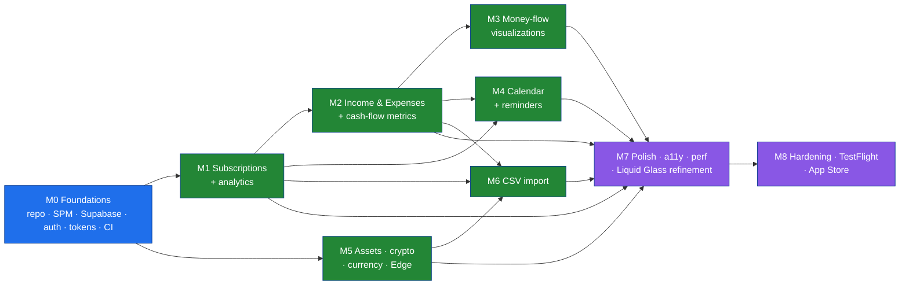

# Roadmap & Milestones

> The internal build order that sequences Finmate's all-in-v1 scope into shippable milestones **M0–M8**, with goals, deliverables, exit criteria, dependencies, a sequencing rationale, a risk register, and a clear post-v1 boundary.

Every feature pillar is **in scope for v1** (see the Canonical Decisions Brief in [`../CLAUDE.md`](../CLAUDE.md), decision #3). "All-in-v1" is a *scope* statement, not a *sequencing* statement: we still build in a deliberate order so each milestone is independently demonstrable, keeps the app launchable, and de-risks the hard parts (money correctness, RLS, sync, Liquid Glass) early. This document defines that order. Granular, checkbox-tracked tasks live in [`./10-task-backlog.md`](./10-task-backlog.md); this document is the milestone-level map those tasks roll up into.

---

## Table of contents

- [1. How to read this roadmap](#1-how-to-read-this-roadmap)
- [2. Roadmap at a glance](#2-roadmap-at-a-glance)
- [3. Sequencing rationale](#3-sequencing-rationale)
- [4. Milestone definitions](#4-milestone-definitions)
  - [M0 — Foundations](#m0--foundations)
  - [M1 — Subscriptions core + analytics](#m1--subscriptions-core--analytics)
  - [M2 — Income & Expenses + cash-flow metrics](#m2--income--expenses--cash-flow-metrics)
  - [M3 — Cost-tracker money-flow visualizations](#m3--cost-tracker-money-flow-visualizations)
  - [M4 — Calendar + reminders/notifications](#m4--calendar--remindersnotifications)
  - [M5 — Assets + crypto calculator + multi-currency + Edge market data](#m5--assets--crypto-calculator--multi-currency--edge-market-data)
  - [M6 — CSV import](#m6--csv-import)
  - [M7 — Polish, accessibility, performance & Liquid Glass refinement](#m7--polish-accessibility-performance--liquid-glass-refinement)
  - [M8 — Hardening, TestFlight beta & App Store submission](#m8--hardening-testflight-beta--app-store-submission)
- [5. Cross-cutting workstreams](#5-cross-cutting-workstreams)
- [6. Definition of Ready / Definition of Done per milestone](#6-definition-of-ready--definition-of-done-per-milestone)
- [7. What is explicitly POST-v1](#7-what-is-explicitly-post-v1)
- [8. Risk register](#8-risk-register)
- [9. Rough timeline & capacity assumptions](#9-rough-timeline--capacity-assumptions)
- [10. Related documents](#10-related-documents)

---

## 1. How to read this roadmap

Each milestone is specified with the same six fields:

- **Goal** — the single outcome that defines the milestone.
- **Scope** — what is in (and pointedly what is *deferred to a later milestone* even though it touches the same area).
- **Key deliverables** — concrete artifacts (modules, screens, tables, RPCs, Edge Functions, tests).
- **Exit criteria** — objective, demonstrable conditions that mean "done"; these are the milestone-level Definition of Done (the per-PR DoD lives in [`./09-engineering-practices.md`](./09-engineering-practices.md)).
- **Dependencies** — which milestones / docs must land first.
- **Backlog** — a pointer to the corresponding section in [`./10-task-backlog.md`](./10-task-backlog.md).

**Conventions used in this document**

- Milestones are **sequential by default** but several can overlap once their dependencies clear; see [§3](#3-sequencing-rationale) and the dependency graph.
- Module names (`DesignSystem`, `DataLayer`, `Domain`, `Features/Subscriptions`, …) and patterns (unidirectional MVVM, `@Observable` stores, repository protocols, offline-first cache) come from [`./03-architecture.md`](./03-architecture.md). Do not invent new ones here.
- Schema, field names, RLS, and triggers are **normative** in [`./05-data-model.md`](./05-data-model.md). Tables named below (e.g. `subscriptions`, `subscription_price_history`, `income_sources`, `fixed_expenses`, `variable_expenses`, `financial_assets`, `asset_transactions`, `categories`, `currency_preferences`, `user_preferences`, `dashboard_layouts`) are defined there.
- Security requirements (Keychain tokens, RLS-on-every-table, hardened `SECURITY DEFINER` RPCs, anon-key-only client, biometric lock) are **normative** in [`./07-security-and-privacy.md`](./07-security-and-privacy.md) and are satisfied incrementally per milestone, then audited as a whole in **M8**.
- Checkbox lists below are **milestone acceptance checklists**, not the granular task list. They are intentionally outcome-level.

---

## 2. Roadmap at a glance

| Milestone | Theme | Primary pillar(s) unlocked | Core modules touched | Demo at end |
|-----------|-------|----------------------------|----------------------|-------------|
| **M0** | Foundations | — (platform) | App, `DesignSystem`, `DataLayer`, `Domain`, `Shared` | Sign in with Apple → empty themed shell with 5 tabs |
| **M1** | Subscriptions core + analytics | Subscriptions, Subscription analytics | `Features/Subscriptions`, `Features/Home`, `DataLayer`, `DesignSystem` (charts) | Add/edit/delete subs offline, see monthly trend + category charts |
| **M2** | Income & Expenses + cash-flow metrics | Income, Fixed/Variable expenses | `Features/CashFlow`, `DataLayer`, `Domain` | Add income/expenses, see monthly income, expenses, net (savings) & savings-rate figures |
| **M3** | Cost-tracker money-flow | Sankey / money-flow viz | `DesignSystem` (FlowDiagram renderer), `Features/CashFlow` | Interactive income→category→spend flow diagram |
| **M4** | Calendar + reminders | Payday calendar, upcoming charges | `Features/Calendar`, local notifications | Month calendar with paydays + charges; opt-in reminders |
| **M5** | Assets + crypto + currency + Edge market data | Assets/investments, BTC calculator, multi-currency | `Features/Assets`, `Features/Calculator`, `Shared` (currency), Edge Function `market-data` | Track assets, convert fiat↔sats, switch display currency |
| **M6** | CSV import | CSV import w/ preview + validation | `Features/Import`, `Shared` (parsing) | Import a CSV → mapped, validated, previewed, committed |
| **M7** | Polish & a11y & perf | Cross-cutting | All `Features/*`, `DesignSystem` | Liquid Glass complete; VoiceOver/Dynamic Type clean; 60 fps |
| **M8** | Hardening & ship | Cross-cutting | All | TestFlight beta → App Store submission |

### Dependency graph

Key edges to note:

- **M5 (currency)** depends only on **M0**, not on M1–M4. The `Money` value type, currency conversion, and the `market-data` Edge Function are foundational enough that M5's *currency + Edge* slice can start in parallel with M1/M2 (the *Assets* and *crypto calculator* UI slices wait for the rest of M5). See [§3](#3-sequencing-rationale).
- **M6 (CSV import)** depends on M1, M2, and M5 because it imports into subscriptions, expenses/income, and must resolve currencies; it cannot meaningfully exist before those domains and the `Money` type do.
- **M7** depends on every feature milestone — it is the convergence point where the single Liquid Glass language, accessibility, and performance are finished across the whole app.

---

## 3. Sequencing rationale

The order is chosen to **front-load risk and correctness**, keep a **launchable app at every milestone**, and respect the **dependency reality** of the domain.

1. **Foundations first, non-negotiably (M0).** Money correctness (`Int64` minor units, the `Money` value type, `Decimal` math), RLS-on-every-table, Keychain token storage, the SPM module graph, and CI are the things that are catastrophically expensive to retrofit. Substimate's float money + pre-store currency conversion bug (see [`./11-substimate-analysis.md`](./11-substimate-analysis.md)) is the canonical example of getting this wrong; M0 makes that class of bug structurally impossible before any feature is written.
2. **Subscriptions next (M1) because it is the product's spine.** It is the highest-value pillar, exercises the full vertical slice (Domain → repository protocol → SwiftData cache → Supabase remote → `@Observable` store → SwiftUI list/detail → Swift Charts), and forces us to finish the offline-first sync engine and the price-history trigger early. Everything after M1 reuses that proven slice. The customizable dashboard (Home) gets its first real cards here.
3. **Income & Expenses (M2) before money-flow (M3)** because a Sankey/flow diagram is meaningless without both *sources* (income) and *sinks* (subscriptions + fixed + variable expenses) to flow between. M2 also produces the cash-flow aggregation logic (Monthly Income, Monthly Expenses, Net/savings, Savings rate %) that M3 visualizes and M4's calendar references.
4. **Money-flow visualization (M3) is deliberately its own milestone** because Swift Charts has **no built-in Sankey**, so a custom `Canvas`/`Path` flow renderer must be built and tested in `DesignSystem` (called out as a known engineering item in the brief and in [`./03-architecture.md`](./03-architecture.md) / [`./06-design-system.md`](./06-design-system.md)). Isolating it prevents it from blocking the simpler M2 work and lets it be swapped for a vetted SPM dependency if the custom renderer underperforms.
5. **Calendar (M4)** depends on subscription billing schedules (M1) and income `next_payment` / expense `due_date` data (M2). It introduces the first *local* `UserNotifications` work (opt-in reminders) — a contained surface to get notification permissions and scheduling right without the full push-notification machinery (which is post-v1).
6. **Assets + crypto + currency + Edge market data (M5)** is grouped because they share the same backbone: the `Money` type, currency conversion, and the server-side `market-data` Edge Function (which keeps any provider keys off the client — a hard improvement over Substimate's client-side market calls). Multi-currency display is foundational, so its *engine* lands early (parallel with M1/M2); the assets/crypto *UI* completes the milestone.
7. **CSV import (M6) comes late** because it is a *consumer* of every domain it imports into. Building it last means we map to final, stable schemas and the `Money` type, and we get the most leverage from one robust, well-tested parser/validator/preview pipeline (Substimate's import lacked real validation and tests — we fix that here).
8. **Polish, a11y, performance (M7)** is a dedicated milestone, not an afterthought, because the design north star is "flawless, Apple-grade Liquid Glass." Concentrating the final Liquid Glass refinement, Dynamic Type / VoiceOver / reduce-motion / contrast passes, and performance tuning (60 fps, launch time, memory) at the end — once all surfaces exist — produces a coherent result rather than per-feature drift.
9. **Hardening + ship (M8) last** gathers the security audit, account deletion + data export (App Store requirements), the App Privacy nutrition label, beta feedback, and submission into one controlled gate.

> **Launchable-at-every-milestone rule:** after M0 the app builds, signs in, and runs on a device. Each subsequent milestone adds a usable slice without breaking the previous ones. This makes every milestone a real TestFlight-able checkpoint (internal track), not just a code state.

---

## 4. Milestone definitions

### M0 — Foundations

**Goal**
Stand up the entire skeleton — repository, modular SPM workspace, Supabase project with schema + RLS, authentication with Keychain-backed tokens, the Liquid Glass design tokens, and green CI — so that every later milestone is a vertical feature slice on a proven base.

**Scope**

- In: repo bootstrap; Xcode 26 project + SPM package graph; Supabase project (dev + prod) with the full v1 schema, RLS, triggers, and seed categories; Sign in with Apple + email/password auth; Keychain token storage; the `Money` value type and currency primitives; design tokens + the Liquid Glass primitive (`glassEffect` with Materials fallback); the 5-tab `TabView` shell + router; CI pipeline.
- Deferred: any feature data UI beyond empty states (M1+); the `market-data` Edge Function logic (stub only in M0, completed in M5); biometric *enforcement* timeout polish (basic toggle in M0, refined in M7/M8).

**Key deliverables**

- **Repo & tooling**
  - `finmate` repo initialized and pushed to `https://github.com/RNT56/finmate.git`; protected `main`, conventional commits, PR template, CODEOWNERS.
  - Xcode 26 workspace; thin **App** target (composition root) + local SPM packages: `DesignSystem`, `DataLayer`, `Domain`, `Shared`. Feature packages scaffolded as empty modules (`Features/Auth`, `Features/Home`, `Features/Subscriptions`, `Features/CashFlow`, `Features/CostTracker`, `Features/Calendar`, `Features/Import`, `Features/Assets`, `Features/Calculator`, `Features/Settings`).
  - Swift 6 language mode with **strict concurrency checking** enabled across all targets.
  - SwiftLint + swift-format configs; pre-commit hook + CI enforcement.
- **Backend (Supabase)**
  - Supabase projects provisioned (dev + prod). All v1 tables created via migrations with `user_id` FK to `auth.users`, `created_at`/`updated_at`, the shared `set_updated_at()` trigger, and CHECK constraints (currency ∈ allowed set; `amount_minor >= 0` where appropriate). Full schema is **normative** in [`./05-data-model.md`](./05-data-model.md).
  - **RLS enabled on every table** with owner-only policies derived from `auth.uid()`.
  - `subscription_price_history` auto-write trigger (hardened `SECURITY DEFINER`, `SET search_path = public`).
  - `get_user_categories` RPC (or equivalent) seeding defaults (Streaming, Music, Gaming, Productivity, AI Chat, Coding, …) with protected pseudo-categories (All, Favorites, Other).
  - `market-data` Edge Function **scaffolded** (returns a static stub; real provider integration in M5) to lock the client contract early.
  - Generated Postgres types committed for the future web client's reuse and the Swift mapping reference.
- **Client core**
  - `supabase-swift` SDK integrated; single configured client in `DataLayer`; **only the public anon key** ships in the bundle.
  - Auth: Sign in with Apple + email/password; **access/refresh tokens stored in the iOS Keychain** (never `UserDefaults`); SDK auto-refresh wired.
  - First-run onboarding skeleton: currency + appearance + optional biometric lock toggle (writes `user_preferences` / `currency_preferences`).
  - `Money` value type (`Int64` minor units + ISO currency code; `Decimal` for compute/format; `satsPerBTC = 100_000_000`); currency formatting in `Shared`. **Unit tests from day one.**
  - Repository **protocols** defined in `Domain` (implementations in `DataLayer`) for all domains (implementations land per feature milestone); offline-first cache wired to SwiftData behind those protocols.
  - `DesignSystem`: color/typography/spacing/elevation tokens; light/dark/system appearance; the Liquid Glass primitive wrapper (`glassEffect` / `GlassEffectContainer` on iOS 26+, automatic `Material` fallback on iOS 18–25); base button styles (`.glass` / `.glassProminent` with fallback).
  - Navigation: root `TabView` (Home, Subscriptions, Cash Flow, Calendar, More) + `NavigationStack` + typed paths + lightweight router; contextual Add (+) affordance placeholder.
- **CI/CD**
  - GitHub Actions: build + unit test + SwiftLint + swift-format check + **Gitleaks secret scan** + dependency review, all required on PRs.
  - Fastlane lanes scaffolded (`test`, `beta`); signing/match strategy chosen; TestFlight internal track reachable (smoke build).

**Exit criteria**

- [ ] App builds and runs on a physical iPhone (min deploy target **iOS 18.0**) under Swift 6 strict concurrency with **zero concurrency warnings**.
- [ ] A user can Sign in with Apple **and** with email/password; tokens are verified present in the Keychain and absent from `UserDefaults`; auto-refresh works across an expired access token.
- [ ] `psql`/Supabase check confirms **RLS is enabled on every v1 table** and a second test user cannot read the first user's rows.
- [ ] The 5-tab shell renders with the Liquid Glass primitive on an iOS 26 device/simulator and the Materials fallback on an iOS 18 device/simulator (verified with a screenshot pair).
- [ ] `Money` math + currency formatting unit tests pass (including BTC/sats round-trips and a non-EUR amount stored in its native currency without pre-store conversion).
- [ ] CI is green on `main` with all required checks (build, test, lint, format, Gitleaks, dependency review).
- [ ] An internal TestFlight build of the empty shell is installable.

**Dependencies:** none (this is the root). Normative inputs: [`./05-data-model.md`](./05-data-model.md), [`./07-security-and-privacy.md`](./07-security-and-privacy.md), [`./03-architecture.md`](./03-architecture.md), [`./04-tech-stack.md`](./04-tech-stack.md).

**Backlog:** [`./10-task-backlog.md`](./10-task-backlog.md) → *M0 — Foundations*.

---

### M1 — Subscriptions core + analytics

**Goal**
Deliver the product's spine end-to-end: full subscription CRUD with offline-first sync and price history, plus the first analytics (monthly trend, category distribution, lifetime cost, usage, payment-method breakdown) on a customizable Home dashboard. This milestone also **finishes the sync engine** that every later feature reuses.

**Scope**

- In: `Features/Subscriptions` (list, detail, add/edit/delete, reorder via `sort_order`, favorite, usage state, categories); subscription analytics; first Home dashboard cards; the offline-first repository implementation + sync engine (optimistic writes, last-write-wins per field via `updated_at`); price-history surfacing.
- Deferred: income/expenses (M2); flow diagram (M3); calendar (M4); currency *switching* UI beyond storing native currency (display conversion lands with M5 — M1 displays each subscription in its stored currency and an estimated home-currency total once M5's engine is available).

**Key deliverables**

- `SubscriptionRepository` implementation in `DataLayer` (SwiftData read cache + Supabase remote source of truth) implementing the protocol from M0.
- **Sync engine**: optimistic local write → enqueue remote mutation → reconcile; **conflict policy = last-write-wins per field using `updated_at`** (documented in [`./03-architecture.md`](./03-architecture.md)); Realtime subscription to push remote changes into the cache; offline queue with retry.
- `SubscriptionStore` (`@Observable`) + SwiftUI list/detail/add/edit screens using `DesignSystem` components only.
- Category picker backed by `get_user_categories`; protected categories (All, Favorites, Other) honored.
- Price-history: edits that change price/currency trigger the DB-side `subscription_price_history` write; a detail-screen price-history timeline reads it back.
- **Subscription analytics** (computed in `Domain`/`Shared`, rendered with **Swift Charts**): monthly cost trend (line/bar), category distribution (donut/bar), lifetime cost, usage breakdown (active/rarely/unused), payment-method breakdown.
- Home: first **customizable/draggable dashboard** cards (`dashboard_layouts` persisted), seeded with subscription summary + a chart card.
- Optimistic-update toast feedback (success/error) via a `DesignSystem` toast component (the native, single-design replacement for Substimate's `ToastContext`).
- **Tests**: unit tests for analytics aggregation and money math on subscriptions; snapshot tests for the subscription card and chart cards; an XCUITest for "add a subscription" happy path.

**Exit criteria**

- [ ] Full subscription CRUD works **offline** (airplane mode), and changes sync correctly on reconnect with no duplicate or lost rows.
- [ ] A price change writes a `subscription_price_history` row via the DB trigger and the detail timeline shows it.
- [ ] All five analytics render correctly for a seeded dataset and match hand-computed expected values in unit tests.
- [ ] Reorder, favorite, and usage-state changes persist and survive an app relaunch (read from cache instantly, then reconcile).
- [ ] Home dashboard cards can be reordered and the layout persists to `dashboard_layouts`.
- [ ] Coverage: analytics + money logic unit tests pass; subscription snapshot tests pass; the add-subscription XCUITest passes in CI.

**Dependencies:** **M0**. Reads [`./02-product-spec.md`](./02-product-spec.md) (Subscriptions + analytics acceptance criteria), [`./05-data-model.md`](./05-data-model.md), [`./06-design-system.md`](./06-design-system.md).

**Backlog:** [`./10-task-backlog.md`](./10-task-backlog.md) → *M1 — Subscriptions & analytics*.

---

### M2 — Income & Expenses + cash-flow metrics

**Goal**
Add the income and expense sides of the ledger and the cash-flow math that turns raw entries into meaningful figures (Monthly Income, Monthly Expenses, Net/savings, Savings rate %, from normalized recurring totals), reusing the M1 sync slice.

> **Metric scope (v1):** the cash-flow metrics are exactly **Monthly Income**, **Monthly Expenses**, **Net (savings)** = income − expenses, and **Savings rate %** = Net ÷ income. Finmate does **not** model a liquid balance in v1, so a **runway** metric (months of cover) has no input and is **not** part of v1 — it is intentionally excluded here, not deferred work hiding in M2.

**Scope**

- In: `Features/CashFlow` for `income_sources`, `fixed_expenses`, `variable_expenses`; frequency normalization (weekly/monthly/quarterly/yearly/one_time → a common monthly basis); net cash-flow metrics and dashboard cards.
- Deferred: the Sankey/flow *visualization* (M3 — M2 produces the aggregation, M3 draws it); calendar surfacing of these dates (M4); CSV import of these rows (M6).

**Key deliverables**

- **Expense-category taxonomy migration (M2-DATA):** the `categories.kind` discriminator (`'subscription' | 'expense'`) and the `(user_id, kind, name)` unique constraint, plus seeding the **11 expense categories** (Housing, Transportation, Food, Utilities, Insurance, Healthcare, Entertainment, Shopping, Education, Savings, Other) via `seed_default_categories`, and `get_user_categories(p_kind)` filtering by kind. `fixed_expenses`/`variable_expenses` resolve their `category_id` FKs against `kind = 'expense'`. Normative in [`./05-data-model.md`](./05-data-model.md); tracked under *M2-DATA* in [`./10-task-backlog.md`](./10-task-backlog.md).
- `IncomeRepository`, `FixedExpenseRepository`, `VariableExpenseRepository` implementations (same offline-first pattern as M1).
- CRUD screens for income sources, fixed expenses (with `autopay`), and variable expenses, all using `DesignSystem` components and the shared category picker filtered to `kind = 'expense'`.
- **Cash-flow engine** in `Domain`/`Shared`: normalize each entry's `frequency`/`billing_period` to a monthly-equivalent `Money`; compute **Monthly Income** (normalized recurring income), **Monthly Expenses** (normalized subscriptions from M1 + fixed expenses + variable spend), **Net (savings)** = income − expenses, and **Savings rate %** = Net ÷ income.
- New Home dashboard cards: "Monthly income", "Monthly expenses", "Net (savings)", and a savings-rate summary.
- **Tests**: unit tests for frequency normalization and net-flow math across all currencies and frequencies (including one_time exclusion from recurring totals); snapshot tests for the new cards.

**Exit criteria**

- [ ] The M2-DATA migration is applied: `categories.kind` exists with the `(user_id, kind, name)` constraint, the 11 expense categories are seeded, and `get_user_categories(p_kind => 'expense')` returns only expense categories; expense sheets show expense categories only.
- [ ] Income, fixed, and variable entries support full offline-first CRUD and sync.
- [ ] Net (savings) = Monthly Income − Monthly Expenses, where Monthly Expenses = (normalized subscriptions + fixed) + (variable for the period); and Savings rate % = Net ÷ income — all verified against unit-test fixtures for monthly/quarterly/yearly/weekly inputs.
- [ ] Mixed-currency entries are normalized correctly (no float drift; `Int64` minor units throughout) — covered by tests.
- [ ] Dashboard cash-flow cards (Monthly Income, Monthly Expenses, Net/savings, Savings rate %) render and update reactively when an entry changes.
- [ ] Cash-flow aggregation unit tests pass; snapshot tests pass.

**Dependencies:** **M1** (reuses sync engine; subscriptions feed outflow). Reads [`./02-product-spec.md`](./02-product-spec.md), [`./05-data-model.md`](./05-data-model.md).

**Backlog:** [`./10-task-backlog.md`](./10-task-backlog.md) → *M2 — Income & expenses*.

---

### M3 — Cost-tracker money-flow visualizations

**Goal**
Build the signature money-flow (Sankey-style) visualization that shows income flowing through categories into subscriptions and expenses — the feature Swift Charts cannot provide out of the box.

**Scope**

- In: a custom `Canvas`/`Path`-based **flow-diagram renderer** in `DesignSystem`; the `Features/CostTracker` screen that feeds it from the M2 cash-flow engine; interaction (tap a node/link to drill in), light animation, light/dark theming, and accessibility descriptions.
- Deferred: nothing downstream depends on M3 except M7 polish; M3 is a leaf in feature terms.

**Key deliverables**

- `FlowDiagram` component in `DesignSystem`: a deterministic layout (node ranking + link routing) rendered with SwiftUI `Canvas`/`Path`, themed with design tokens, honoring `reduceMotion`. (Evaluate a vetted SPM Sankey dependency as a fallback; document the decision as an ADR in [`./12-decisions-adr.md`](./12-decisions-adr.md) if adopted.)
- A `FlowModel` mapping (income sources → categories → outflows) derived from the M2 cash-flow engine, expressed in `Money` minor units.
- Interaction: tap to highlight a path, tap a node to drill into the underlying subscriptions/expenses; haptics on selection.
- **Accessibility**: VoiceOver reads each flow as "X from {source} to {category}: {amount}"; the diagram has a tabular alternative for assistive tech and reduce-motion users.
- **Tests**: unit tests for the layout/aggregation transform (deterministic node/link sizing); snapshot tests for the diagram in light + dark at representative datasets; performance check on a large flow graph.

**Exit criteria**

- [ ] The flow diagram renders correctly for representative datasets and totals reconcile exactly with the M2 cash-flow numbers (sum of link weights = node throughput).
- [ ] Tapping a node/link drills into the correct underlying entries.
- [ ] The diagram is fully usable with VoiceOver and provides a non-animated tabular alternative under reduce-motion.
- [ ] Renders at ≥ 60 fps for a realistic graph (e.g. 6 income sources, 8 categories, 30 outflows) on a baseline device.
- [ ] Layout-transform unit tests and light/dark snapshot tests pass.

**Dependencies:** **M2** (the cash-flow aggregation it visualizes). Reads [`./06-design-system.md`](./06-design-system.md) (FlowDiagram spec), [`./03-architecture.md`](./03-architecture.md).

**Backlog:** [`./10-task-backlog.md`](./10-task-backlog.md) → *M3 — Money-flow visualization*.

---

### M4 — Calendar + reminders/notifications

**Goal**
Provide the payday + upcoming-charges calendar and opt-in **local** reminders for paydays and upcoming subscription/expense charges.

**Scope**

- In: `Features/Calendar` month/agenda views surfacing income `next_payment` (paydays), subscription billing dates (derived from `start_date` + `billing_period`), and fixed-expense `due_date`s; opt-in **local** notifications (`UserNotifications`) for upcoming charges and paydays with configurable lead time.
- Deferred: **rich/remote push notifications** are post-v1 (see [§7](#7-what-is-explicitly-post-v1)); M4 ships *local* notifications only.

**Key deliverables**

- **Notifications schema migration (M4-DATA):** add `user_preferences.payment_reminders_enabled` / `payday_reminders_enabled` (`boolean NOT NULL DEFAULT true`) and `reminder_lead_time_days` (`integer NOT NULL DEFAULT 2 CHECK (reminder_lead_time_days BETWEEN 0 AND 30)`), plus `subscriptions.reminders_enabled` (`boolean NOT NULL DEFAULT false`), and the matching Swift fields. Normative in [`./05-data-model.md`](./05-data-model.md); tracked under *M4-DATA* in [`./10-task-backlog.md`](./10-task-backlog.md).
- A billing-schedule generator in `Domain`: expands recurring subscriptions/expenses/income into concrete future occurrences within a window.
- Calendar UI (month grid + agenda list) with Liquid Glass styling; day detail shows the charges/paydays on that date and links to the underlying entity.
- Opt-in local notification scheduling: permission request flow, per-type toggles (paydays, upcoming charges), configurable lead time (e.g. same-day / 1 day / 3 days before), rescheduling on data change, cancellation on delete.
- Settings entries for notification preferences persisted in `user_preferences` (`payment_reminders_enabled`, `payday_reminders_enabled`, `reminder_lead_time_days`) plus the per-subscription `subscriptions.reminders_enabled` toggle.
- **Tests**: unit tests for the occurrence generator (DST/month-end edge cases, leap years, quarterly/yearly expansion); tests that scheduled notifications match generated occurrences; an XCUITest for granting permission and seeing a reminder toggle.

**Exit criteria**

- [ ] The M4-DATA migration is applied: the `user_preferences` reminder columns and `subscriptions.reminders_enabled` exist with their defaults/CHECK, and reminder scheduling honors them.
- [ ] The calendar correctly shows paydays, subscription charges, and fixed-expense due dates for any month, including month-end and leap-year edge cases (unit-tested).
- [ ] With permission granted, local reminders fire at the configured lead time and are cancelled/rescheduled when the underlying entry changes or is deleted.
- [ ] Notification permission denial degrades gracefully (calendar still works; toggles show disabled state with guidance to Settings).
- [ ] Occurrence-generator and scheduling unit tests pass; the calendar XCUITest passes.

**Dependencies:** **M1** (subscription schedules) and **M2** (income/expense dates). Reads [`./02-product-spec.md`](./02-product-spec.md), [`./07-security-and-privacy.md`](./07-security-and-privacy.md) (permission/privacy handling).

**Backlog:** [`./10-task-backlog.md`](./10-task-backlog.md) → *M4 — Calendar & reminders*.

---

### M5 — Assets + crypto calculator + multi-currency + Edge market data

**Goal**
Complete the assets/investments pillar, the BTC/crypto calculator, and **multi-currency display**, all powered by a **server-side** `market-data` Edge Function so no provider keys ever reach the client.

**Scope**

- In: `Features/Assets` (`financial_assets` + `asset_transactions`); `Features/Calculator` (fiat↔sats, BTC valuation); the multi-currency *engine* (display-currency conversion using `currency_preferences.exchange_rates`); the **`market-data` Edge Function** (real provider integration, keys server-side); display-currency switching across the app.
- Note on parallelism: the **currency engine + Edge Function** slice may begin right after **M0** (it is foundational and unblocks M1/M2 totals); the **assets + calculator UI** slice completes the milestone and depends on the currency engine.

**Key deliverables**

- `market-data` **Edge Function** (completing the M0 stub): fetches fiat FX and BTC spot from a public provider, caches, and returns rates; **provider keys live only in Supabase Edge environment secrets** — never in the app bundle (the explicit fix for Substimate's client-side market calls).
- Currency engine in `Shared`: convert `Money` between currencies via cached `exchange_rates` (jsonb in `currency_preferences`), with `satsPerBTC = 100_000_000` for BTC↔fiat; refresh path through the Edge Function; stale-rate handling.
- `FinancialAssetRepository` + `AssetTransactionRepository` (offline-first); assets list/detail with cost basis, current value (from market data where applicable), and gain/loss; buy/sell/dividend/other transactions.
- BTC/crypto **calculator** screen: fiat↔sats conversion, "what is X BTC worth", using live rates from the Edge Function; offline shows last-known rate with a staleness indicator.
- App-wide **display currency switch**: subscription/cash-flow/asset totals re-expressed in the chosen display currency while each entity retains its **native stored currency** (the Substimate pre-store-conversion bug is structurally avoided — conversion is display-only).
- **Tests**: unit tests for currency conversion (fiat↔fiat, fiat↔BTC/sats, rounding rules, stale-rate fallback); contract test for the Edge Function response shape; snapshot tests for the calculator and asset cards.

**Exit criteria**

- [ ] The `market-data` Edge Function returns valid rates and is the **only** path to market data; a bundle/secret scan confirms no provider keys ship in the app (ties into the M8 audit and CI Gitleaks).
- [ ] Fiat↔fiat and fiat↔BTC conversions are exact to the minor unit and match unit-test fixtures; sats round-trips are lossless.
- [ ] Switching display currency re-expresses all totals while stored currencies remain native (verified in DB and tests).
- [ ] Assets track cost basis and gain/loss correctly across buy/sell/dividend transactions (unit-tested).
- [ ] The calculator works online (live rate) and offline (last-known rate with staleness indicator).
- [ ] Currency + Edge contract tests pass; asset/calculator snapshot tests pass.

**Dependencies:** **M0** (for the currency engine + Edge slice). The assets/calculator UI slice depends on the currency engine. Reads [`./05-data-model.md`](./05-data-model.md), [`./07-security-and-privacy.md`](./07-security-and-privacy.md) (Edge secrets posture), [`./04-tech-stack.md`](./04-tech-stack.md).

**Backlog:** [`./10-task-backlog.md`](./10-task-backlog.md) → *M5 — Assets, crypto & currency*.

---

### M6 — CSV import

**Goal**
Ship a robust CSV import pipeline — parse, map columns, validate, preview, and commit — for subscriptions, income, and expenses, with **real automated tests** (Substimate's import lacked them).

**Scope**

- In: `Features/Import` covering file/document picking, delimiter/encoding detection, column→field mapping, per-row validation, a preview/diff before commit, and a batched, offline-first commit into the relevant repositories.
- Deferred: bank/aggregator-feed import is **post-v1** (see [§7](#7-what-is-explicitly-post-v1)); M6 is user-supplied CSV only.

**Key deliverables**

- CSV parser in `Shared`: encoding detection (UTF-8/UTF-16/Latin-1), delimiter inference, quoted-field handling, header detection.
- Mapping UI: map columns to fields per target type (subscription / income / fixed / variable); remember a mapping profile.
- **Validation**: required fields, currency ∈ allowed set, amounts parsed into `Money` minor units (rejecting float ambiguity), date parsing, category resolution (create-or-map), duplicate detection against existing rows.
- **Preview**: a row-by-row table marking valid / warning / error rows with reasons; user resolves or skips before commit.
- Commit: batched optimistic writes through the existing repositories; partial-success handling; an import summary toast.
- **Tests**: unit tests for the parser (malformed rows, embedded delimiters, BOM, mixed line endings), validators (currency/amount/date), and the money conversion path; an XCUITest importing a fixture CSV end-to-end.

**Exit criteria**

- [ ] A representative CSV (with messy rows: bad currency, blank amount, future date, duplicate) imports with each problem correctly flagged in preview; only the user-approved rows commit.
- [ ] All amounts land as `Int64` minor units in the correct native currency — no float, no pre-store conversion (verified in tests and DB).
- [ ] Imported rows participate in offline-first sync and appear in analytics/cash-flow immediately.
- [ ] Parser, validator, and money-path unit tests pass; the end-to-end import XCUITest passes.

**Dependencies:** **M1**, **M2**, **M5** (imports into subscriptions, income/expenses, and resolves currencies). Reads [`./02-product-spec.md`](./02-product-spec.md), [`./05-data-model.md`](./05-data-model.md).

**Backlog:** [`./10-task-backlog.md`](./10-task-backlog.md) → *M6 — CSV import*.

---

### M7 — Polish, accessibility, performance & Liquid Glass refinement

**Goal**
Make it Apple-grade: finish the single Liquid Glass design language across every surface, complete accessibility, and meet performance budgets — once all feature surfaces exist.

**Scope**

- In: final Liquid Glass refinement (consistent `glassEffect` usage, `GlassEffectContainer`/`glassEffectID` morphing transitions, scroll-edge effects, motion, depth, haptics) with verified Materials fallback on iOS 18–25; full accessibility pass; performance tuning; empty/error/loading-state polish; iconography (SF Symbols + bespoke symbols) finalization.
- Deferred: nothing — M7 is the cross-cutting convergence before ship.

**Key deliverables**

- A design-consistency sweep against [`./06-design-system.md`](./06-design-system.md): no ad-hoc colors/spacing; all components from `DesignSystem`; verified light/dark/system across every screen; **no remnants of Substimate's 9 styles** (single language only).
- **Accessibility**: Dynamic Type (up to the largest accessibility sizes) without truncation/clipping; VoiceOver labels/traits/ordering on every interactive element and chart/diagram; `reduceMotion` and increased-contrast variants; minimum tap targets; color-contrast audit.
- **Performance**: launch time, scroll at 60 fps on baseline hardware, memory ceilings, Instruments time-profiler + SwiftUI re-render audit; chart/flow-diagram performance on large datasets; cache/query tuning in `DataLayer`.
- **Snapshot test expansion** (swift-snapshot-testing) across `DesignSystem` components and key screens in light/dark + a large Dynamic Type size, locked into CI.
- Haptics and motion polish (selection/impact feedback; glass morph transitions) consistent across flows.

**Exit criteria**

- [ ] Every screen verified in light, dark, and system appearance; Liquid Glass on iOS 26+ and Materials fallback on iOS 18–25 confirmed (paired screenshots in the PR).
- [ ] VoiceOver can complete every critical flow; Dynamic Type at the largest accessibility size shows no clipped or overlapping content; reduce-motion and increased-contrast paths verified.
- [ ] Performance budgets met: cold launch under target, sustained 60 fps on the baseline device for lists, charts, and the flow diagram; no memory growth over a scripted session.
- [ ] Expanded snapshot suite is green and required in CI; no design-token violations flagged by lint/review.

**Dependencies:** **M1–M6** (all feature surfaces must exist to polish them). Reads [`./06-design-system.md`](./06-design-system.md), [`./09-engineering-practices.md`](./09-engineering-practices.md).

**Backlog:** [`./10-task-backlog.md`](./10-task-backlog.md) → *M7 — Polish, a11y & performance*.

---

### M8 — Hardening, TestFlight beta & App Store submission

**Goal**
Pass a full security/privacy audit, satisfy App Store requirements (account deletion, data export, accurate privacy label), run an external TestFlight beta, and submit v1.

**Scope**

- In: end-to-end security audit; biometric privacy-lock finalization (configurable timeout); ATS verification + optional certificate pinning for the Supabase host; account deletion + data export in-app; App Privacy nutrition label; release engineering (versioning, App Store Connect metadata, screenshots); external TestFlight beta + feedback triage; submission.
- Deferred: anything in [§7](#7-what-is-explicitly-post-v1).

**Key deliverables**

- **Security audit** against [`./07-security-and-privacy.md`](./07-security-and-privacy.md): verify RLS on every table with a hostile second-user test; confirm hardened `SECURITY DEFINER` RPCs (`SET search_path = public`, `REVOKE ALL FROM PUBLIC`, `GRANT EXECUTE TO authenticated`, per-row owner checks); confirm **only the anon key** ships and no provider secrets are in the bundle (Gitleaks + manual bundle inspection); tokens in Keychain only.
- **Biometric privacy lock** (Face ID/Touch ID via `LocalAuthentication`): app-entry gate with configurable timeout; sensitive caches cleared on logout.
- **App Transport Security** HTTPS-only confirmed; optional **certificate pinning** for the Supabase host implemented or explicitly deferred via ADR.
- **Account deletion + data export** inside the app (App Store requirement): full account+data deletion path (client + server/RPC) and an export of the user's data.
- **App Privacy nutrition label** authored to match actual data use; confirm **no third-party trackers** and **no PII in analytics/logs**.
- Release engineering: semantic version, build metadata, Fastlane release lane, App Store Connect listing (description, keywords, screenshots, privacy policy URL), TestFlight external group.
- **External TestFlight beta**: recruit testers, collect crash/feedback, triage and fix blockers; a beta-feedback log with resolutions.
- Final QA pass of the XCUITest suite on the release candidate; crash-free-session target met during beta.

**Exit criteria**

- [ ] Security checklist in [`./07-security-and-privacy.md`](./07-security-and-privacy.md) fully passed and signed off; hostile-user RLS test confirms zero cross-user data access.
- [ ] No service-role key, provider secret, or PII ships in the app bundle or logs (verified by Gitleaks + manual inspection).
- [ ] Biometric lock gates entry with a configurable timeout; logout clears sensitive caches.
- [ ] Account deletion and data export both work end-to-end and meet App Store requirements.
- [ ] App Privacy label is accurate; privacy policy is published and linked.
- [ ] External TestFlight beta completed; all P0/P1 issues resolved; crash-free-session target met.
- [ ] v1 submitted to App Store review with all required checks green on the release candidate.

**Dependencies:** **M7** (and transitively all milestones). Reads [`./07-security-and-privacy.md`](./07-security-and-privacy.md) (normative), [`./09-engineering-practices.md`](./09-engineering-practices.md).

**Backlog:** [`./10-task-backlog.md`](./10-task-backlog.md) → *M8 — Hardening & release*.

---

## 5. Cross-cutting workstreams

These run **across all milestones** rather than living in one; each milestone must satisfy its slice of them, with a final convergence in M7/M8.

| Workstream | Per-milestone obligation | Final gate |
|------------|--------------------------|-----------|
| **Testing** | Unit tests for all pure logic introduced (money math, conversion, aggregation, parsing); snapshot tests for new `DesignSystem` components; XCUITest for the milestone's critical flow. | Full suite green; coverage of pure logic; M7 snapshot expansion. |
| **Security & privacy** | RLS + owner checks on any new table/RPC; no new secrets in client; Keychain for any new tokens; permission flows handled. | M8 full audit. |
| **Accessibility** | New screens ship with VoiceOver labels, Dynamic Type support, and respect `reduceMotion`. | M7 full a11y pass. |
| **Design consistency** | Use only `DesignSystem` tokens/components; Liquid Glass + Materials fallback verified on new surfaces. | M7 single-language sweep. |
| **Observability** | Structured `OSLog` logging on new code paths (no PII); typed throwing errors; feature flags for risky surfaces. | M8 log/PII review. |
| **CI/CD & DoD** | Every PR passes build/test/lint/format/Gitleaks/dependency-review and meets the [`./09-engineering-practices.md`](./09-engineering-practices.md) Definition of Done. | M8 release lane. |
| **Docs** | Update the relevant normative doc *first* on any schema/security change, then propagate, then record an ADR in [`./12-decisions-adr.md`](./12-decisions-adr.md). | Docs match shipped code at M8. |

---

## 6. Definition of Ready / Definition of Done per milestone

A milestone may **start** (Definition of Ready) when:

- [ ] Its dependencies' exit criteria are met.
- [ ] Its scope is reflected as tasks in [`./10-task-backlog.md`](./10-task-backlog.md) with acceptance criteria.
- [ ] Any new schema/RLS/RPC is specified in [`./05-data-model.md`](./05-data-model.md) and any new security surface in [`./07-security-and-privacy.md`](./07-security-and-privacy.md).
- [ ] Any new UI maps to existing `DesignSystem` components/tokens in [`./06-design-system.md`](./06-design-system.md) (or new components are specced there first).

A milestone is **done** (milestone Definition of Done) when:

- [ ] All exit criteria in its section above are checked.
- [ ] All cross-cutting obligations ([§5](#5-cross-cutting-workstreams)) for that milestone are met.
- [ ] CI is green on `main`; the per-PR DoD in [`./09-engineering-practices.md`](./09-engineering-practices.md) was satisfied for every merged PR.
- [ ] An internal TestFlight build is installable and the milestone's demo is reproducible.
- [ ] Docs updated and any architectural change recorded as an ADR in [`./12-decisions-adr.md`](./12-decisions-adr.md).

---

## 7. What is explicitly POST-v1

These are **deliberately out of v1 scope** per the Canonical Decisions Brief. They are listed so no milestone silently absorbs them, and so the backend contract is built to *accommodate* them later without rework.

- [ ] **Web client — now in scope, after the iOS foundation (not post-v1).** Originally deferred; brought into committed scope by [ADR-0021](./12-decisions-adr.md#adr-0021--web-client-brought-into-scope-amends-adr-0002). It is a *separate* Vite + React 19 + TypeScript client under `web/` that reuses the same Supabase backend contract (schema + RLS + Edge Functions + generated types) and the [`./13-algorithms-and-calculations.md`](./13-algorithms-and-calculations.md) algorithms (TypeScript port), in the same Liquid Glass language. **iOS leads;** the web **tracks the iOS pillars (M1…M8)** rather than defining its own roadmap — see [`./16-web-client.md`](./16-web-client.md) §10. The iOS v1 itself remains iPhone-only.
- [ ] **iPad / Mac Catalyst.** Post-v1 considerations, not v1. v1 targets iPhone, portrait-first.
- [ ] **Bank / financial-institution aggregation** (Plaid/Tink/Nordigen-style automatic transaction feeds). v1 import is user-supplied **CSV only** (M6). Aggregation adds significant compliance, security, and provider-cost surface.
- [ ] **Home Screen / Lock Screen widgets & Live Activities (WidgetKit).** Attractive but additive; deferred to keep v1 focused.
- [ ] **Rich / remote push notifications.** v1 ships **local** notifications only (M4). Remote push (server-driven, time-sensitive, actionable) requires APNs + server infra and is post-v1.
- [ ] **Sharing / collaboration** (shared subscriptions, household/family views). Requires a multi-owner data model and new RLS — post-v1.
- [ ] **Siri / Shortcuts / App Intents** (voice and Shortcuts automation, "Add subscription" intents). Post-v1.
- [ ] **Advanced forecasting / ML insights** (predictive spend, anomaly detection). Post-v1; v1 ships deterministic analytics.
- [ ] **Apple Watch / watchOS companion.** Post-v1.
- [ ] **Additional auth providers / passkeys beyond Sign in with Apple + email-password.** Post-v1.

> Architectural note: because the backend is a portable contract (Supabase + RLS + Edge Functions + generated types) and the client is modular SPM with repository protocols, the web client, widgets, App Intents, and aggregation can be added later as **new clients/modules** against the same data layer rather than rewrites. Keep that property intact when building v1.

---

## 8. Risk register

Top risks, ordered by combined likelihood × impact. Each has an owner-style mitigation; review at each milestone boundary.

| # | Risk | Likelihood | Impact | Mitigation | First addressed in |
|---|------|-----------|--------|------------|--------------------|
| R1 | **Liquid Glass API churn / availability** — iOS 26 `glassEffect`/`GlassEffectContainer`/`glassEffectID` APIs evolve, or look wrong on some devices. | Medium | High | Wrap all glass usage behind `DesignSystem` primitives with a **Materials fallback** (iOS 15+) so the app never hard-depends on iOS 26 surface; verify on iOS 18 and 26 each milestone; keep fallback paths first-class. | M0, audited M7 |
| R2 | **Offline-first sync correctness** — lost/duplicated writes, conflict resolution bugs, Realtime races. | Medium | High | Build the sync engine once in M1 with documented **last-write-wins per field via `updated_at`**; idempotent mutation queue; extensive unit tests + an offline/online XCUITest; reconcile against Realtime. | M1, hardened M8 |
| R3 | **Money/currency correctness** — repeating Substimate's float-money + pre-store-conversion bug. | Low (by design) | Critical | `Money` value type (`Int64` minor units, `Decimal` compute) and conversion are **display-only**; entities keep native currency; comprehensive money/conversion tests from M0; CI guards. | M0/M5 |
| R4 | **Custom Sankey/flow renderer underperforms or is hard to make accessible.** | Medium | Medium | Isolate in M3; define a deterministic layout transform with unit tests; have a **vetted SPM Sankey dependency as fallback** (ADR if adopted); ship a tabular VoiceOver/reduce-motion alternative. | M3 |
| R5 | **Edge Function market-data provider** — rate limits, downtime, key cost, or schema changes. | Medium | Medium | All market data via the server-side `market-data` Edge Function (keys server-side); cache rates in `currency_preferences`; **graceful stale-rate fallback** with a staleness indicator; provider abstracted behind one function so it can be swapped. | M5 |
| R6 | **SwiftData limitations** for complex analytics/import queries. | Medium | Medium | SwiftData is hidden behind **repository protocols**; if it proves limiting, swap the cache to **GRDB/SQLite** without touching feature code (noted in the brief and [`./04-tech-stack.md`](./04-tech-stack.md)); spike complex queries early in M1. | M1, decision point by M3/M6 |
| R7 | **Swift 6 strict concurrency friction** with the SDK or SwiftData (actor isolation, `Sendable`). | Medium | Medium | Adopt strict concurrency in M0 so issues surface immediately, not late; `@MainActor` stores, actor-isolated repositories; keep the SDK boundary well-typed; upgrade SDK versions deliberately. | M0 |
| R8 | **App Store rejection** — privacy label inaccuracy, missing account deletion/export, Sign in with Apple requirements. | Low | High | Bake **account deletion + data export** and an accurate **privacy label** into M8 as exit criteria; follow Apple's Sign in with Apple guidelines from M0; pre-submission checklist. | M8 (designed-for from M0) |
| R9 | **Scope pressure** — "all pillars in v1" tempts skipping tests/polish to hit dates. | High | Medium | Milestones are independently shippable; **testing and a11y are per-milestone obligations**, not deferrable; M7/M8 are explicit gates; cut depth within a pillar before cutting a quality gate. | All |
| R10 | **Single/low contributor capacity** — solo or small team across a broad scope. | Medium | Medium | Strict module boundaries enable focused work; AI coding agents build from these docs; keep each milestone demoable to maintain momentum; trunk-based with small PRs. | All |
| R11 | **Secret leakage** — a provider/service-role key accidentally committed or bundled. | Low | Critical | **Only the anon key** in the client; provider secrets only in Edge env; **Gitleaks in CI** from M0; manual bundle inspection in M8; `.env`/secrets git-ignored. | M0, audited M8 |
| R12 | **Supabase cost & scaling limits** — Free-tier ceilings or Pro-tier limits bind as usage grows: Monthly Active Users (auth), Edge Function invocations (per-user `market-data` calls), Realtime concurrent connections, and the 500 MB Free database ceiling. | Medium | Medium | Dev on **Free**, production on **Pro** (avoids 7-day inactivity auto-pause, unlocks PITR); cache market-data aggressively behind a **shared rates row** so per-user fan-out doesn't multiply Edge invocations; route Edge Function DB access through **Supavisor** (transaction pooling); define scale-up trigger thresholds and monitor at each milestone boundary. See [`./04-tech-stack.md`](./04-tech-stack.md) "Operating cost & scaling" and ADR-0018 in [`./12-decisions-adr.md`](./12-decisions-adr.md). | M0 (plan choice), monitored each milestone |
| R13 | **Data loss / bad migration** — a destructive or buggy forward migration corrupts or drops production data, or a release needs to recover prior state. | Low | Critical | Production on **Pro** with **daily backups + Point-in-Time Recovery (≥7-day retention)**; migrations are **forward-only** with a tested rollback/forward-fix policy; take a fresh backup/snapshot **immediately before** any destructive prod migration; follow the restore runbook (identify timestamp → PITR restore to a fork → verify → cut over). See [`./07-security-and-privacy.md`](./07-security-and-privacy.md) §13 (Backups & disaster recovery) and ADR-0018. | M0 (policy), enforced on every prod migration, audited M8 |

---

## 9. Rough timeline & capacity assumptions

These are **planning estimates**, not commitments; the product owner can revisit. They assume a small senior team (or a senior engineer plus AI coding agents building from these docs), trunk-based with PRs.

| Milestone | Rough effort (relative) | Can overlap with |
|-----------|-------------------------|------------------|
| M0 Foundations | Large | — (must complete first) |
| M1 Subscriptions + analytics | Large | M5 *currency-engine* slice |
| M2 Income & expenses | Medium | tail of M1 |
| M3 Money-flow viz | Medium | M4 |
| M4 Calendar + reminders | Medium | M3, start of M5 |
| M5 Assets + crypto + currency + Edge | Large | M1/M2 (currency slice early) |
| M6 CSV import | Medium | — (needs M1/M2/M5) |
| M7 Polish + a11y + perf | Large | — (needs all features) |
| M8 Hardening + ship | Medium | — (final gate) |

**Sequencing flexibility**

- The **currency engine + `market-data` Edge Function** (part of M5) is the main candidate to pull forward — starting it right after M0 lets M1/M2 show home-currency totals sooner.
- **M3** and **M4** are largely independent of each other (both depend on M1/M2) and can interleave.
- **M6** is the most gated (M1 + M2 + M5) and is intentionally late.
- Treat each milestone's exit criteria as the only valid signal to advance; do not start a milestone whose dependencies are unmet (see [§6](#6-definition-of-ready--definition-of-done-per-milestone)).

---

## 10. Related documents

- [`../CLAUDE.md`](../CLAUDE.md) — single source of truth; the Canonical Decisions Brief that fixes scope, platform, and the all-in-v1 decision this roadmap sequences.
- [`./02-product-spec.md`](./02-product-spec.md) — the feature pillars, flows, screens, and acceptance criteria each milestone delivers against.
- [`./03-architecture.md`](./03-architecture.md) — the module graph, MVVM + Observation, offline-first repositories, and sync/conflict policy referenced throughout.
- [`./05-data-model.md`](./05-data-model.md) — **normative** schema, field names, RLS, triggers, and migrations underpinning every milestone's data work.
- [`./06-design-system.md`](./06-design-system.md) — the Liquid Glass language, tokens, components, FlowDiagram, and accessibility targets for M1–M7.
- [`./07-security-and-privacy.md`](./07-security-and-privacy.md) — **normative** hardening posture audited in M8 and satisfied incrementally before it.
- [`./09-engineering-practices.md`](./09-engineering-practices.md) — the per-PR Definition of Done and CI quality gates every milestone PR must pass.
- [`./10-task-backlog.md`](./10-task-backlog.md) — the granular, checkbox-tracked tasks that roll up into these milestones.
- [`./11-substimate-analysis.md`](./11-substimate-analysis.md) — the KEEP / IMPROVE / CUT map and the specific Substimate bugs this roadmap structurally avoids.
- [`./12-decisions-adr.md`](./12-decisions-adr.md) — the binding ADRs (e.g. a future Sankey-dependency or SwiftData→GRDB decision) recorded as milestones surface them.
