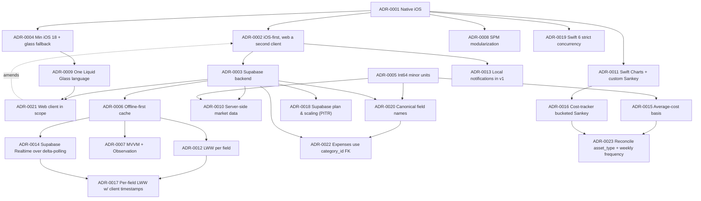

# Architecture Decision Records (ADRs)

> The numbered, dated, **normative** log of Finmate's binding architectural decisions — each captured in the standard ADR format (Context, Decision, Consequences, Alternatives) so engineers and AI coding agents can see not just *what* was decided but *why*, and what was rejected.

This document is the authoritative source for "why is it built this way?" It restates and grounds the [Canonical Decisions Brief](../CLAUDE.md) in the formal ADR shape. **If any other document conflicts with an ADR here, this document wins** (see the normative/descriptive split in [`./00-index.md`](./00-index.md)). To change a decision, do not silently edit code — add a new ADR that **supersedes** the old one and flip the old one's status to `Superseded by ADR-XXXX`.

---

## How to read and write ADRs

- **Format.** Each ADR has: a stable number (`ADR-0001`…), a short title, a **Status**, a **Date**, the deciding owner, a **Context** (forces at play), a **Decision** (the choice, stated decisively), **Consequences** (positive, negative, and follow-on work), and **Alternatives considered** (what we rejected and why).
- **Statuses.** `Proposed` → `Accepted` → (`Superseded by ADR-XXXX` | `Deprecated`). Every ADR below is **Accepted** as of the dates shown unless noted. An Accepted ADR is binding.
- **Immutability.** Accepted ADRs are not rewritten to reverse a decision; they are superseded. Typo/clarity fixes are fine. This preserves the decision trail.
- **Numbering.** Monotonic, never reused. Gaps are allowed if an ADR is withdrawn before acceptance.
- **Owner.** The product owner (`ridfox44@gmail.com`) is the deciding authority for v1. ADRs are dated `2026-06-27` (the brief date) unless a later revision is recorded.

### Index

| ADR | Title | Status | Supersedes |
|-----|-------|--------|------------|
| [ADR-0001](#adr-0001--native-ios-swift--swiftui-over-cross-platform) | Native iOS Swift / SwiftUI over cross-platform | Accepted | — |
| [ADR-0002](#adr-0002--ios-first-web-second-client-after-the-ios-foundation) | iOS-first; web a second client after the iOS foundation | Accepted (amended by ADR-0021) | — |
| [ADR-0003](#adr-0003--supabase-as-the-backend) | Supabase as the backend | Accepted | — |
| [ADR-0004](#adr-0004--minimum-ios-180-with-liquid-glass-progressive-enhancement) | Minimum iOS 18.0 with Liquid Glass progressive enhancement | Accepted | — |
| [ADR-0005](#adr-0005--money-as-int64-minor-units) | Money as `Int64` minor units (never floats) | Accepted | — |
| [ADR-0006](#adr-0006--offline-first-with-a-swiftdata-cache-behind-repository-protocols) | Offline-first with a SwiftData cache behind repository protocols | Accepted | — |
| [ADR-0007](#adr-0007--unidirectional-mvvm--observation-over-tca-and-mvc) | Unidirectional MVVM + Observation (over TCA / MVC) | Accepted | — |
| [ADR-0008](#adr-0008--modularization-via-local-swift-packages-spm) | Modularization via local Swift Packages (SPM) | Accepted | — |
| [ADR-0009](#adr-0009--a-single-liquid-glass-design-language-retire-the-9-themes) | A single Liquid Glass design language (retire the 9 themes) | Accepted | — |
| [ADR-0010](#adr-0010--server-side-market-data-via-supabase-edge-functions) | Server-side market data via Supabase Edge Functions | Accepted | — |
| [ADR-0011](#adr-0011--swift-charts--a-custom-canvas-flow-renderer-for-sankey) | Swift Charts + a custom Canvas flow renderer for Sankey | Accepted | — |
| [ADR-0012](#adr-0012--last-write-wins-per-field-conflict-resolution-using-updated_at) | Last-write-wins-per-field conflict resolution using `updated_at` | Accepted | — |
| [ADR-0013](#adr-0013--local-notifications-in-v1-remote-push-reminder-service-deferred) | Local notifications in v1 (remote/push reminder service deferred) | Accepted | — |
| [ADR-0014](#adr-0014--supabase-realtime-in-v1-as-a-latency-optimization-over-delta-polling) | Supabase Realtime in v1 as a latency optimization over delta-polling | Accepted | — |
| [ADR-0015](#adr-0015--asset-valuation-uses-average-cost-basis-in-v1-fifo-deferred) | Asset valuation uses average-cost basis in v1 (FIFO deferred) | Accepted | — |
| [ADR-0016](#adr-0016--cost-tracker-money-flow-redesign-bucketed-sankey-with-drill-down) | Cost-tracker money-flow redesign (bucketed Sankey with drill-down) | Accepted | — |
| [ADR-0017](#adr-0017--per-field-last-write-wins-sync-with-client-mutation-timestamps) | Per-field last-write-wins sync with client mutation timestamps | Accepted | — |
| [ADR-0018](#adr-0018--supabase-plan--scaling-posture-free-dev--pro-prod-with-pitr) | Supabase plan & scaling posture (Free dev / Pro prod with PITR) | Accepted | — |
| [ADR-0019](#adr-0019--swift-6-strict-concurrency-from-day-one) | Swift 6 strict concurrency from day one | Accepted | — |
| [ADR-0020](#adr-0020--single-canonical-domain-field-names-kill-substimate-duality) | Single canonical domain field names (kill Substimate duality) | Accepted | — |
| [ADR-0021](#adr-0021--web-client-brought-into-scope-amends-adr-0002) | Web client brought into scope (amends ADR-0002) | Accepted | — |
| [ADR-0022](#adr-0022--expenses-use-the-normalized-category_id-fk-names-resolved-client-side) | Expenses use the normalized `category_id` FK (names resolved client-side) | Accepted | — |
| [ADR-0023](#adr-0023--reconcile-asset_type-union-set--fixed_expenses-weekly-frequency-to-the-schema) | Reconcile `asset_type` (union set) + `fixed_expenses` weekly frequency to the schema | Accepted | — |

---

## ADR-0001 — Native iOS Swift / SwiftUI over cross-platform

- **Status:** Accepted
- **Date:** 2026-06-27
- **Owner:** Product owner (`ridfox44@gmail.com`)

### Context

Finmate's north star is an "Apple-grade", flawlessly polished **Liquid Glass** experience: real depth, motion, haptics, Dynamic Type, VoiceOver, and the iOS 26 glass APIs. The predecessor, Substimate, is a React 19 + Vite web app whose design degraded into nine competing visual styles and whose mobile experience was a sidebar-plus-hamburger compromise. The forces:

- **Fidelity.** Liquid Glass (`glassEffect`, `GlassEffectContainer`, `glassEffectID`, `.glass`/`.glassProminent` button styles, scroll-edge effects) and first-class haptics/SF Symbols are only fully available through native SwiftUI/UIKit. Cross-platform toolkits reach them late, partially, or via brittle bridges.
- **Performance & feel.** 120 Hz ProMotion scrolling, gesture-driven transitions, and Canvas-based money-flow rendering demand native rendering with no JS bridge tax.
- **Team & maintenance.** One platform, one language, no abstraction layer to fight when an OS feature ships.

### Decision

Build Finmate as a **native iOS app in Swift / SwiftUI**. No React Native, no Flutter, no Capacitor/Ionic, no cross-platform UI framework. UI, navigation, charts, and design system are pure SwiftUI (dropping to UIKit/`UIViewRepresentable` only where SwiftUI lacks a capability).

### Consequences

- **Positive:** Full, immediate access to iOS 26 Liquid Glass, SF Symbols, haptics, Swift Charts, the Observation framework, SwiftData, and Swift Concurrency. Highest possible polish and performance. Simplest mental model for engineers and AI agents — one language, one UI stack.
- **Negative:** No code-sharing of UI with a future web client; UI must be rebuilt for the web (mitigated by ADR-0002's shared *backend* contract, not shared UI). Talent pool is iOS-specific.
- **Follow-on:** Architecture, module graph, and design system are specified natively in [`./03-architecture.md`](./03-architecture.md) and [`./06-design-system.md`](./06-design-system.md).

### Alternatives considered

- **React Native / Expo.** Would have reused some Substimate React mental models and a JS team. **Rejected:** Liquid Glass and the bespoke flow charts would require native modules anyway, the bridge undermines the "flawless feel" requirement, and we would inherit the very web-centric patterns we are trying to leave behind.
- **Flutter.** Excellent rendering control, but Skia/Impeller does not give us *Apple-native* glass and the platform look; it imitates rather than uses system materials. **Rejected** on fidelity and platform-idiom grounds.
- **Kotlin Multiplatform (shared logic, native UI).** Closest reasonable contender; would let a future Android client share domain logic. **Rejected for v1:** adds a build/toolchain burden with no Android target in sight, and the portable layer we actually want is the Supabase backend contract, not KMP modules.

---

<a id="adr-0002--ios-first-web-second-client-after-the-ios-foundation"></a>

## ADR-0002 — iOS-first; web a second client after the iOS foundation

- **Status:** Accepted — **amended by [ADR-0021](#adr-0021--web-client-brought-into-scope-amends-adr-0002)** (web brought into scope as a committed second client; this ADR's iOS-first *sequencing* stands, but the web is no longer "deferred").
- **Date:** 2026-06-27 (amended 2026-06-28)
- **Owner:** Product owner

### Context

Substimate already exists as a web app, so the *vision* is web-proven. The question is sequencing for the rebuild, not whether the web matters. Building two clients in parallel doubles surface area before product-market fit on the new design language is established, and the owner wants depth (a perfect iPhone app) over breadth.

### Decision

Ship **iOS (iPhone) first** and build it as the lead client. The web is a **second client that follows the iOS foundation** — not a post-v1 afterthought (it was originally deferred; [ADR-0021](#adr-0021--web-client-brought-into-scope-amends-adr-0002) brings it into committed scope). It is a *separate client reusing the same Supabase backend contract* — the schema, RLS policies, Edge Functions, and generated types — and the [`./13-algorithms-and-calculations.md`](./13-algorithms-and-calculations.md) algorithms reimplemented in its own language, **never** a shared UI codebase. iPhone remains the only iOS form factor for v1; iPad / Mac Catalyst stay post-v1.

### Consequences

- **Positive:** Focus and velocity; one polished surface ships first. The portable contract is preserved deliberately: anything client-specific stays in each client, and all multi-client invariants (ownership, validation, money rules) live in Postgres/RLS/Edge Functions so the web client adopts them unchanged.
- **Negative:** The web waits on the iOS foundation. Some logic (e.g., currency formatting, analytics aggregation) is reimplemented in the web client's language; we mitigate by keeping the *rules* server-side or trivially portable and by documenting them in [`./05-data-model.md`](./05-data-model.md) and [`./13-algorithms-and-calculations.md`](./13-algorithms-and-calculations.md).
- **Follow-on:** Edge Functions and RLS must be authored as the multi-client boundary from day one, not retrofitted (see [`./07-security-and-privacy.md`](./07-security-and-privacy.md)). The web client's architecture and plan are specified in [`./16-web-client.md`](./16-web-client.md).

### Alternatives considered

- **Web + iOS simultaneously.** **Rejected:** dilutes the "flawless iPhone app" goal and the Liquid Glass investment up front; iOS leads and the web follows on the same backend contract.
- **iPad/Catalyst in v1.** **Rejected:** adaptive layout and pointer/keyboard polish are real work; defer until the iPhone experience is shipped and validated.

---

## ADR-0003 — Supabase as the backend

- **Status:** Accepted
- **Date:** 2026-06-27
- **Owner:** Product owner

### Context

Finmate stores personal financial data for many independent users and must enforce strict per-user isolation, support auth (including Sign in with Apple), realtime updates, server-side secrets for market data, and remain cheap at small scale while scaling cleanly. Substimate already runs on Supabase, with a mature set of RLS policies and `SECURITY DEFINER` RPCs we can learn from.

### Decision

Use **Supabase** — managed **PostgreSQL + Auth + Row Level Security + Edge Functions + Realtime + Storage** — as the single backend. Access it from Swift via the official **`supabase-swift`** SDK. Security centers on **RLS on every table**, deriving ownership from `auth.uid()`. The backend contract (schema, RLS, Edge Functions, generated types) is the portable layer for the future web client (ADR-0002).

### Consequences

- **Positive:** Postgres gives us real constraints, triggers, and transactional integrity for money. RLS pushes authorization into the database so a client bug cannot leak another user's data. Edge Functions hold provider secrets server-side (ADR-0010). Starts cheap, scales without a backend rewrite. Reusing Substimate's hardened patterns shortens the path.
- **Negative:** Vendor coupling to Supabase; RLS authoring is exacting and must be tested (a missing/loose policy is a data leak). Realtime and Edge Functions have their own operational characteristics to learn.
- **Follow-on:** Every table gets RLS with owner-only policies via `auth.uid()`, `created_at`/`updated_at` with an `updated_at` trigger, and CHECK constraints; `SECURITY DEFINER` RPCs are hardened with `SET search_path = public`, `REVOKE ALL FROM PUBLIC`, `GRANT EXECUTE TO authenticated`, and per-row owner checks — mirroring the patterns in Substimate's latest migrations (e.g. the price-history and `get_user_categories` functions). Detailed in [`./05-data-model.md`](./05-data-model.md) and [`./07-security-and-privacy.md`](./07-security-and-privacy.md).

### Alternatives considered

- **Firebase / Firestore.** Strong realtime and auth, but a document model with security *rules* rather than SQL constraints; weaker fit for relational financial data, money integrity, and the portable SQL contract we want. **Rejected.**
- **Custom backend (Vapor/Hummingbird or Node on a VPS) + Postgres.** Maximum control. **Rejected for v1:** we would rebuild auth, RLS-equivalent authorization, realtime, and ops that Supabase gives us turnkey, with no offsetting benefit at this scale.
- **CloudKit.** Native, free-ish, private. **Rejected:** Apple-only (kills the future web client outright), weak server-side compute for market data, and limited relational querying/constraints.

---

## ADR-0004 — Minimum iOS 18.0 with Liquid Glass progressive enhancement

- **Status:** Accepted
- **Date:** 2026-06-27
- **Owner:** Product owner

### Context

We want the iOS 26 Liquid Glass design at full fidelity, but we also want broad device coverage. iOS 26 glass APIs (`glassEffect`, `GlassEffectContainer`, `glassEffectID`, `.glass`/`.glassProminent`) are not available on older OSes; system **Materials** (`.ultraThinMaterial`, `.regularMaterial`, …) have existed since iOS 15 and approximate the look acceptably. iOS 18 gives us mature **Observation**, **SwiftData**, **Swift Charts**, and **Swift Concurrency** — the foundations the architecture depends on.

### Decision

Set the **deployment target to iOS 18.0**, build with **Xcode 26+ / Swift 6** (strict concurrency). Render the **design-complete Liquid Glass experience on iOS 26+**, and **automatically fall back to system Materials on iOS 18–25** via runtime availability checks. This is a reversible decision the owner may revisit as iOS 26 adoption climbs.

### Consequences

- **Positive:** Broad device reach today while delivering the flagship look on current hardware. The foundational frameworks are all mature at iOS 18, avoiding back-deployment workarounds. One codebase, two visual tiers.
- **Negative:** The design system must implement and *test both tiers* (glass and Materials), roughly doubling visual QA for affected components. `if #available(iOS 26, *)` branching is a maintenance cost until the floor rises.
- **Follow-on:** [`./06-design-system.md`](./06-design-system.md) specifies the glass primitives, their Materials fallbacks, and the availability gating. Snapshot tests cover both tiers (see [`./09-engineering-practices.md`](./09-engineering-practices.md)).

```swift
// DesignSystem: one call site, automatic enhancement.
extension View {
    @ViewBuilder
    func finmateGlass(_ shape: some Shape = .rect(cornerRadius: 20)) -> some View {
        if #available(iOS 26, *) {
            self.glassEffect(.regular, in: shape)
        } else {
            self.background(.regularMaterial, in: shape) // iOS 18–25 fallback
        }
    }
}
```

### Alternatives considered

- **iOS 26 minimum.** Cleanest code (no fallback tier). **Rejected for v1:** too small an addressable device base at launch; the owner prioritizes reach.
- **iOS 17 minimum.** Slightly more reach. **Rejected:** iOS 18 hardens Observation/SwiftData/Swift Charts and Swift 6 ergonomics; the marginal extra coverage is not worth back-deployment friction.

---

## ADR-0005 — Money as `Int64` minor units

- **Status:** Accepted
- **Date:** 2026-06-27
- **Owner:** Product owner

### Context

Substimate stored money as floating-point. It also carried a serious bug: the client **converted non-EUR amounts to EUR before storing while keeping the original currency label**, corrupting both the value and its meaning. Floating-point money accumulates rounding error and fails equality/sum invariants. Finmate is currency-aware (EUR, USD, BTC at minimum) and must be exact.

### Decision

Store all monetary amounts as **integer minor units in `Int64`** — **cents** for fiat, **satoshis** for BTC (`satsPerBTC = 100_000_000`) — paired with an **ISO currency code**. **Never** store money as `Double`/`Float`. Amounts are stored in their **native currency** (no pre-store conversion). Use Swift's `Decimal` for computation and formatting, and a dedicated **`Money` value type** at the boundary.

```swift
struct Money: Hashable, Sendable {
    let minorUnits: Int64          // stored property; cents for fiat, satoshis for BTC
    let currency: Currency         // ISO 4217 + "BTC"

    init(minorUnits: Int64, currency: Currency) {
        self.minorUnits = minorUnits
        self.currency = currency
    }

    var decimalValue: Decimal {    // for display/computation only
        Decimal(minorUnits) / currency.minorUnitScale  // 100 fiat, 100_000_000 BTC
    }

    // Throws — never crashes — on a currency mismatch (honors the no-force-unwrap / no-crash rule).
    func adding(_ other: Money) throws -> Money {
        guard currency == other.currency else { throw MoneyError.currencyMismatch }
        let (sum, overflow) = minorUnits.addingReportingOverflow(other.minorUnits)
        guard !overflow else { throw MoneyError.overflow }
        return Money(minorUnits: sum, currency: currency)
    }

    // Parses a user/display string into minor units, rounding HALF-UP to the currency precision.
    // Rejects negative input for amount fields, rejects more fractional digits than the currency
    // allows, and guards Int64 overflow — all surfaced as typed MoneyError cases, never a crash.
    static func parse(_ string: String, currency: Currency) throws -> Money { … }
}

enum MoneyError: Error, Sendable {
    case currencyMismatch
    case overflow
    case negativeAmount
    case tooManyFractionalDigits
}
```

In Postgres, money columns are `bigint` named `*_minor` (e.g. `amount_minor`, `value_minor`, `purchase_price_minor`, `fees_minor`) with `CHECK (amount_minor >= 0)` where non-negative, plus a `currency` column constrained to the allowed set.

#### `Money` API contract

The `Money` type has **one** canonical contract, reconciled across [`./05-data-model.md`](./05-data-model.md) §2.2 and [`./09-engineering-practices.md`](./09-engineering-practices.md) §3.2:

- **Initializer:** `init(minorUnits: Int64, currency: Currency)`; the stored property is `minorUnits` (not `amount`/`value`).
- **Addition throws, never crashes:** `func adding(_ other: Money) throws -> Money` throws `MoneyError.currencyMismatch` on a currency mismatch — **no `precondition`/`fatalError`/crash** (this honors the no-force-unwrap, no-crash-on-production-paths rule in [`./09-engineering-practices.md`](./09-engineering-practices.md)).
- **Parsing is strict:** `parse(_:currency:)` rounds **HALF-UP** to the currency's minor-unit precision, **rejects negative input** for amount fields, **rejects input with more fractional digits than the currency allows**, and **guards `Int64` overflow** — each failure is a typed `MoneyError`, never a crash.
- **Named unit-test cases.** These behaviors are pinned as named tests: half-up rounding at the precision boundary, currency-mismatch on `adding`, rejection of negative amounts, rejection of excess fractional digits, and overflow guards on both `adding` and `parse`.

### Consequences

- **Positive:** Exact arithmetic; sums, equality, and aggregation are deterministic. Eliminates Substimate's float drift and the pre-store conversion corruption class. Satoshis fit `Int64` comfortably (max ~9.2e18 ≫ 21e6 BTC × 1e8). Conversion happens only at display time, on demand.
- **Negative:** Every read/write must marshal between `Int64` minor units and `Decimal`/UI strings; developers must resist the temptation to "just use a Double." Multi-currency display requires an explicit conversion step (rates from [ADR-0010]).
- **Follow-on:** A thoroughly unit-tested `Money` type and currency scale table live in `Domain/Models`; money math, currency conversion, and formatting are tested per [`./09-engineering-practices.md`](./09-engineering-practices.md). Schema specified in [`./05-data-model.md`](./05-data-model.md).

### Alternatives considered

- **`Decimal` stored as Postgres `numeric`.** Exact, no rounding. **Rejected as the stored type:** `Decimal` round-trips awkwardly through JSON and the SDK, invites accidental `Double` coercion, and integer minor units are the industry-standard, unambiguous wire format. We still *use* `Decimal` for in-memory math.
- **Keep `Double`.** **Rejected outright** — this is the exact defect we are fixing.

---

## ADR-0006 — Offline-first with a SwiftData cache behind repository protocols

- **Status:** Accepted
- **Date:** 2026-06-27
- **Owner:** Product owner

### Context

A finance companion must feel instant and work on a subway with no signal: reads should never block on the network, and writes should not lose the user's edit. We also want testability and the freedom to swap the local store or backend later without rewriting features.

### Decision

Adopt an **offline-first** architecture. A **local cache is the read source** and serves reads instantly; **writes are optimistic** (applied locally immediately, with toast feedback) and then **synced** to Supabase, which is the **source of truth**. The local cache is **SwiftData (iOS 17+)**, hidden entirely behind **repository protocols** so it is swappable. Conflicts are resolved last-write-wins per field via `updated_at` (specified in ADR-0012).

```swift
protocol SubscriptionRepository: Sendable {
    func observeAll() -> AsyncStream<[Subscription]>      // from local cache
    func upsert(_ subscription: Subscription) async throws // optimistic local + remote sync
    func delete(id: Subscription.ID) async throws
}
// SwiftDataSubscriptionRepository (cache) + SupabaseSubscriptionSync (remote) live behind this.
```

### Consequences

- **Positive:** Instant UI, resilient to flaky networks, no data loss on write. Protocols enable mocking for tests and a future backend swap (ADR-0003/0002). SwiftData is native, integrates with Observation, and needs no extra dependency.
- **Negative:** Sync is genuinely hard — reconciliation, ordering, partial failures, and the merge policy must be implemented and tested. SwiftData's query power and migration story are less battle-tested than SQLite.
- **Follow-on:** A sync engine in `DataLayer` reconciles cache and remote and applies ADR-0012's merge. **GRDB/SQLite is the documented fallback** if SwiftData proves limiting for complex analytics queries; because everything is behind the repository protocol, swapping it does not touch feature code. Architecture detail in [`./03-architecture.md`](./03-architecture.md).

### Alternatives considered

- **GRDB/SQLite from the start.** More control and proven at scale. **Rejected as default** to avoid a dependency and hand-rolled mapping when SwiftData fits; explicitly kept as the escape hatch.
- **Core Data directly.** **Rejected:** more boilerplate, worse Swift Concurrency/Observation ergonomics than SwiftData.
- **Online-only (no cache).** Simpler. **Rejected:** fails the "instant, works offline" requirement and loses optimistic writes.

---

## ADR-0007 — Unidirectional MVVM + Observation (over TCA and MVC)

- **Status:** Accepted
- **Date:** 2026-06-27
- **Owner:** Product owner

### Context

We need a state-management pattern that is predictable, testable, native, and approachable for both human engineers and AI coding agents — without a heavy framework learning curve or runtime indirection.

### Decision

Use **unidirectional MVVM** built on the **Observation framework**. Views observe `@Observable` **Stores/ViewModels**; Stores call **repository protocols** (ADR-0006); repository implementations coordinate the local cache and Supabase. State flows one way (Store → View) and intent flows back via method calls (View → Store). Use `@Observable`, `@Bindable`, and `@Environment`; concurrency via `async`/`await`, actors, and `@MainActor`.

### Consequences

- **Positive:** Minimal ceremony, native types, fine-grained Observation re-render. Stores are plain `@Observable` classes that are trivial to unit-test by injecting mock repositories. Low cognitive load for agents generating code.
- **Negative:** Less prescriptive than a framework like TCA — we must enforce the unidirectional discipline by convention and review (no view writing straight to repositories, no cross-feature Store dependencies).
- **Follow-on:** Conventions (one Store per feature screen, intent methods, no business logic in views) are codified in [`./03-architecture.md`](./03-architecture.md) and [`./09-engineering-practices.md`](./09-engineering-practices.md).

### Alternatives considered

- **The Composable Architecture (TCA).** Excellent testability and explicit unidirectional flow. **Rejected:** heavy dependency, its own mental model and reducer boilerplate, and friction with the native Observation/SwiftData stack we are committing to.
- **MVC / massive view controllers.** **Rejected:** not idiomatic SwiftUI; poor testability; the pattern Substimate-style sprawl encourages.
- **Plain `@State`/`@StateObject` with logic in views.** **Rejected:** business logic leaks into the view layer, defeating testing of money math and analytics.

---

## ADR-0008 — Modularization via local Swift Packages (SPM)

- **Status:** Accepted
- **Date:** 2026-06-27
- **Owner:** Product owner

### Context

A single monolithic app target rots into tangled dependencies and slow builds. We want enforced boundaries (features cannot import each other), fast incremental builds, and parallelizable work for multiple engineers/agents.

### Decision

Structure the codebase as **local Swift Packages (SPM)** with a **thin app target as composition root**. The module graph:

```
App (target, composition root)
 └─ Features/* (Auth, Home, Subscriptions, CashFlow, CostTracker,
                Calendar, Import, Assets, Calculator, Settings)
      ├─ Domain/Models       (entities, value types, Money)
      ├─ DesignSystem        (tokens, Liquid Glass primitives, components, charts)
      └─ DataLayer           (Supabase wrapper, repository protocols + impls, sync, cache)
              └─ Shared/Utilities (formatting, currency, logging)
```

**Rule:** Features depend on `Domain`, `DesignSystem`, and `DataLayer` *abstractions* — **never on each other**. Core packages do not depend on Features.

### Consequences

- **Positive:** Compiler-enforced boundaries (an illegal `import` fails to build), faster incremental and parallel builds, clear ownership, and modules that are independently testable and previewable. Ideal for AI agents working on one feature in isolation.
- **Negative:** Up-front package wiring and a learning curve for SPM module setup; cross-cutting changes can touch several `Package.swift` files.
- **Follow-on:** The full package manifest layout and dependency rules are specified in [`./03-architecture.md`](./03-architecture.md); the build order that fills these modules is in [`./08-roadmap-and-milestones.md`](./08-roadmap-and-milestones.md).

### Alternatives considered

- **Single app target with folder groups.** Simplest start. **Rejected:** no enforced boundaries — discipline erodes, exactly the rot we are escaping from Substimate.
- **Multiple Xcode framework targets (not SPM).** Works, but `.xcodeproj` merge conflicts and weaker cross-tooling than SPM. **Rejected.**

---

## ADR-0009 — A single Liquid Glass design language (retire the 9 themes)

- **Status:** Accepted
- **Date:** 2026-06-27
- **Owner:** Product owner

### Context

Substimate shipped **nine competing visual styles** — aurora, brutalist, claymorphism, glassmorphism, minimal, modern, neobrutalist, neumorphism, retro — producing CSS duplication, inconsistent components, and no coherent brand. This is a primary thing Finmate exists to fix.

### Decision

Finmate has **one** cohesive design language: **Liquid Glass**, by default. The nine themes are **cut**. The only user-facing appearance choice is **light / dark / system**. The design system provides bespoke, next-level components and iconography (SF Symbols + custom symbols), with motion, depth, and haptics as first-class. Full Liquid Glass on iOS 26+, Materials fallback on iOS 18–25 (per ADR-0004).

### Consequences

- **Positive:** One design system to build, test (snapshot-tested), and maintain; consistent, premium brand; far less code and zero CSS-style duplication. Every component looks intentional.
- **Negative:** Users who liked picking a theme lose that toggle (acceptable per the brief — coherence over chrome). The single language must be excellent because there is no fallback "style" to hide behind.
- **Follow-on:** Tokens, primitives, components, charts, motion, and accessibility are specified in [`./06-design-system.md`](./06-design-system.md); the theme cut is recorded in the migration map in [`./11-substimate-analysis.md`](./11-substimate-analysis.md).

### Alternatives considered

- **Keep a reduced theme set (e.g., glass + minimal).** **Rejected:** any plurality reintroduces the duplication and incoherence problem; the value is in *one* language done flawlessly.
- **Ship Liquid Glass but keep an accent-color/customization layer.** **Deferred, not adopted for v1:** light/dark/system is the only appearance axis; richer personalization can be a future ADR if demanded.

---

## ADR-0010 — Server-side market data via Supabase Edge Functions

- **Status:** Accepted
- **Date:** 2026-06-27
- **Owner:** Product owner

### Context

The BTC/crypto calculator and multi-currency conversion need live market data (BTC price, FX rates). Substimate **called market-data providers directly from the client**, which exposes provider keys, prevents caching/rate-limiting, and couples the client to provider quirks. Provider secrets must never ship in an app bundle.

### Decision

Fetch all market data **server-side via Supabase Edge Functions**. The client calls a single authenticated Edge Function, `market-data`; the function holds any **provider keys in its environment**, fetches/caches the data, and returns normalized results. The app bundle contains **only the public anon key** — no service-role key, no provider secrets.

```
iOS app ──(authenticated)──▶ Edge Function `market-data`
                                   │  (provider API key in env, never in app)
                                   ▼
                          Provider API → normalize + cache → JSON back to app
```

### Consequences

- **Positive:** Secrets stay server-side; we can cache, rate-limit, and swap providers without an app release; one normalized contract for both the iOS app and the future web client (ADR-0002). Conversions become deterministic and auditable.
- **Negative:** An extra network hop and an Edge Function to deploy/monitor; offline conversions rely on the last cached `exchange_rates` (`jsonb` on `CurrencyPreference`) rather than live data.
- **Follow-on:** Rates are persisted in `CurrencyPreference.exchange_rates` with `last_updated`; the calculator reads cached rates offline. Edge Function contracts and secret handling are specified in [`./07-security-and-privacy.md`](./07-security-and-privacy.md) and [`./05-data-model.md`](./05-data-model.md).

### Alternatives considered

- **Client-side provider calls (Substimate's approach).** **Rejected:** leaks keys, no central caching/rate-limiting, hard to swap providers. This is the defect we are correcting.
- **Hardcode/bundle rates.** **Rejected:** stale immediately; useless for live BTC.
- **A separate microservice for market data.** **Rejected for v1:** Edge Functions already give us serverless server-side compute within Supabase; a standalone service adds ops with no benefit at this scale.

---

## ADR-0011 — Swift Charts + a custom Canvas flow renderer for Sankey

- **Status:** Accepted
- **Date:** 2026-06-27
- **Owner:** Product owner

### Context

Analytics needs monthly trends, category distribution, lifetime cost, usage stats, and payment-method breakdowns — all standard chart types. The cost-tracker money-flow visualization, however, is a **Sankey / flow diagram**, which **Swift Charts does not provide**.

### Decision

Use **Swift Charts** (native, Apple) for all standard charts (line, bar, area, sector/pie). For the **Sankey / money-flow** diagram, build a **custom `Canvas`/`Path`-based flow renderer** living in `DesignSystem` (or adopt a vetted SPM dependency if one clears review). This is an explicitly acknowledged engineering item, not a hidden assumption.

### Consequences

- **Positive:** Native, accessible, animated charts for the common cases with zero dependency. The flow renderer is bespoke, themable to the Liquid Glass language, and fully under our control for interaction/animation.
- **Negative:** The Sankey renderer is real engineering: layout (node placement, link thickness ∝ flow), hit-testing, animation, and accessibility (VoiceOver descriptions of flows) must be built and tested. Until it exists, the cost tracker has a known gap.
- **Follow-on:** The flow renderer is tracked as a first-class item in [`./08-roadmap-and-milestones.md`](./08-roadmap-and-milestones.md) and [`./10-task-backlog.md`](./10-task-backlog.md); chart components and their accessibility live in [`./06-design-system.md`](./06-design-system.md).

### Alternatives considered

- **A third-party charting library (e.g., DGCharts).** **Rejected as the default:** Swift Charts covers the standard cases natively with better SwiftUI integration; a heavy dependency is unwarranted. A *narrow* vetted SPM dependency for Sankey alone remains acceptable.
- **WebView + a JS charting library (D3/ECharts).** **Rejected:** reintroduces a web layer and breaks the native feel, accessibility, and theming we require.

---

## ADR-0012 — Last-write-wins-per-field conflict resolution using `updated_at`

- **Status:** Accepted
- **Date:** 2026-06-27
- **Owner:** Product owner

### Context

Offline-first (ADR-0006) means the same record may be edited on a device while offline and concurrently changed elsewhere (e.g., a DB trigger, or a future web client). When sync reconciles, conflicts can occur. We need a deterministic, simple, well-documented policy — full CRDTs are overkill for a single-user-per-account finance app.

### Decision

Resolve conflicts **last-write-wins (LWW) per field**, arbitrated by the most recent **`updated_at`** timestamp. Every table carries `created_at`/`updated_at`, with an **`updated_at` trigger** maintaining the server timestamp. During sync, the engine merges field-by-field, keeping the value from the side with the newer `updated_at`; the remote (Supabase) is the source of truth on ties.

### Consequences

- **Positive:** Deterministic, easy to reason about and test, and adequate because accounts are effectively single-user. Per-field (rather than whole-record) merging avoids clobbering an untouched field.
- **Negative:** A genuinely concurrent edit to the *same field* silently loses one value (acceptable trade-off; rare for single-user accounts). Relies on reasonably synced clocks; the server timestamp is authoritative to mitigate client clock skew.
- **Follow-on:** The sync engine in `DataLayer` implements this; the `updated_at` trigger and timestamps are part of the schema in [`./05-data-model.md`](./05-data-model.md). Sync semantics are detailed in [`./03-architecture.md`](./03-architecture.md).

### Alternatives considered

- **CRDTs.** Conflict-free and merge-correct. **Rejected:** disproportionate complexity for a single-user-per-account model.
- **Manual conflict UI ("which version do you want?").** **Rejected for v1:** poor UX for the rare single-user conflict; revisit if multi-user sharing is ever added.
- **Whole-record LWW.** **Rejected:** would discard concurrent edits to *different* fields of the same record.

---

## ADR-0013 — Local notifications in v1 (remote/push reminder service deferred)

- **Status:** Accepted
- **Date:** 2026-06-27
- **Owner:** Product owner

### Context

A finance companion is most useful when it nudges the user at the right moment: an upcoming subscription charge or an approaching payday. The forces: users want timely reminders, but a server-driven push or email reminder service means standing up APNs/push tokens, a server scheduler, delivery monitoring, and another channel of personal-data handling — disproportionate work for v1 and outside the iPhone-only, focus-first scope. iOS already provides on-device scheduling via `UserNotifications` (`UNUserNotificationCenter`, calendar/time-interval triggers) that runs without any backend.

### Decision

Ship **local (on-device) notifications in v1** for upcoming charges and upcoming paydays, scheduled with the `UserNotifications` framework. They are **opt-in and permission-gated** (the app requests notification authorization and degrades gracefully if denied). A **remote/server-driven push or email reminder service is explicitly deferred** as a post-v1 non-goal. Notifications are wired in milestone **M4 (Calendar + reminders/local notifications)** per [`./08-roadmap-and-milestones.md`](./08-roadmap-and-milestones.md).

### Consequences

- **Positive:** Real, timely reminders with zero backend surface — no APNs setup, no push tokens, no server scheduler, no extra personal-data channel. Works fully offline and respects the iPhone-only v1 scope. Permission-gating keeps it user-controlled and App Store-review friendly.
- **Negative:** Reminders only fire on the device that scheduled them — no cross-device or server-side delivery, and no email fallback. Scheduling is bounded by iOS's pending-notification limits, so far-future or high-volume reminders must be re-scheduled as the app runs.
- **Follow-on:** The notification scheduling, permission flow, and the calendar/payday surfaces that drive it are specified alongside M4 in [`./08-roadmap-and-milestones.md`](./08-roadmap-and-milestones.md); [`./01-vision-and-principles.md`](./01-vision-and-principles.md) §9 keeps local notifications in scope while listing a remote reminder service as a non-goal.

### Alternatives considered

- **Remote push (APNs) / email reminder service in v1.** Cross-device, server-scheduled delivery. **Rejected for v1:** disproportionate backend and ops investment (push tokens, scheduler, monitoring, deliverability) for the iPhone-only scope; revisit post-v1 if cross-device delivery is demanded.
- **No reminders at all in v1.** **Rejected:** timely nudges are core to the payday-calendar and subscriptions value proposition; on-device notifications deliver them cheaply.

---

## ADR-0014 — Supabase Realtime in v1 as a latency optimization over delta-polling

- **Status:** Accepted
- **Date:** 2026-06-27
- **Owner:** Product owner

### Context

Offline-first sync (ADR-0006) reconciles the local cache with Supabase. The correctness baseline is **delta-polling by `updated_at`**: on launch, on foreground, and after writes, the client pulls rows changed since its last sync cursor. That is robust and works offline, but it introduces latency — a change made elsewhere (a DB trigger, or a future web client) is only seen on the next poll. Supabase ships **Realtime** (Postgres change streams over WebSockets) that can surface changes promptly.

### Decision

Adopt **Supabase Realtime in v1** as a **latency optimization layered over the delta-poll baseline**, not a replacement for it. Realtime subscriptions push fresh changes promptly when connected; **delta-poll-by-`updated_at` remains the correctness and offline fallback** and runs regardless (on launch/foreground/post-write and whenever Realtime is unavailable). The merge policy is unchanged — Realtime-delivered rows flow through the same LWW-per-field reconciliation as polled rows (ADR-0012).

### Consequences

- **Positive:** Near-real-time freshness when online without sacrificing correctness; the poll path guarantees convergence even if a Realtime message is missed, the socket drops, or the device was offline. One reconciliation path serves both sources.
- **Negative:** A persistent WebSocket to manage (connect/reconnect, auth refresh, battery) and the need to de-duplicate a change that arrives via both Realtime and the next poll (idempotent upserts keyed by id + `updated_at`).
- **Follow-on:** Realtime is layered on the M1 sync work and documented as the latency optimization over the delta-poll baseline in [`./03-architecture.md`](./03-architecture.md) §5.6; the sync engine in `DataLayer` owns both channels. No open question remains about whether Realtime ships in v1 — it does.

### Alternatives considered

- **Delta-polling only (no Realtime).** Simplest, fully sufficient for correctness. **Rejected for v1:** poll-only freshness lags noticeably; Realtime is a cheap, additive win on top of the poll baseline we keep anyway.
- **Realtime as the sole sync mechanism.** **Rejected:** it is not a correctness guarantee — missed messages, dropped sockets, and offline periods require the poll fallback to converge.

---

## ADR-0015 — Asset valuation uses average-cost basis in v1 (FIFO deferred)

- **Status:** Accepted
- **Date:** 2026-06-27
- **Owner:** Product owner

### Context

The assets/investments pillar tracks holdings (including crypto) bought across multiple purchases at different prices, then reports unrealized gain/loss against the current market price. Computing a cost basis requires a lot-accounting method. **FIFO** (and other lot-matching methods) require storing and matching individual purchase lots — meaningful schema and engineering — whereas **average-cost** needs only an aggregate invested total and a unit count, which is far simpler and adequate for a personal net-worth view in v1.

### Decision

Compute asset cost basis using the **average-cost method in v1**; **FIFO (and other lot-level methods) are deferred** post-v1. Concretely (aligned with [`./05-data-model.md`](./05-data-model.md) §3.7): `purchase_price_minor` holds the **total cost basis** (aggregate amount invested, average-cost), `current_price_minor` holds the **latest per-unit market price**, and `value_minor` holds the **current total market value**; **unrealized gain/loss = `value_minor` − `purchase_price_minor`**. All amounts follow the `Int64` minor-units rule (ADR-0005).

### Consequences

- **Positive:** Minimal schema (no per-lot table) and simple, deterministic math for the v1 net-worth and gain/loss view. Aligns cleanly with the average-cost fields pinned in [`./05-data-model.md`](./05-data-model.md) §3.7 and the asset calculations in [`./02-product-spec.md`](./02-product-spec.md) §9.2/§9.4.
- **Negative:** Average-cost cannot produce per-lot or tax-style FIFO realized-gain reporting; users needing that must wait for the deferred method. Migrating to FIFO later requires capturing per-purchase lots that v1 does not retain.
- **Follow-on:** The cost-basis fields and gain/loss formula are the schema of record in [`./05-data-model.md`](./05-data-model.md) §3.7; the asset valuation UI and calculations are specified in [`./02-product-spec.md`](./02-product-spec.md) §9.2/§9.4.

### Alternatives considered

- **FIFO / specific-lot accounting in v1.** Enables tax-style realized-gain reporting. **Rejected for v1:** requires per-lot storage and matching logic disproportionate to the personal net-worth use case; deferred to a future ADR if demanded.
- **No cost basis (current value only).** **Rejected:** unrealized gain/loss is a core part of the assets pillar; average-cost delivers it cheaply.

---

## ADR-0016 — Cost-tracker money-flow redesign (bucketed Sankey with drill-down)

- **Status:** Accepted
- **Date:** 2026-06-28
- **Owner:** Product owner

### Context

Substimate's cost-tracker money-flow flowed a single **Total Income** node directly to **one node per category** — a wide, flat fan-out that became unreadable as categories multiplied and gave no sense of the high-level shape of where money goes. Finmate's reason to exist includes a *clearer overview*, and the Sankey renderer is bespoke (ADR-0011), so we are free to redesign the topology rather than faithfully port it.

### Decision

Redesign the cost-tracker money-flow as a **two-level, bucketed Sankey with drill-down**. The flow is **INCOME (left)** → **top-level bucket nodes (middle/right)**: **Fixed Expenses, Variable Expenses, Subscriptions, Savings**, where **`Savings = max(0, totalIncome − totalExpenses)`**. Each bucket is **tap-to-expand**, drilling into its per-category sub-flows (fixed-expense categories, variable-expense categories, subscription categories). This is an **intentional, recorded divergence from Substimate** — not a faithful port.

**Acceptance criteria:** the sum of outgoing link widths equals total income; expanding a bucket reveals its per-category breakdown; **empty buckets are omitted**. All amounts follow the `Int64` minor-units rule (ADR-0005), and rendering uses the custom `Canvas`/`Path` flow renderer (ADR-0011).

### Consequences

- **Positive:** A legible, hierarchical overview — the four buckets communicate the money's shape at a glance, and drill-down preserves full category detail on demand. Scales gracefully as categories grow. Themable to the Liquid Glass language and fully under our control for interaction/animation.
- **Negative:** More renderer work than a flat one-level Sankey: bucket aggregation, expand/collapse state, animated transitions between levels, and VoiceOver descriptions of both levels must be built and tested. The `Savings` bucket is a derived node, not a stored category, so it needs its own handling.
- **Follow-on:** The bucketed topology, the `Savings` derivation, and the expand/collapse interaction are specified in [`./02-product-spec.md`](./02-product-spec.md) (cost-tracker) and rendered by the flow renderer in [`./06-design-system.md`](./06-design-system.md); the divergence is recorded in the migration map in [`./11-substimate-analysis.md`](./11-substimate-analysis.md).

### Alternatives considered

- **Faithful port (one node per category off a single Total Income node).** **Rejected:** reproduces the unreadable flat fan-out Finmate exists to improve on.
- **Buckets only, no drill-down.** **Rejected:** loses the per-category detail users need; the tap-to-expand drill-down keeps both the overview and the detail.

---

## ADR-0017 — Per-field last-write-wins sync with client mutation timestamps

- **Status:** Accepted
- **Date:** 2026-06-28
- **Owner:** Product owner

### Context

ADR-0012 fixes the **policy** (last-write-wins per field, arbitrated by `updated_at`) and ADR-0014 layers Realtime over a delta-poll baseline, but neither pins the **mechanism** the sync engine uses to reconcile an offline-mutated local row against a newer remote row without clobbering the user's still-pending edit. Server `updated_at` alone cannot tell the engine *which fields* the client changed locally, so a naive whole-row apply would silently discard a pending local edit whenever the remote row is newer.

### Decision

v1 uses **per-field last-write-wins** implemented with **client mutation timestamps**. A `PendingMutation` records the **set of changed field keys** and a **client mutation timestamp** (monotonic, persisted). The reconcile algorithm is:

1. **Apply the incoming remote row** to the local cache.
2. **Re-apply any still-pending changed-field values** whose local mutation timestamp is **newer than the remote `updated_at`** (older pending values lose to the remote, per LWW).

Additional pinned mechanics:

- **Delta-poll cursor.** `lastSyncedAt` is persisted **per entity type** and drives delta-poll by `updated_at` (ADR-0014).
- **First-sync bootstrap.** The initial sync does a **full paginated fetch** (page size **1000**) before switching to delta-poll.
- **Tombstone lifecycle.** A delete tombstone is **retained until its push is confirmed**, then GC'd; an incoming Realtime **insert of a tombstoned id is ignored** until the delete confirms.
- **No resurrection.** A queued upsert whose `category_id` was **`SET NULL` server-side keeps NULL** — it is not resurrected to the stale local value.
- **One reconciliation path.** Realtime is the latency layer over delta-poll (ADR-0014); Realtime-delivered and polled rows flow through the **same** per-field reconcile.

### Consequences

- **Positive:** A pending local edit to one field survives a concurrent remote change to a *different* field, and the engine is deterministic and testable. The bootstrap/delta-poll split bounds first-run cost; the tombstone rules prevent deleted rows from reappearing via a racing Realtime insert.
- **Negative:** Per-mutation field-key tracking and a persisted monotonic client clock add bookkeeping to `DataLayer`; clock-skew edge cases (a fast client clock vs. server `updated_at`) must be tested. Whole-row replace would have been simpler but would clobber concurrent different-field edits.
- **Follow-on:** The engine, `PendingMutation` shape, and the reconcile algorithm are specified in [`./03-architecture.md`](./03-architecture.md) §5.4/§5.5; the `updated_at` trigger and timestamps are the schema of record in [`./05-data-model.md`](./05-data-model.md). This ADR **refines** ADR-0012 (it does not supersede it — the policy is unchanged; this pins the mechanism).

### Alternatives considered

- **Whole-row last-write-wins.** Simplest. **Rejected:** discards concurrent edits to different fields and silently loses pending local work when the remote row is newer.
- **Server `updated_at` only, no client mutation timestamp.** **Rejected:** the engine cannot know which fields the client changed offline, so it cannot safely re-apply a pending edit.
- **CRDTs.** **Rejected** for the same reason as ADR-0012 — disproportionate for a single-user-per-account model.

---

## ADR-0018 — Supabase plan & scaling posture (Free dev / Pro prod with PITR)

- **Status:** Accepted
- **Date:** 2026-06-28
- **Owner:** Product owner

### Context

Supabase is the backend (ADR-0003). Two operational questions were unpinned: which **plan tier** to run on, and how to **back up / recover** production data. The **Free** tier auto-pauses a project after 7 days of inactivity and offers no Point-in-Time Recovery (PITR), which is unacceptable for a production finance app holding user data. We also need a stated view of which usage limits will bind first as the user base grows.

### Decision

**Start on the Free tier for development**; run **production on Supabase Pro**. Pro avoids the 7-day inactivity auto-pause and unlocks **daily backups + PITR (≥ 7-day retention)** — the backbone of the disaster-recovery posture in [`./07-security-and-privacy.md`](./07-security-and-privacy.md) §13.

**First limits expected to bind**, with mitigations:

- **Monthly Active Users (auth).** Watch MAU against the plan allowance.
- **Edge Function invocations.** The per-user `market-data` calls dominate (ADR-0010) — **cache aggressively** and back them with a **single shared rates row** rather than per-user fetches.
- **Realtime concurrent connections.** Bounded by plan; the delta-poll baseline (ADR-0014) means a connection cap degrades latency, not correctness.
- **Database size.** The 500 MB Free DB ceiling is a development concern; production sizing tracks Pro.
- **Connection model.** Edge Functions reach Postgres through **Supavisor (transaction pooling)** to avoid exhausting direct connections.

**Scale-up trigger thresholds (owner to confirm exact numbers):** move tier / enable add-ons when sustained MAU, Edge Function invocations, Realtime connections, or DB size cross roughly **80% of the current plan's limit**.

### Consequences

- **Positive:** Cheap dev, durable prod. PITR + daily backups make the DR runbook in [`./07-security-and-privacy.md`](./07-security-and-privacy.md) §13 real. Caching + a shared rates row keep Edge Function invocations far below per-user-call levels. Supavisor keeps DB connections healthy under serverless load.
- **Negative:** Pro is a recurring cost from launch; the team must monitor the binding limits and act before they cap the product. Some mitigations (shared rates row, aggressive caching) are work that must actually be built, not assumed.
- **Follow-on:** The operating-cost & scaling subsection lives in [`./04-tech-stack.md`](./04-tech-stack.md); the backup/PITR/DR runbook lives in [`./07-security-and-privacy.md`](./07-security-and-privacy.md) §13; the matching **cost/scaling** and **data-loss / bad-migration** risks are in the [`./08-roadmap-and-milestones.md`](./08-roadmap-and-milestones.md) risk register.

### Alternatives considered

- **Free tier in production.** **Rejected:** 7-day inactivity auto-pause and no PITR are non-starters for a production finance app holding user data.
- **Self-managed Postgres for backups/PITR.** **Rejected:** rebuilds ops that Pro provides turnkey, contrary to ADR-0003's rationale.

---

## ADR-0019 — Swift 6 strict concurrency from day one

- **Status:** Accepted
- **Date:** 2026-06-27
- **Owner:** Product owner

### Context

The app is concurrent by nature: optimistic writes, background sync, Edge Function calls, Realtime streams, and UI updates. Data races in a finance app are unacceptable. Swift 6 makes concurrency safety a compile-time guarantee via `Sendable` checking and actor isolation.

### Decision

Build in **Swift 6 language mode with strict concurrency checking enabled** from the start, targeting Xcode 26+. Use `async`/`await`, actors, and `@MainActor` throughout; types crossing concurrency boundaries are `Sendable`. The `Money` value type and domain models are `Sendable` value types; repositories are `Sendable`; Stores are `@MainActor @Observable`.

### Consequences

- **Positive:** Data races are caught at compile time, not in production; the model of who-runs-where is explicit. Aligns perfectly with the actor-based sync engine and `@MainActor` Stores.
- **Negative:** Steeper authoring curve; some third-party/SDK types may need `@preconcurrency` or wrapping until they adopt `Sendable`. Up-front annotation work.
- **Follow-on:** Concurrency conventions, the `@MainActor` Store rule, and lint enforcement are codified in [`./09-engineering-practices.md`](./09-engineering-practices.md); the actor boundaries are drawn in [`./03-architecture.md`](./03-architecture.md).

### Alternatives considered

- **Swift 5 mode / "minimal" concurrency checking, tighten later.** **Rejected:** retrofitting strict concurrency onto a grown codebase is far harder than starting strict; we accept the up-front cost.

---

## ADR-0020 — Single canonical domain field names (kill Substimate duality)

- **Status:** Accepted
- **Date:** 2026-06-27
- **Owner:** Product owner

### Context

Substimate accumulated **dual field-name cruft**: `amount` vs `monthlyCost`, `favorite` vs `isFavorite`, and other backwards-compat shims that caused ambiguity, bugs, and duplicated handling. Finmate is a clean rebuild with no legacy data to preserve.

### Decision

Adopt **one canonical name per concept**. The dualities are removed: a subscription has a single `amount_minor` (not `amount`/`monthlyCost`) and a single `favorite` flag (not `favorite`/`isFavorite`). The convention is **`snake_case` in Postgres, `camelCase` in Swift**. **No backwards-compat shims** are carried over from Substimate.

### Consequences

- **Positive:** Unambiguous schema and models, no double-handling, fewer bugs, simpler generated types. AI agents see exactly one name to use.
- **Negative:** None for new code; old Substimate exports/imports (if ever needed) must be mapped at the boundary — handled in the CSV import layer, not the domain model.
- **Follow-on:** The canonical entity definitions and column names are the schema of record in [`./05-data-model.md`](./05-data-model.md); the rename mapping from Substimate is documented in [`./11-substimate-analysis.md`](./11-substimate-analysis.md).

### Alternatives considered

- **Keep aliases for a transition period.** **Rejected:** there is no production Finmate data and no shared codebase with Substimate to transition; aliases would only reintroduce the ambiguity we are removing.

---

## ADR-0021 — Web client brought into scope (amends ADR-0002)

- **Status:** Accepted
- **Date:** 2026-06-28
- **Owner:** Product owner (`ridfox44@gmail.com`)
- **Amends:** [ADR-0002](#adr-0002--ios-first-web-second-client-after-the-ios-foundation)

### Context

[ADR-0002](#adr-0002--ios-first-web-second-client-after-the-ios-foundation) sequenced iOS first and **deferred** a web client indefinitely. Since then the owner has decided that Finmate needs a **full web interface alongside iOS** — Substimate's audience is web-native, and a browser client widens reach without waiting on an iPad/Catalyst effort. The iOS foundation (M0) is now built, compiled, and tested, so the multi-client backend boundary that ADR-0002/0003/0010 deliberately preserved is real and ready to carry a second client. The forces:

- **Reach.** A web client serves desktop and non-Apple users that the iPhone-only v1 cannot.
- **Cost of divergence.** The portable contract is the Supabase backend (schema + RLS + Edge Functions + generated types) and the [`./13-algorithms-and-calculations.md`](./13-algorithms-and-calculations.md) algorithms — **not** UI code. The right amount of sharing is "the backend and the math," not a cross-platform UI framework (ADR-0001 still stands: iOS UI is native SwiftUI).
- **Design coherence.** ADR-0009's "one Liquid Glass design language" must not fork into a second visual identity; the web must mirror the same tokens and glass language, not invent its own.

### Decision

Bring a **web client into committed scope** as a **separate Vite + React 19 + TypeScript + `supabase-js` application** living under `web/`. It:

- **Reuses the identical Supabase backend contract** — the same schema, RLS policies, Edge Functions (`market-data`, `delete-account`), and generated types — against the **same Supabase project** as iOS. No web-specific tables, no RLS relaxation, no new service-role surface.
- **Reimplements the [`./13-algorithms-and-calculations.md`](./13-algorithms-and-calculations.md) algorithms in TypeScript** — `Money` as integer **minor units** (`number`, safe because max satoshis ≪ 2⁵³), HALF-UP scaling, EUR/USD/BTC conversion (`eurUsd`, `btcEur`, `btcUsd`), subscription period normalization (weekly ×52/12, quarterly /3, yearly /12), analytics aggregation, locale-aware CSV parsing, and the exact-then-substring subscription predictor with the <2-char guard — mirroring the Swift reference in `Packages/FinmateCore`. **Never** floating-point money.
- **Speaks the same one Liquid Glass design language** (ADR-0009) via CSS `backdrop-filter` glass and the **same design tokens** from [`./06-design-system.md`](./06-design-system.md) (color, financial up/down, chart palette, radii), with a `prefers-reduced-transparency` opaque fallback paralleling the iOS Reduce-Transparency tier. It does **not** introduce a new visual identity.
- **Ships only the public anon key** (ADR-0010 unchanged): provider secrets stay in Edge Functions; market data is fetched server-side; the web bundle carries no service-role key.

**iOS remains the lead client.** The web follows the iOS pillars (M1…M8) and tracks the same product spec; iOS sets the bar that the web mirrors. Full architecture and plan: [`./16-web-client.md`](./16-web-client.md).

### Consequences

- **Positive:** Wider reach (desktop + non-Apple) on the backend boundary we already paid for; the contract-first design (ADR-0002/0003/0010) pays off exactly as intended. One design language and one set of algorithms keep the two clients coherent. No backend change is required — the web is purely additive.
- **Negative:** A second client to build, test, and keep in lock-step; the [`./13`](./13-algorithms-and-calculations.md) algorithms now have **two** implementations (Swift + TypeScript) that must stay equivalent (mitigated by the shared test vectors in [`./13`](./13-algorithms-and-calculations.md) being applied to both). The Liquid Glass language must be expressed twice (SwiftUI + CSS) without drifting.
- **Follow-on:** [`./16-web-client.md`](./16-web-client.md) specifies the stack, structure, design parity, auth, secrets, and build/deploy. The shared TypeScript algorithm port carries the same [`./13`](./13-algorithms-and-calculations.md) test vectors as the Swift implementation; the web slice must build and render with **sample data** so no live backend is needed to preview. ADR-0002's status is updated to *amended by this ADR*; ADR-0001 (native iOS UI) and ADR-0009 (one design language) are **unchanged** and explicitly upheld.

### Alternatives considered

- **React Native Web (one codebase for iOS + web).** Would share UI between platforms. **Rejected:** directly contradicts [ADR-0001](#adr-0001--native-ios-swift--swiftui-over-cross-platform) — Liquid Glass and the bespoke flow charts demand native SwiftUI, and a shared-UI layer reintroduces the bridge tax and web-centric patterns Finmate exists to leave behind. The portable layer is the backend, not the UI.
- **Next.js (SSR/RSC React framework).** Server-side rendering, file-based routing, an API layer. **Rejected for v1 web:** Finmate's data is per-user and RLS-gated behind `supabase-js`, so a client-rendered SPA on a static host is simpler and cheaper; a Next.js server tier would duplicate authorization that already lives in Postgres/RLS and Edge Functions, adding ops with no benefit at this scale. Revisit if SEO or server rendering becomes a requirement.
- **Keep the web deferred (status quo of ADR-0002).** **Rejected:** the owner now requires a web interface, and the backend boundary to support it already exists.

---

## ADR-0022 — Expenses use the normalized `category_id` FK (names resolved client-side)

- **Status:** Accepted
- **Date:** 2026-06-28
- **Owner:** Product owner (`ridfox44@gmail.com`)
- **Relates to:** [ADR-0020](#adr-0020--single-canonical-domain-field-names-kill-substimate-duality), [docs/05 §3.5–3.6](./05-data-model.md)

### Context

The schema ([docs/05 §3.5–3.6](./05-data-model.md)) models the expense→category relationship as a **normalized foreign key**: `fixed_expenses.category_id` and `variable_expenses.category_id` both reference `categories(id)` with `ON DELETE SET NULL`. `Subscription` already follows this — its domain type carries `categoryID: UUID?` and its DTO maps `category_id`. The two expense entities had **diverged** from both the schema and `Subscription`:

- iOS modeled the category as **free text** — `FixedExpense.category: String?` / `VariableExpense.category: String?` — never persisted to the FK column, with the DTOs hard-coding `category: nil` on read.
- web carried a **denormalized** `categoryName: string` rather than an id.

This is exactly the field-name/representation duality ADR-0020 exists to kill: two spellings of "what category is this," neither matching the normalized column the database actually stores. Free text also cannot rename, recolor, or protect a category, and it silently fragments analytics ("Food" vs "food" vs "Groceries").

### Decision

Expenses use the **normalized `category_id` FK** as the single source of truth, matching the schema and matching `Subscription`:

- **Domain:** `FixedExpense.categoryID: UUID?` and `VariableExpense.categoryID: UUID?` (mirroring `Subscription.categoryID`). The free-text `category` field is removed.
- **DataLayer:** `FixedExpenseDTO`/`VariableExpenseDTO` map `category_id ↔ categoryID`, following the `SubscriptionDTO` coding-key pattern.
- **Names are resolved client-side** from the categories list (the `Category` entity + `CategoryRepository` already exist) for display only — breakdown rows, expense-row secondary labels, and the add/edit **category Picker** (which now selects a `Category` by id, not free text). Unknown/`nil` ids resolve to **"Uncategorized"**.
- The pure analytics math is **unaffected**: `Analytics.categoryDistribution(_:)` is label-agnostic (it groups by a supplied string), so the store resolves `categoryID → name` *before* building the rows; KPIs and the money-flow Sankey are amount-based and untouched.

### Consequences

- **Positive:** One representation of "category" across `Subscription`, `FixedExpense`, `VariableExpense`, the schema, and both clients. Categories can be renamed/recolored/protected centrally without rewriting expense rows; analytics no longer fragments on free-text spelling; `ON DELETE SET NULL` is honored end-to-end.
- **Negative:** Display now requires a categories lookup (a small, cached read) rather than reading a string off the row. The **web client must drop the denormalized `categoryName`** as its source of truth and resolve names from the categories list like iOS (follow-on web task).
- **Follow-on:** web `features/cashflow` types/`useCashFlow` switch from `categoryName` to `categoryId` with client-side name resolution; seed categories gain stable ids so both clients agree offline.

---

## ADR-0023 — Reconcile `asset_type` (union set) + `fixed_expenses` weekly frequency to the schema

- **Status:** Accepted
- **Date:** 2026-06-28
- **Owner:** Product owner (`ridfox44@gmail.com`)
- **Relates to:** [ADR-0015](#adr-0015--asset-valuation-uses-average-cost-basis-in-v1-fifo-deferred), [ADR-0016](#adr-0016--cost-tracker-money-flow-redesign-bucketed-sankey-with-drill-down), [ADR-0020](#adr-0020--single-canonical-domain-field-names-kill-substimate-duality), [docs/05 §3.5, §3.7](./05-data-model.md)

### Context

Two enum divergences between the client domain and the schema were flagged during the live data-layer wiring (the last DTO↔schema mismatches in CLAUDE §2 "Remaining build"):

1. **`financial_assets.asset_type`** — the schema `CHECK` allowed `{stock, crypto, savings, real_estate, other}` while the Swift/TS Domain `AssetType` was `{crypto, stock, etf, cash, other}`. Neither was a superset of the other: the schema lacked `etf`/`cash`, the Domain lacked `savings`/`real_estate`. The `SupabaseAssetRepository` mapping papered over this with a **lossy** fold (`etf → other`, `cash → savings`, `real_estate → other`), which silently corrupted the type on round-trip — exactly the field-representation duality [ADR-0020](#adr-0020--single-canonical-domain-field-names-kill-substimate-duality) exists to kill.
2. **`fixed_expenses.frequency`** — the schema `CHECK` allowed `{monthly, quarterly, yearly}` while the Domain `BillingPeriod` is `{weekly, monthly, quarterly, yearly}` (and `BillingPeriodMath` already normalizes `weekly`). `income_sources.frequency` already allowed `weekly`; only `fixed_expenses` was missing it, so a weekly fixed expense was representable in the client but rejected by the database.

### Decision

The **schema is the source of truth, widened to the union the client needs** so all three layers (Postgres `CHECK`, Swift `Domain`, web TS `core`) end up identical:

- **`asset_type` canonical set = `{crypto, stock, etf, cash, savings, real_estate, other}`** (the UNION). Migration `20260628001000_reconcile_enums.sql` widens the `financial_assets_asset_type_check` to all seven values; the Domain `AssetType` gains `.savings` and `.realEstate` (raw value `"real_estate"`). The `SupabaseAssetRepository` mapping becomes a **lossless 1:1** round-trip (`toColumn` = `rawValue`, `toDomain` = `AssetType(rawValue:)`), with `real_estate ↔ realEstate` the only camelCase↔snake_case rename.
- **`fixed_expenses.frequency` gains `weekly`** → `CHECK (frequency IN ('weekly','monthly','quarterly','yearly'))`, matching `BillingPeriod`. No Domain change is needed (it already has `weekly`; `BillingPeriodMath` already normalizes it).

The migration uses idempotent `DROP CONSTRAINT IF EXISTS` + `ADD CONSTRAINT` on the default-named inline `CHECK`s; RLS, indexes, triggers, and all other constraints are untouched.

### Consequences

- **Positive:** One enum vocabulary across schema, iOS, and web; asset type round-trips losslessly (no more `etf → other` corruption); weekly fixed expenses persist correctly. Closes the last two DTO↔schema divergences from the data-layer wiring.
- **Negative:** A small migration to apply on any already-deployed project; the two new asset types appear in the iOS/web type pickers (they iterate `AssetType.allCases`), so legends/icons gain entries (handled).
- **Follow-on:** none — the reconciliation is complete on both clients and in the schema; runtime verification rides along with the broader hosted-project verification still open in CLAUDE §2.

---

## Decision dependency map



---

## Related documents

- [`../CLAUDE.md`](../CLAUDE.md) — Single source of truth; the Canonical Decisions Brief these ADRs formalize.
- [`./00-index.md`](./00-index.md) — Documentation index and the normative/descriptive split.
- [`./03-architecture.md`](./03-architecture.md) — How ADR-0006/0007/0008/0012/0014/0017/0019 manifest as the module graph, MVVM flow, sync engine (per-field LWW), and Realtime layer.
- [`./04-tech-stack.md`](./04-tech-stack.md) — Concrete versions/libraries chosen under these decisions, plus the operating-cost & scaling posture (ADR-0018).
- [`./05-data-model.md`](./05-data-model.md) — Schema, RLS, triggers, asset cost-basis fields, the per-field LWW timestamps, and the `Money`/canonical-name rules from ADR-0003/0005/0012/0015/0017/0020.
- [`./06-design-system.md`](./06-design-system.md) — The single Liquid Glass language, glass/Materials fallback, and the bucketed money-flow renderer (ADR-0004/0009/0011/0016).
- [`./07-security-and-privacy.md`](./07-security-and-privacy.md) — RLS, hardened RPCs, Keychain, Edge Function secret handling, and the backup/PITR/DR posture (ADR-0003/0010/0018).
- [`./11-substimate-analysis.md`](./11-substimate-analysis.md) — What we KEEP / IMPROVE / CUT, grounding ADR-0005/0009/0010/0016/0020.
